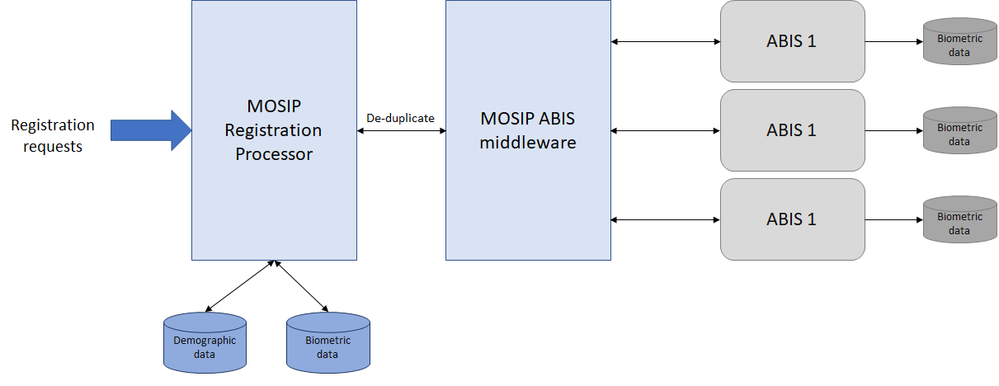

Providing unique identity for an individual is one of key features of MOSIP platform. To do this MOSIP will 

- Use biometric information (finger print and Iris only) of an individual
- Leverage Automated Biometric Identification System (ABIS)
- Design for integrating with multiple ABIS providers and take the best result
- Not use ABIS for authentication (deduplication only)

This document will provide the specification an ABIS provider must implement to meet MOSIP's requirements.

# Overview


- MOSIP will interact with ABIS only via message queues
- JSON format will be used to interact with ABIS

Biometric data sent to ABIS will follow the below standards.
- CBEFF: ISO/IEC 19785-3
- Fingerprints: ISO/IEC 19794-2, ISO/IEC 19794-4
- IRIS: ISO/IEC 19794-6
- Face: ISO/IEC 19794-5

ABIS should support the following types of biometric images
- Unsegmented fingerprint images (4-4-2), or 
- Unsegmented fingerprint images (4-1-4-1), or
- Unsegmented fingerprint images (2-2-2-2-2), or 
- Individual fingerprint images (segmented)
- IRIS images (Left, and Right)
- Face photograph

ABIS should support the following requests

Management | Registration
-----------|-------------
Shutdown   | Insert
Clear      | Identify
Ping       | Delete
GetPendingRequests | Ping
GetReferenceCounts
Configure

## Key terminologies
### ABIS
Automated Biometric Identification System whose primary responsibility is de-duplication of biometric data (finger print & Iris).

### Candidate list
Each Identify request to ABIS can return zero or more records that match the provided biometric data. The returned records is referred to as the candidate list

### Reference Database
The database maintained with the ABIS system which stores the biometrics data of an individual

### Gallery
A subset of the population in the Reference Database used as a target to search for a specific entry. ABIS should have a provision to take an Identify or Verify request with a target gallery parameter

### Master Database
The database within MOSIP which contains the ID details (demographic & biometric) of an Individual. This database is not related to Reference Database.

### TargetFMR
FMR is False Match Rate. This is the rate at which non-matched Verification requests return a match request (a false positive). An ABIS should be able to send the FMR as defined below. This metric will be used if ABIS does verification also.
FMR is an integer which should be calculated as per this formula
```
round (-10 * log10 (target FMR))
```
The acceptable values are

Target False Match Rate | score
------------------------|------
1 in 1,000              | 30
1 in 10,000             | 40
1 in 100,000            | 50

### TargetFPIR
FPIR is False Positive Identification Rate. This metric tells how many false positive identification an ABIS achieved. An ABIS should be able to send the FMR as defined below.
```
round (-10 * log10 (achieved targetFPIR))
```

The acceptable values are

Target FPIR | score
------------------------|------
1 in 1,000              | 30
1 in 10,000             | 40
1 in 100,000            | 50

## Possible strategies for Biometric data management in ABIS
A system owner of MOSIP can choose the strategy to store biometrics data in ABIS. Based on the strategy, they have to modify MOSIP ABIS middleware.

### One entry per registered resident
If a system owner decides to have only one entry per registration, the workflow will look as below
1. Registration
  - Each Registration request on MOSIP will result in a INSERT request on ABIS
  - On IDENTIFY request, if a duplicate is detected then the entry will be deleted (DELETE)

2. Re-registration
  - On Re-Registration in MOSIP, an INSERT request is issued to ABIS followed by DELETE on the old record

### One entry per registration request
If a system owner decides to have only multiple entries per registration, the workflow will look as below
1. Registration
  - Each Registration request on MOSIP will result in a INSERT request on ABIS
  - On IDENTIFY request, if a duplicate is detected then the new entry will be associated with the existing UIN

2. Re-registration
  - On Re-Registration in MOSIP, an INSERT request is issued to ABIS followed by association with the existing UIN


## Possible strategies for deduplication in case of multiple ABIS systems
- MOSIP can be configured to send an INSERT request to one or all the ABIS systems
- MOSIP can be configured to send IDENTIFY request to only 1 ABIS system
- MOSIP can be configured to send IDENTIFY request to all the ABIS systems, and choose the best result based on the scores. This helps to calibrate ABIS for better performance

## Workflows
TODO

## API's to interact with an ABIS system
TODO