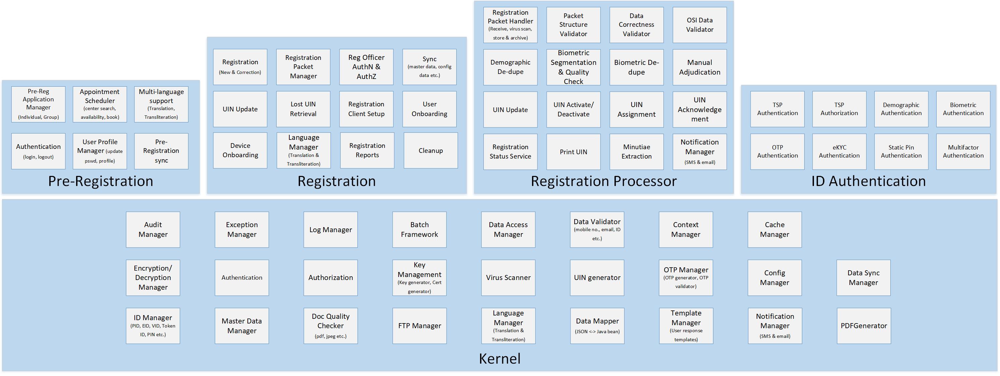

# Eclipse Markdown Editor

### Markdown editor plugin for eclipse 

# Functional View

Search and Install **“ Markdown Text Editor “**  form Eclipse Marketplace.

 
 

Web Link:  https://marketplace.eclipse.org/content/markdown-text-editor

### GitHub Flavored Markdown viewer plugin

Search and Install **“ GitHub Flavored Markdown “** form Eclipse Marketplace.

 

Web Link:  https://marketplace.eclipse.org/content/github-flavored-markdown-viewer-plugin

# MOSIP WIKI Local Setup

**MOSIP wiki will have architecture, API specs and developer documentation only. Low level design will be under the design folder in https://github.com/mosip/mosip/tree/DEV/design**

**Step1.** Access MOSIP wiki at https://github.com/mosip/mosip/wiki

**Step2.** Copy repository URL and Git clone https://github.com/mosip/mosip.wiki.git

 

**Step3.** Import it in Eclipse From File -> Open Projects form File System.. 
 

**Start4.** Edit ****.md file (Markdown Source tab) and Preview your changes (Preview tab)

 

 
 

**Step5:** If you are using GitHub Flavored Markdown Syntax, Right-click .md file then select ''Show in GFM view".
Remember to delete generated “.xxx.md.html” preview file after using this option. 

 

**Start6.** Commit and Push back to GitHub.

**NOTE:** 

- Add MDs files prefixed with SectionNumber.SubSectionNumber

- Create SubFolder/Add Images inside “_images/SubFolderName/”

- Refer https://guides.github.com/features/mastering-markdown for Markdown Syntax guide 

# Editing Code Repository MD Files (Repository for low level design for sequence diagrams and class diagrams)

**NOTE:** 

- Each module has own README.md files for installation, runtime environment and setup instructions.

- Each module has own UML design MD files inside “design/module” folder and respective diagrams inside “design/module/_images” 

 

  

**Refer https://guides.github.com/features/mastering-markdown for Markdown Syntax guide**
