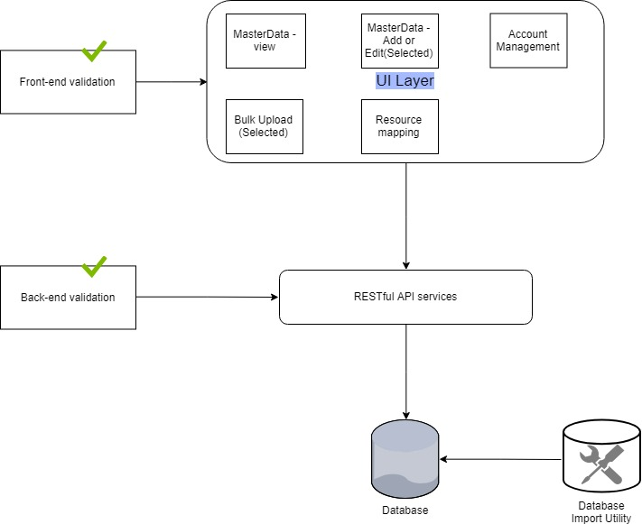

The MOSIP platform is configured via the Admin application. This application can be accessed only by the privileged group of admin personnel. When the MOSIP platform gets initialized, there are default configurations and seed data are setup. Post installation, following operations can be done using the Admin application,  
* Configuration entry changes 
* Master data management
* User management 
* Mapping of the master data to various resources

## Architecturally Significant Use Cases
The MOSIP Admin application is the pivot of the platform. Any changes done through the Admin application will have the ripple effect across the platform. Following are the use cases which have the impact on the architecture significantly. 

### Provide a single user interface to adminster the MOSIP platform
The MOSIP adminstrators have to be given the option to view and manage the the platform with ease. 

### Initial setup
When the platform is setup for the first time, there are some default data and configurtions are required to be available. The provisions are given to upload the data from the CSV file uploads. 

### Secure the services and UI
Admin application contains UI layer and Service layer. All the components in both Services and UI are secure and authenticated. Every component should be defined with the authorization module plugged in. For example, if a component's data is not supposed to be viewed except authorized personnel, no user will be able to view it. So is the creating, editing and deleting functionalities. 

### Maker checker policy
The sensitive parts of the configuration and data should be made sure, that proper verification is done before the changes are made effective and live. The four eye check is done for the the important features. 

### Ensuring consistency of the platform
The configuration options given as part of the Admin application have the direct effect on the application. Any incorrect changes done from the Admin application have the effect on the past, present and the future data. The changes must ensure the consistency and quality of the data which was collected in the system. So, the edit operation of the configuration entries should be limited only to certain properties. Sensitive properties should be routed via the maker checker policy. 

## Logical view

## Solution
### Platform seed data 
When the platform got inititalized and setup, there should be initial data should be available in the system. The initial import is done by the database utility which reads a CSV file creates the data in the database. During this import of this data, the quality of data is checked by the SI and a Database administrator. This kind of import happens only one time during the initial setup. 

### Service layer
All the operations done on the Admin modules for the data are done through the Service layer. The authentication is done in the service layer. The validations such as business validation, mandatory validations, length validations etc., are done in the service layer also. 

### UI layer
The UI layer supports the following salient features, 
1. Responsive design
2. Authentication and authorization
3. Client side validations

UI layer is used only as the renderer. No business side functionality is added in the UI layer. 

## Flow view

