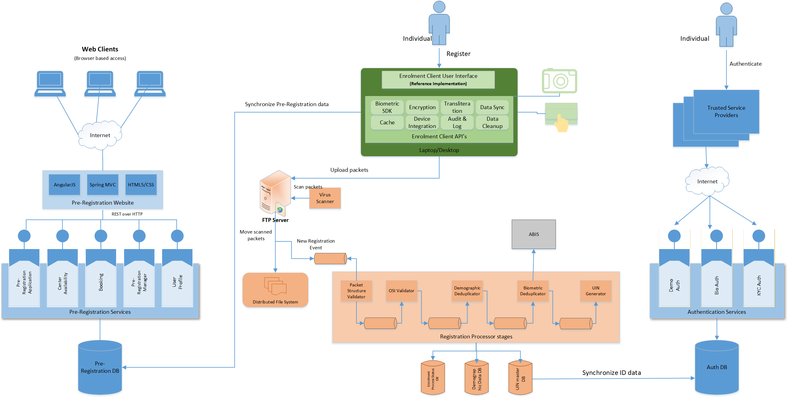
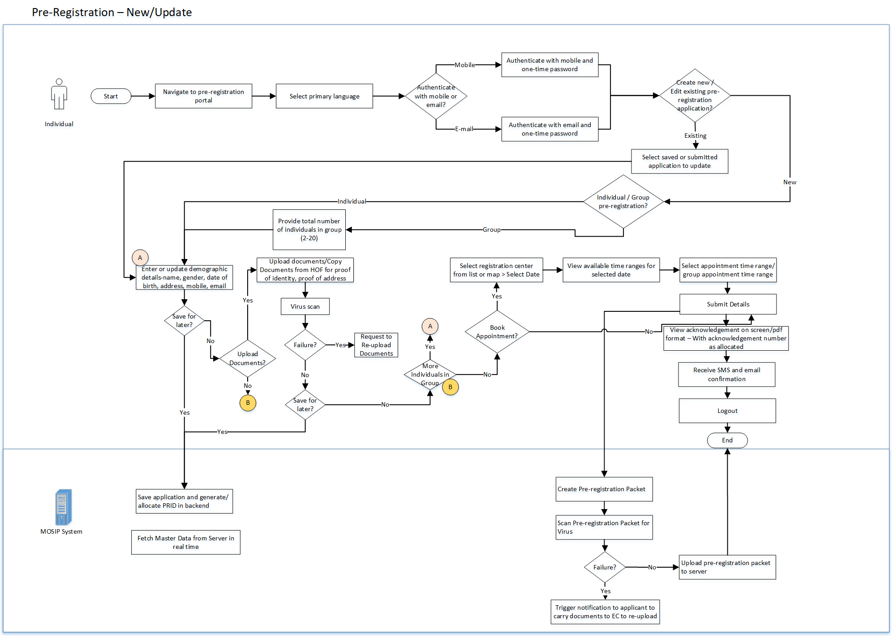
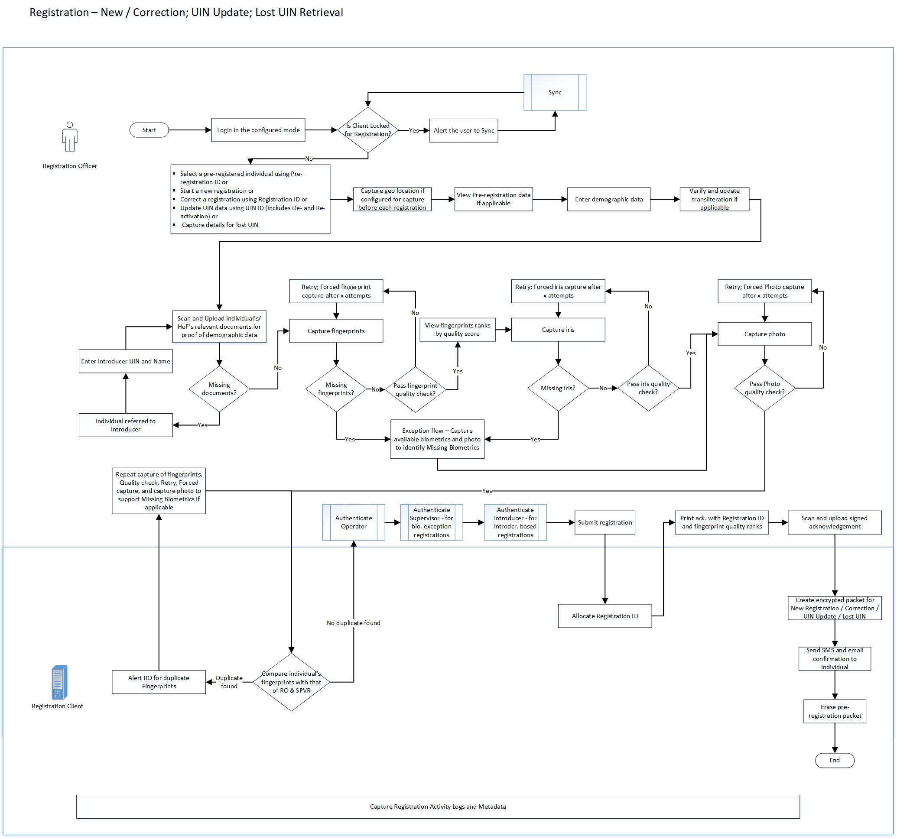
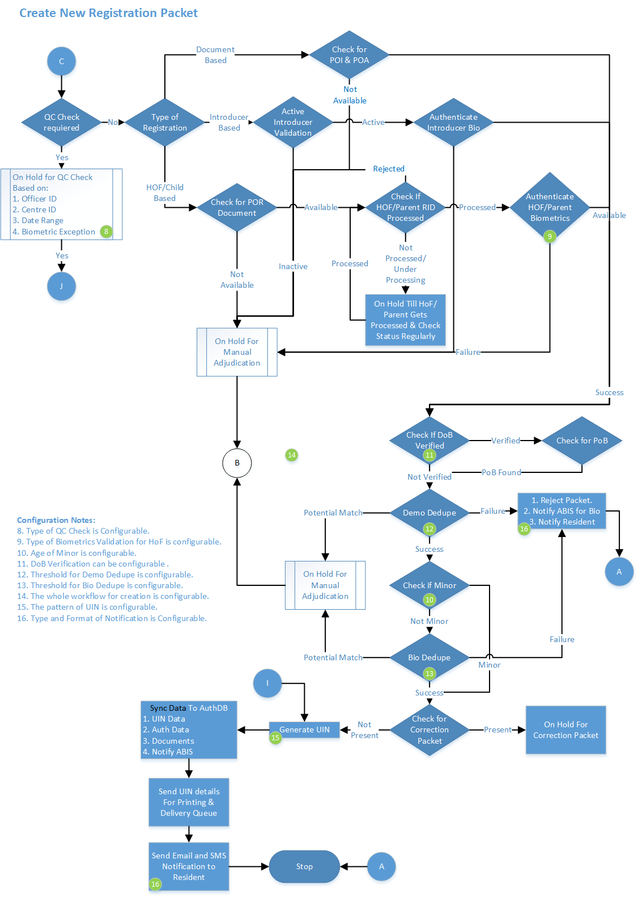
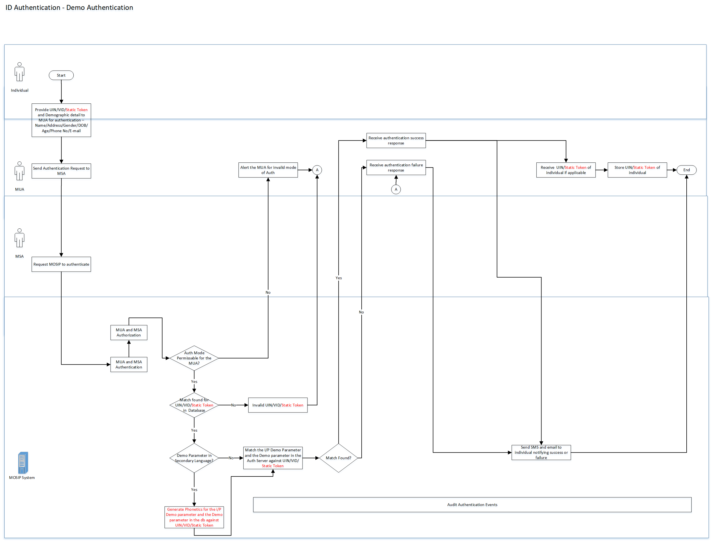

[Architecture Principles](https://github.com/mosip/mosip/wiki/Architecture#architecture-principles)

[Functional view](https://github.com/mosip/mosip/wiki/Architecture#functional-view)

[Logical view](https://github.com/mosip/mosip/wiki/Architecture#logical-view)

[Process view](https://github.com/mosip/mosip/wiki/Architecture#process-view)

[Data view](https://github.com/mosip/mosip/wiki/Architecture#data-view)

# Architecture Principles
MOSIP is built on the following architecture principles

* MOSIP must not use proprietary or commercial license frameworks. Where deemed essential, such components must be encapsulated to enable their replacement if necessary (to avoid vendor lock-in)
* MOSIP must use open standards to expose it’s functionality (to avoid technology lock-in)
* Each MOSIP component must be independently scalable (scale out) to meet varying load requirements
* MOSIP must use commodity computing hardware & software to build the platform
* Data must be encrypted in-flight and at-rest. All requests must be authenticated and authorized. Privacy of Identity Data is an absolute must in MOSIP
* MOSIP must follow platform based approach so that all common features are abstracted as reusable components and frameworks into a common layer
* MOSIP must follow API first approach and expose the business functions as RESTful services
* MOSIP must follow the following manageability principles – Auditability & monitor ability of every event in the system, testability of every feature of the platform & easy upgrade ability of the platform
* MOSIP components must be loosely coupled so that they can be composed to build the identity solution as per the requirements of a country
* MOSIP must support i18n capability
* All modules of MOSIP should be resilient such that the solution as a whole is fault tolerant
* The key sub-systems of MOSIP should be designed for extensibility. For example, if an external system has to be integrated for fingerprint data, it should be easy to do so

# Functional View

# Logical View

# Process View

Pre-Registration process

Registration process

Registration Processor process

ID Authentication process

# Data view

## Data architecture principles
Below principles are followed in designing the data base of MOSIP
- All personally identifiable information like name, age, gender, address etc will be stored in an encrypted form
- The primary key for a record will be a random number and never generated based on the record data
- Select queries by Admin or any other user is prohibited. Only application user will be able to do a select query