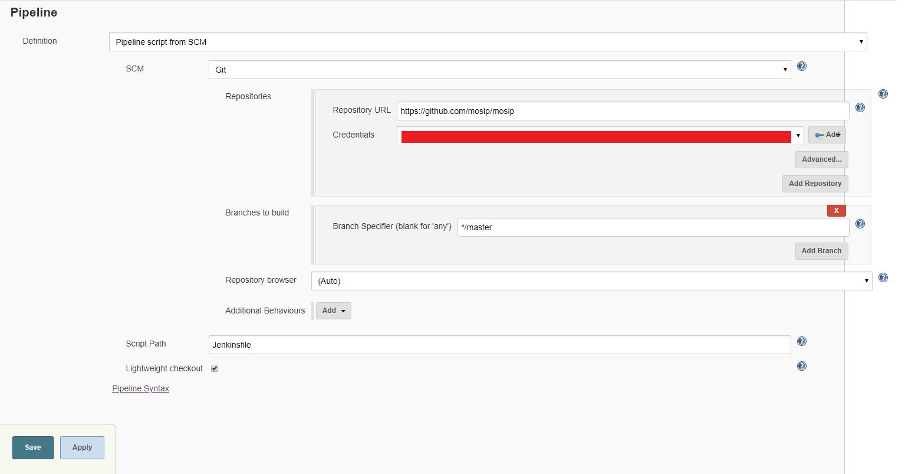
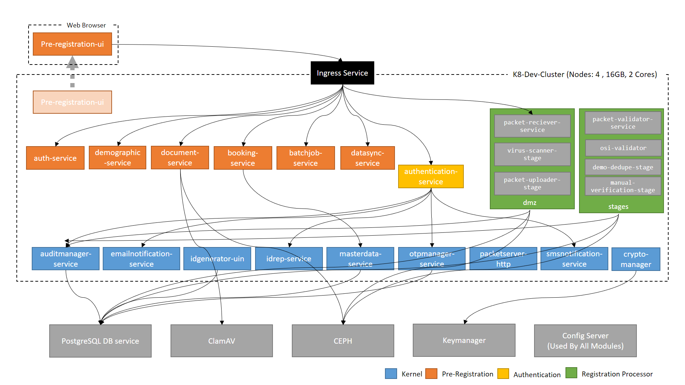

# Content
1. [Getting the Source Code](#1-getting-the-source-code- )
2. [Setup and Configure Jenkins](#2-setup-and-configure-jenkins- )
3. [Setup and Configure Jfrog](#3-setup-and-configure-jfrog- )
4. [Setup and Configure SonarQube](#4-setup-and-configure-sonarqube- )
5. [Setup and Configure Docker Registry](#5-setup-and-configure-docker-registry- )
6. [Installing External Dependencies](#6-installing-external-dependencies- )
7. [Configuring MOSIP](#7-configuring-mosip- )
8. [MOSIP Deployment](#8-mosip-deployment- )

***
## 1. Getting the Source Code [**[↑]**](#content)
MOSIP source code can be obtained via creating a fork of MOSIP Github repository from the URL [https://github.com/mosip/mosip/](https://github.com/mosip/mosip/). To know more about how to fork code from Github follow this [guide](https://help.github.com/articles/fork-a-repo/).
Once Forked, start the process of setting up your CI/CD tools to build and run MOSIP.

***
## 2. Setup and Configure Jenkins [**[↑]**](#content)
In this step, we will setup jenkins and configure it. Configuration contains steps like creating credentials, creating pipelines using xml files present in MOSIP source code, connecting Jenkins to recently forked repository and creating webhooks. Lets look at these steps one by one - 

### A. Installing Jenkins
Jenkins installation is pretty standard one(see [How to install Jenkins](https://jenkins.io/doc/book/installing/)), but to use MOSIP supported build pipelines you have to install Jenkins in an Redhat 7.5 environment. Also you have to install following list of plugins - 
* [Github Plugin](https://wiki.jenkins.io/display/JENKINS/GitHub+Plugin)
* [Artifactory Plugin](https://wiki.jenkins.io/display/JENKINS/Artifactory+Plugin)
* [Credentials Plugin](https://wiki.jenkins.io/display/JENKINS/Credentials+Plugin)
* [Docker Pipeline Plugin](https://wiki.jenkins.io/display/JENKINS/Docker+Pipeline+Plugin)
* [Email Extension Plugin](https://wiki.jenkins-ci.org/display/JENKINS/Email-ext+plugin)
* [Pipeline Plugin](https://wiki.jenkins-ci.org/display/JENKINS/Pipeline+Plugin)
* [Publish Over SSH Plugin](http://wiki.jenkins-ci.org/display/JENKINS/Publish+Over+SSH+Plugin)
* [SonarQube Scanner for Jenkins Plugin](https://docs.sonarqube.org/display/SCAN/Analyzing+with+SonarQube+Scanner+for+Jenkins)
* [SSH Agent Plugin](http://wiki.jenkins-ci.org/display/JENKINS/SSH+Agent+Plugin)
* [SSH Credentials Plugin](https://wiki.jenkins-ci.org/display/JENKINS/SSH+Credentials+Plugin)

### B. Setting Up Github for/in Jenkins
Setting up Github for/in Jenkins involves putting the Jenkins Webhook url in Github Repo so that Github can inform Jenkins for push events(look at [Webhooks](https://developer.github.com/webhooks/) and [Github hook](https://wiki.jenkins.io/display/JENKINS/GitHub+Plugin#GitHubPlugin-GitHubhooktriggerforGITScmpolling)). After hooks are in place, we need to setup Github credentials inside Jenkins, so that on webhook event our pipeline can checkout the code from Github. To set up Github Credentials, follow these steps - 
    
    I. Goto Jenkins
    II. Goto Credentials -> System
    III. Goto Global credentials
    IV. Click on Add Credentials
    V. Now use following details

        Kind=Username with password
        Scope=Global (Jenkins, nodes, items, all child items, etc)
        Username=<Your Github Username>
        Password=<Your Github Password>
        ID=Some Unique Identifier to refer to this credentials (to autogenerate this, leave this blank)
        Description=<It is optional>
    VI. Now since our Jenkinsfile usage this github credentials, update the credentials id in Jenkinsfile. (To know more about look at this [section]())

### C. Create Pipelines
Next step after Jenkins installation is to configure/create Jenkins Jobs. These Jenkins Jobs are written as Jenkins Pipelines and respective Jenkinsfile in the MOSIP Source Code. MOSIP currently have 5 Jenkins job that take care of CI/CD process for Development Environment. There are - 

* master-branch-build-all-modules

    This Job is used to build whole MOSIP as a single unit. This Job is also acts as a nightly process to check the build status of MOSIP code in Master Branch. To create this Job you need to create a new Item in Jenkins as a Pipeline Project. Here are the configuration for Pipeline you might have to explictly change to use MOSIP provided Jenkinsfile- 

    

    

    As it can be seen from the above image that this pipeline usages Jenkinsfile present in master branch of MOSIP repository. Also you need to provide the Github credentials that this pipeline will take to connect and download this Jenkinsfile at the time of the build. Now let us look into this Jenkinsfile. 

  Jenkinsfile for this pipeline is written in Groovy Language using scripted style of writing code. Here in this file,

* Kernel
<TBD>
* Pre-Registration
<TBD>
* Registration
<TBD>
* Registration-Processor
<TBD>
* Authentication
<TBD>

***
## 3. Setup and Configure Jfrog [**[↑]**](#content)
 For installing and setting up Jfrog, steps [here](https://www.jfrog.com/confluence/display/RTF/Installing+Artifactory) need to be followed. 
Once the setup is complete, please add following remote repositories to your Jfrog configuration and point them to libs-release virtual repository:
* **Maven Central -** https://repo.maven.apache.org/maven2/
* **Jcentre -** https://jcenter.bintray.com
* **Openimaj -** http://maven.openimaj.org 
To configure Maven to resolve artifacts through Artifactory you need to modify the settings.xml of Jenkins machine's m2_home. 
To generate these settings, go to  Artifact Repository Browser of the Artifacts module, select Set Me Up. In the Set Me Up dialog, set Maven in the Tool field and click "Generate Maven Settings". For more information on artifactory configuration refer [here](https://www.jfrog.com/confluence/display/RTF/Maven+Repository)

***
## 4. Setup and Configure SonarQube [**[↑]**](#content)
SonarQube server can be setup by following single instructions given [here](https://docs.sonarqube.org/latest/setup/get-started-2-minutes/). 
For configuring SonarQube with Jenkins, steps given [here](https://docs.sonarqube.org/display/SCAN/Analyzing+with+SonarQube+Scanner+for+Jenkins) can be followed.

***
## 5. Setup and Configure Docker Registry [**[↑]**](#content)
In this step we will setup and configure a private docker registry, which will be basic authenticated, SSL secured. In our setup we are using azure blobs as storage for our docker images. More options for configuring registry can be found [here](https://docs.docker.com/registry/configuration/)
We are deploying Docker registry as Containerized services. For setting up the registry, [Docker](https://docs.docker.com/install/) and [Docker Compose](https://docs.docker.com/compose/install/) need to be installed. We have setted up the registry in a machine with Redhat 7.5 installed. 
Once installation is done, the yaml files which we will be using to setup the registry can be found under scripts/docker-registry folder in the source code.
We are using Registry image : registry:2.5.1, registry with any other version can be deployed from [here](https://hub.docker.com/_/registry).  For routing purpose, we are using HAproxy image dockercloud/haproxy:1.6.2, other options such as ngnix etc. can also be used for the same purpose. 
We have the following docker-compose files, under scripts/docker-registry folder: 
1. **registry-docker-compose.yml:**  For basic registry and haproxy setup.
2. **registry-docker-compose-basic-authentication.yml:**  For securing the docker registry through base authentication.
For basic authentication, you have to setup a htpasswd file and add a simple user to it. For generating this htpaswd file: 
  * Create Htpasswd_dir directory 
`mkdir -p ~/htpasswd_dir` 
  * Create htpasswd file with your username and password 
 `docker run --rm --entrypoint htpasswd registry:2 -Bbn <username> "<password>" > ~/htpassword_dir/htpasswd` 
  * In the registry-docker-compose-basic-authentication.yml file, replace <YOUR-REALM-NAME> and <YOUR-HTPASSWD-PATH> with 
    specific values.
     
3. **registry-docker-compose-azure-storage.yml:**  This file is used for configuring azure blob storage. We are assuming that Azure blob has already been configured by you. Replace REGISTRY_STORAGE_AZURE_ACCOUNTNAME, REGISTRY_STORAGE_AZURE_ACCOUNTKEY, REGISTRY_STORAGE_AZURE_CONTAINER with appropriate values configured by you while setting up azure blob storage.
4. **registry-docker-compose-tls-enabled.yml:**  We are using **Let's Encrypt**, CA signed SSL certificates. Documentation of Let's Encrypt can be referred [here](https://letsencrypt.org/getting-started/)
  Once Certificates have been generated, replace the <REGISTRY_HTTP_TLS_CERTIFICATE> property and <REGISTRY_HTTP_TLS_KEY> property in registry-docker-compose-tls-enabled.yml with appropriate values.
After completing all the above changes, use docker-compose tool to bring up the container using the following command: 
`docker-compose -f registry-docker-compose.yml -f registry-docker-compose-basic-authentication.yml -f registry-docker-compose-azure-storage.yml -f registry-docker-compose-tls-enabled.yml  up -d` 
Once the registry is up and running, variables **registryUrl**, **registryName**, **registryCredentials** can be configured accordingly in Jenkinsfile.  For configuring registry Credentials in Jenkins, Username/Password credentials need to be added in Jenkins Global Credentials and credential ID needs to be provided in **registryCredentials** variable in all the Jenkinsfiles.

***
## 6. Installing External Dependencies [**[↑]**](#content)
### Install and use PostgreSql on RHEL 7.5

Often simply Postgres, is an object-relational database management system (ORDBMS) with an emphasis on extensibility and standards compliance. It can handle workloads ranging from small single-machine applications to large Internet-facing applications (or for data warehousing) with many concurrent users
Postgresql Prerequisites
On a Linux or Mac system, you must have superuser privileges to perform a PostgreSQL installation. To perform an installation on a Windows system, you must have administrator privileges.
#### Steps to install Postgresql in RHEL-7.5
##### Download and install PostgreSQL.  
$ sudo yum install (https://download.postgresql.org/pub/repos/yum/10/redhat/rhel-7-x86_64/pgdg-redhat10-10-2.noarch.rpm) 
*The password that you are prompted to provide during the installation process is for the 'postgres' account, which is the database root-level account, sometimes called the super user ('postgres'). Remember this username and password. You will need it each time you log in to the database. 
*	The default port for PostgreSQL is 5432. If you decide to change the default port, please ensure that your new port number does not conflict with any services running on that port. You will also need to remember to update all further mentions of the database port. 

##### checking  the postgresql packages  
$ sudo yum update  
$ sudo yum list postgresql*  
##### Installation command  	
$ sudo yum install postgresql10 postgresql10-server 
$sudo /usr/pgsql-10/bin/postgresql-10-setup initdb  
$sudo systemctl enable postgresql-10  
##### Postgresql service stop/start/restart command 
$ sudo systemctl start postgresql-10  
$ sudo systemctl status postgresql-10  
$ sudo systemctl stop postgresql-10  
To changing default port 5432 to 9001 and connection + buffer size we need to edit the postgresql.conf file from below path
$ sudo vi /var/lib/pgsql/10/data/postgresql.conf  
listen_addresses = '*'
port = 9001 
unix_socket_directories = '/var/run/postgresql, /tmp'

##### Below command to open the port 9001 from RHEL 7.5 VM
$ sudo firewall-cmd --zone=public --add-port=9001/tcp –permanent  
$ sudo firewall-cmd --reload  
Reference link:
 
(https://www.tecmint.com/install-postgresql-on-centos-rhel-fedora)
 
 
### Install and use Nginx on RHEL 7.5

We are using nginx for webserver andalso proxy server for MOSIP project
Create the file named /etc/yum.repos.d/nginx.repo using a text editor such as vim command

$sudo vi /etc/yum.repos.d/nginx.repo  
#### Install nginx package using the yum command:
$sudo yum update  
$sudo yum install nginx  
Append following for RHEL 7.5  
[nginx]    
name=nginx repo  
baseurl=http://nginx.org/packages/mainline/rhel/7/$basearch/  
gpgcheck=0  
enabled=1  
$ sudo yum install nginx  
$ sudo systemctl enable nginx   
###### nginx start/stop/restart/status commands   
$ sudo systemctl start nginx  
$ sudo systemctl stop nginx  
$ sudo systemctl restart nginx  
$ sudo systemctl status nginx  

##### To edit files use a text editor such as vi
$ sudo vi /etc/nginx/conf.d/default or $ sudo vi /etc/nginx/nginx.conf  
##### Below command to open the port 80/443 from RHEL 7.5 VM 
$ sudo firewall-cmd --zone=public --add-port=80/tcp --permanent   
$ sudo firewall-cmd –reload  

##### Reference link:
(https://www.cyberciti.biz/faq/how-to-install-and-use-nginx-on-centos-7-rhel-7)

### Install Clam AntiVirus

 ClamAV is a free, cross-platform and open-source antivirus software toolkit able to detect many types of malicious software, including viruses.

#### Steps to install ClamAV in RHEL-7.5

$ sudo wget http://dl.fedoraproject.org/pub/epel/epel-release-latest-7.noarch.rpm  
$ sudo rpm -ivh epel-release-latest-7.noarch.rpm  
$ sudo yum repolist  
$ sudo yum update  
$ yum --enablerepo=epel info clamav  
$ sudo yum --enablerepo=epel install clamav clamav-scanner clamav-update  
$ sudo yum --enablerepo=epel install clamav-daemon  
$ sudo yum --enablerepo=epel install clamd  
$ sudo yum -y install clamav-server clamav-data clamav-update clamav-filesystem clamav clamav-scanner-systemd clamav-devel clamav-lib clamav-server-systemd  
$ sudo freshclam  
$  sudo systemctl  clamd status  
$  sudo systemctl freshclam stauts  
$  sudo systemctl start freshclam  
$  sudo systemctl status clamd  
$  sudo systemctl start clamd  

##### ClamAv port : 3310
#### Command to check the ClamAV status:
$ sudo systemctl status clamd@scan.service  
$ sudo systemctl start clamd@scan.service  
$ sudo systemctl stop clamd@scan.service  
##### Below command to open the port 3310 from RHEL 7.5 VM
$ sudo firewall-cmd --zone=public --add-port=3310/tcp --permanent 
$ sudo firewall-cmd –reload

***
## 7. Configuring MOSIP [**[↑]**](#content)
We are using Spring cloud configuration server in MOSIP for storing and serving distributed configurations across all the applications and environments.
We are storing all applications' configuration in config folder inside our Github Repository.
For getting more details about how to use configuration server with our applications, following developer document can be referred:
[**MOSIP CONFIGURATION SERVER**](https://github.com/mosip/mosip/wiki/MOSIP-Configuration-Server)

***
## 8. MOSIP Deployment [**[↑]**](#content)
Currently for the Development Process MOSIP Platform is deployed as/in the Kubernetes Cluster. We are using Azure Kubernetes Service for provisioning of Cluster.
Here is the Logical Deployment Diagram (Detailing will be done later)- 

***