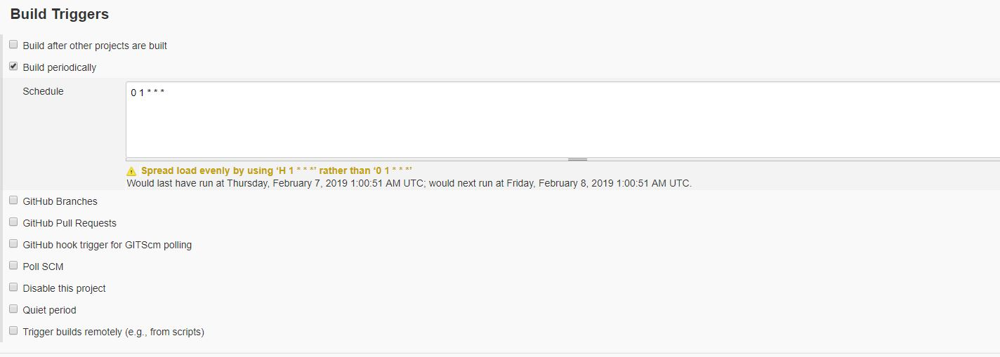
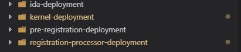

# Content
1. [Getting the Source Code](#1-getting-the-source-code- )
2. [Setup and Configure Jenkins](#2-setup-and-configure-jenkins- )
3. [Setup and Configure Jfrog](#3-setup-and-configure-jfrog- )
4. [Setup and Configure SonarQube](#4-setup-and-configure-sonarqube- )
5. [Setup and Configure Docker Registry](#5-setup-and-configure-docker-registry- )
6. [Installing External Dependencies](#6-installing-external-dependencies- )
7. [Configuring MOSIP](#7-configuring-mosip- )
8. [MOSIP Deployment](#8-mosip-deployment- )

***
## 1. Getting the Source Code [**[↑]**](#content)
MOSIP source code can be obtained via creating a fork of MOSIP Github repository from the [URL](/mosip/mosip/). To know more about how to fork code from Github follow this [guide](//help.github.com/articles/fork-a-repo/).
Once Forked, start the process of setting up your CI/CD tools to build and run MOSIP.

**NOTE** MOSIP configuration has been seperated from the source code. For running the source code, you will be needing a fork of mosip-configuration repository from this [URL](https://github.com/mosip/mosip-configuration.git). All the configuration files will be stored under config folder under this repository.

***
## 2. Setup and Configure Jenkins [**[↑]**](#content)
In this step, we will setup jenkins and configure it. Configuration contains steps like creating credentials, creating pipelines using xml files present in MOSIP source code, connecting Jenkins to recently forked repository and creating webhooks. Lets look at these steps one by one - 

### A. Installing Jenkins version 2.150.1
Jenkins installation is pretty standard one(see [How to install Jenkins](//jenkins.io/doc/book/installing/)), but to use MOSIP supported build pipelines you have to install Jenkins in an Redhat 7.5 environment. Also you have to install following list of plugins - 
* [Github Plugin](//wiki.jenkins.io/display/JENKINS/GitHub+Plugin)
* [Artifactory Plugin](//wiki.jenkins.io/display/JENKINS/Artifactory+Plugin)
* [Credentials Plugin](//wiki.jenkins.io/display/JENKINS/Credentials+Plugin)
* [Docker Pipeline Plugin](//wiki.jenkins.io/display/JENKINS/Docker+Pipeline+Plugin)
* [Email Extension Plugin](//wiki.jenkins-ci.org/display/JENKINS/Email-ext+plugin)
* [Pipeline Plugin](//wiki.jenkins-ci.org/display/JENKINS/Pipeline+Plugin)
* [Publish Over SSH Plugin](//wiki.jenkins-ci.org/display/JENKINS/Publish+Over+SSH+Plugin)
* [SonarQube Scanner for Jenkins Plugin](//docs.sonarqube.org/display/SCAN/Analyzing+with+SonarQube+Scanner+for+Jenkins)
* [SSH Agent Plugin](//wiki.jenkins-ci.org/display/JENKINS/SSH+Agent+Plugin)
* [Pipeline Utility Steps Plugin](//wiki.jenkins.io/display/JENKINS/Pipeline+Utility+Steps+Plugin)
* [M2 Release Plugin](//wiki.jenkins.io/display/JENKINS/M2+Release+Plugin)

Once the plugin installation is complete, we need to run this command in Jenkins Script Console - 

`System.setProperty("hudson.model.DirectoryBrowserSupport.CSP", "")`

This above command modifies Content Security Policy in Jenkins to enable loading of style and javascript for HTML Reports.


* [SSH Credentials Plugin](//wiki.jenkins-ci.org/display/JENKINS/SSH+Credentials+Plugin)

### B. Setting Up Github for/in Jenkins
Setting up Github for/in Jenkins involves putting the Jenkins Webhook url in Github Repo so that Github can inform Jenkins for push events(look at [Webhooks](//developer.github.com/webhooks/) and [Github hook](//wiki.jenkins.io/display/JENKINS/GitHub+Plugin#GitHubPlugin-GitHubhooktriggerforGITScmpolling)). After hooks are in place, we need to setup Github credentials inside Jenkins, so that on webhook event our pipeline can checkout the code from Github. To set up Github Credentials, follow these steps - 
    
    I. Goto Jenkins
    II. Goto Credentials -> System
    III. Goto Global credentials
    IV. Click on Add Credentials
    V. Now use following details

        Kind=Username with password
        Scope=Global (Jenkins, nodes, items, all child items, etc)
        Username=<Your Github Username>
        Password=<Your Github Password>
        ID=Some Unique Identifier to refer to this credentials (to autogenerate this, leave this blank)
        Description=<It is optional>
    VI. Now since our Jenkinsfile usage this github credentials, update the credentials id in Jenkinsfile. (To know more about look at this [section]())

### C. Create Pipelines
Next step after Jenkins installation is to configure/create Jenkins Jobs. These Jenkins Jobs are written as Jenkins Pipelines and respective Jenkinsfile in the MOSIP Source Code. MOSIP currently have 5 Jenkins job that take care of CI/CD process for Development Environment. There are - 

* master-branch-build-all-modules

    This Job is used to build whole MOSIP as a single unit. This Job is also acts as a nightly process to check the build status of MOSIP code in Master Branch. To create this Job you need to create a new Item in Jenkins as a Pipeline Project. Here are the configuration for Pipeline you might have to explictly change to use MOSIP provided Jenkinsfile- 

    

    

    As it can be seen from the above image that this pipeline usages Jenkinsfile present in master branch of MOSIP repository. Also you need to provide the Github credentials that this pipeline will take to connect and download this Jenkinsfile at the time of the build. Now let us look into this Jenkinsfile. 

  Jenkinsfile for this pipeline is written in Groovy Language using scripted style of writing code. Here in this file,

* Kernel
<TBD>
* Pre-Registration
<TBD>
* Registration
<TBD>
* Registration-Processor
<TBD>
* Authentication
<TBD>

***
## 3. Setup and Configure Jfrog Artifactory Version 6.5.2 [**[↑]**](#content)
 For installing and setting up Jfrog, steps [here](//jfrog.com/confluence/display/RTF/Installing+Artifactory) need to be followed.<br/>
Once the setup is complete, please add following remote repositories to your Jfrog configuration and point them to libs-release virtual repository:
* [**Maven Central**](//repo.maven.apache.org/maven2/)
* [**Jcentre**](//jcenter.bintray.com)
* [**Openimaj**](//maven.openimaj.org)

To configure Maven to resolve artifacts through Artifactory you need to modify the settings.xml of Jenkins machine's m2_home to point to JFrog.<br/>
To generate these settings, go to  Artifact Repository Browser of the Artifacts module, select Set Me Up. In the Set Me Up dialog, set Maven in the Tool field and click "Generate Maven Settings". For more information on artifactory configuration refer [here](//jfrog.com/confluence/display/RTF/Maven+Repository)

**NOTE** JFrog Artifactory setup by Mindtree is open to public for read only access. So if any of the modules are dependent on previous modules, that you don't have built, you need to connect to our JFrog server to pull those dependencies. For doing that, in the settings.xml file that you generated above, replace url of ID with repository snapshot and release to our Jfrog URLs which will be : </br>
1. `<url>http://devops.mosip.io/artifactory/libs-snapshot</url>` for libs-snapshot 
2. `<url>http://devops.mosip.io/artifactory/libs-release</url>` for libs-release

Once you are done with pulling the dependencies you need, you can replace it back to your Jfrog URLs. <br/>
Also if you are planning to import all versions of the Mosip modules in Jfrog to your VM or Jfrog, make sure you have enough space in your Jfrog VM where you will be importing these dependencies.


***
## 4. Setup and Configure SonarQube version 7.3 [**[↑]**](#content)
SonarQube server can be setup by following single instructions given [here](//docs.sonarqube.org/latest/setup/get-started-2-minutes/).<br/>
For configuring SonarQube with Jenkins, steps given [here](//docs.sonarqube.org/display/SCAN/Analyzing+with+SonarQube+Scanner+for+Jenkins) can be followed.

***
## 5. Setup and Configure Docker Registry [**[↑]**](#content)
In this step we will setup and configure a private docker registry, which will be basic authenticated, SSL secured. In our setup we are using azure blobs as storage for our docker images. More options for configuring registry can be found [here](//docs.docker.com/registry/configuration/)
We are deploying Docker registry as Containerized services. For setting up the registry, [Docker](//docs.docker.com/install/) and [Docker Compose](//docs.docker.com/compose/install/) need to be installed. We have setted up the registry in a machine with Redhat 7.5 installed.<br/>
Once installation is done, the yaml files which we will be using to setup the registry can be found under scripts/docker-registry folder in the source code.
We are using Registry image : registry:2.5.1, registry with any other version can be deployed from [here](//hub.docker.com/_/registry). <br/>For routing purpose, we are using HAproxy image dockercloud/haproxy:1.6.2, other options such as ngnix etc. can also be used for the same purpose.<br/>
We have the following docker-compose files, under scripts/docker-registry folder:<br/>
1. **registry-docker-compose.yml:**  For basic registry and haproxy setup.
2. **registry-docker-compose-basic-authentication.yml:**  For securing the docker registry through base authentication.
For basic authentication, you have to setup a htpasswd file and add a simple user to it. For generating this htpaswd file:<br/>
  * Create Htpasswd_dir directory<br/>
`mkdir -p ~/htpasswd_dir`<br/>
  * Create htpasswd file with your username and password<br/>
 `docker run --rm --entrypoint htpasswd registry:2 -Bbn <username> "<password>" > ~/htpassword_dir/htpasswd`<br/>
  * In the registry-docker-compose-basic-authentication.yml file, replace <YOUR-REALM-NAME> and <YOUR-HTPASSWD-PATH> with 
    specific values.
     
3. **registry-docker-compose-azure-storage.yml:**  This file is used for configuring azure blob storage. We are assuming that Azure blob has already been configured by you. Replace REGISTRY_STORAGE_AZURE_ACCOUNTNAME, REGISTRY_STORAGE_AZURE_ACCOUNTKEY, REGISTRY_STORAGE_AZURE_CONTAINER with appropriate values configured by you while setting up azure blob storage.
4. **registry-docker-compose-tls-enabled.yml:**  We are using **Let's Encrypt**, CA signed SSL certificates. Documentation of Let's Encrypt can be referred [here](//letsencrypt.org/getting-started/)
  Once Certificates have been generated, replace the <REGISTRY_HTTP_TLS_CERTIFICATE> property and <REGISTRY_HTTP_TLS_KEY> property in registry-docker-compose-tls-enabled.yml with appropriate values.
After completing all the above changes, use docker-compose tool to bring up the container using the following command:<br/>
`docker-compose -f registry-docker-compose.yml -f registry-docker-compose-basic-authentication.yml -f registry-docker-compose-azure-storage.yml -f registry-docker-compose-tls-enabled.yml  up -d`<br/>
Once the registry is up and running, variables **registryUrl**, **registryName**, **registryCredentials** can be configured accordingly in Jenkinsfile.<br/> For configuring registry Credentials in Jenkins, Username/Password credentials need to be added in Jenkins Global Credentials and credential ID needs to be provided in **registryCredentials** variable in all the Jenkinsfiles.


***
## 6. Installing External Dependencies [**[↑]**](#content)
### 6.1 Install and use PostgreSql Version 10.2 on RHEL 7.5

Often simply Postgres, is an object-relational database management system (ORDBMS) with an emphasis on extensibility and standards compliance. It can handle workloads ranging from small single-machine applications to large Internet-facing applications (or for data warehousing) with many concurrent users
Postgresql Prerequisites
On a Linux or Mac system, you must have superuser privileges to perform a PostgreSQL installation. To perform an installation on a Windows system, you must have administrator privileges.
#### Steps to install Postgresql in RHEL-7.5
##### Download and install PostgreSQL. <br/>
$ sudo yum install <div>https://download.postgresql.org/pub/repos/yum/10/redhat/rhel-7-x86_64/pgdg-redhat10-10-2.noarch.rpm</div> <br/>
##### checking  the postgresql packages  
$ sudo yum update <br/>
$ sudo yum list postgresql* <br/>
##### Installation command <br/>	
$ sudo yum install postgresql10 postgresql10-server<br/>
$sudo /usr/pgsql-10/bin/postgresql-10-setup initdb <br/>
$sudo systemctl enable postgresql-10 <br/>
##### Postgresql service stop/start/restart command 
$ sudo systemctl start postgresql-10 <br/>
$ sudo systemctl status postgresql-10 <br/>
$ sudo systemctl stop postgresql-10 <br/>
To changing default port 5432 to 9001 and connection + buffer size we need to edit the postgresql.conf file from below path <br/>
PostgreSQL is running on default port 5432. <br/>
you decide to change the default port, please ensure that your new port number does not conflict with any services running on that port. <br/>

##### Steps to change the default port :

###### Open the file  and modify the below changes 
$ sudo vi /var/lib/pgsql/10/data/postgresql.conf 
listen_addresses = '*'   (changed to * instad of local host )
port = 9001       ( uncomment port=5432 and change the port number 
###### Open the port 9001 from the VM 
$  sudo firewall-cmd --zone=public --add-port=9001/tcp --permanent
$  sudo firewall-cmd --reload

##### To increase the buffer size and number of postgreSql connection  same fine modify the below changes also 
$ sudo vi /var/lib/pgsql/10/data/postgresql.conf 
unix_socket_directories = '/var/run/postgresql, /tmp' 
max_connections = 1000  
shared_buffers = 2GB  

##### To change the default password 
Login to postgrsql
$ sudo su postgres
bash-4.2$ psql -p 9001
postgres=# \password postgres
Enter new password:
Enter it again:
postgres=# \q

sudo systemctl restart postgresql-10
It will ask new password to login to postgresql <br/>

####### example  for sourcing the sql file form command line 
$ psql --username=postgres --host=10.240.0.66 --port=9001 --dbname=postgres -f mosip_role_regprcuser.sql
 
Open the file <br/>
$ Sudo vim /var/lib/pgsql/10/data/pg_hba.conf

###### Default lines are present in pg_hab.conf file <br/>

 TYPE  DATABASE        USER            ADDRESS                 METHOD <br/>

local   all             all                                     peer <br/>
host    all             all             127.0.0.1/32            ident <br/>
host    all             all             ::1/128                 ident <br/>
local   replication     all                                     peer  <br/>
host    replication     all             127.0.0.1/32            ident <br/>
host    replication     all             ::1/128                 ident <br/>

###### Modify  with below changes in file  /var/lib/pgsql/10/data/pg_hba.conf   
local   all             all                                     md5 <br/>
host    all             all             127.0.0.1/32            ident <br/>
host    all             all             0.0.0.0/0               md5 <br/>
host    all             all             ::1/128                 ident <br/>
local   replication     all                                     peer <br/>
host    replication     all             127.0.0.1/32            ident <br/>
host    replication     all             ::1/128                 ident <br/>

$ sudo vi /var/lib/pgsql/10/data/postgresql.conf <br/>
listen_addresses = '*'
port = 9001 
unix_socket_directories = '/var/run/postgresql, /tmp'

##### Below command to open the port 9001 from RHEL 7.5 VM
$ sudo firewall-cmd --zone=public --add-port=9001/tcp –permanent <br/>
$ sudo firewall-cmd --reload <br/>
Reference link:
<br/>
<div>https://www.tecmint.com/install-postgresql-on-centos-rhel-fedora</div> 
<br/>
<br/>
### 6.2 Install and use Nginx Version-1.15.8 on RHEL 7.5

We are using nginx for webserver andalso proxy server for MOSIP project
Create the file named /etc/yum.repos.d/nginx.repo using a text editor such as vim command

$sudo vi /etc/yum.repos.d/nginx.repo <br/>
#### Install nginx package using the yum command:
$sudo yum update <br/>
$sudo yum install nginx <br/>
Append following for RHEL 7.5 <br/>
[nginx]   <br/>
name=nginx repo <br/>
baseurl=`http://nginx.org/packages/mainline/rhel/7/$basearch/` <br/>
gpgcheck=0 <br/>
enabled=1 <br/>
$ sudo yum install nginx <br/>
$ sudo systemctl enable nginx  <br/>
###### nginx start/stop/restart/status commands  <br/>
$ sudo systemctl start nginx <br/>
$ sudo systemctl stop nginx <br/>
$ sudo systemctl restart nginx <br/>
$ sudo systemctl status nginx <br/>

##### To edit files use a text editor such as vi
$ sudo vi /etc/nginx/conf.d/default or $ sudo vi /etc/nginx/nginx.conf <br/>
   Example : <br/> 
          location / {  <br/>
                        proxy_set_header Host $host; <br/>
                        proxy_set_header X-Real-IP $remote_addr; <br/>
                        proxy_set_header X-Forwarded-For $proxy_add_x_forwarded_for; <br/>
                        proxy_set_header X-Forwarded-Proto $scheme; <br/>
                        proxy_pass `https://mosip-dev-k8.southindia.cloudapp.azure.com/`; //endpoint of kubernetes <br/>
                        proxy_connect_timeout                   3600s; <br/>
                        proxy_send_timeout                      3600s; <br/>
                        proxy_read_timeout                      3600s; <br/>
           } <br/>

   
##### Below command to open the port 80/443 from RHEL 7.5 VM 
$ sudo firewall-cmd --zone=public --add-port=80/tcp --permanent  <br/>
$ sudo firewall-cmd –reload <br/>
##### Bind SSL certificate to work https 
**  We are using **Let's Encrypt**, CA signed SSL certificates. Documentation of Let's Encrypt can be referred [here](//letsencrypt.org/getting-started/)

** need to run below command to solve the permisstion issues in nginx reffer blow link

https://stackoverflow.com/questions/23948527/13-permission-denied-while-connecting-to-upstreamnginx
setsebool -P httpd_can_network_connect 1
##### Reference link:
<div>https://www.cyberciti.biz/faq/how-to-install-and-use-nginx-on-centos-7-rhel-7</div>


### 6.3 Clam AntiVirus Version 0.101.0
ClamAV is a free, cross-platform and open-source antivirus software toolkit able to detect many types of malicious software, including viruses.

#### Steps to install ClamAV in RHEL-7.5
To install clamAV first we need to install EPEL Repository:
```
$ yum install epel-release
```
After that we need to install ClamAV and its related tools. 
```
$ yum -y install clamav-server clamav-data clamav-update clamav-filesystem clamav clamav-scanner-systemd clamav-devel clamav-lib clamav-server-systemd
```

After completion of above steps, we need to configure installed ClamAV. This can be done via editing __/etc/clamd.d/scan.conf__. In this file we have to remove `Example` lines. So that ClamAV can use this file's configurations. We can easily do it via running following command - 
```
$ sed -i '/^Example/d' /etc/clamd.d/scan.conf
```
Another thing we need to do in this file is to define our TCP server type. Open this file using - 
```
$ vim /etc/clamd.d/scan.conf
```
here this we need to uncomment line with `#LocalSocket /var/run/clamd.scan/clamd.sock`. Just remove **#** symbol from the beginning of the line.

Now we need to configure FreshClam so that it can update ClamAV db automatically. For doing that follow below steps -
 
First create a backup of original FreshClam Configuration file - 
```
$ cp /etc/freshclam.conf /etc/freshclam.conf.bak
```
In this **freshclam.conf** file, Here also we need to remove **Example** line from the file. Run following command to delete all `Example` lines- 
```
$ sed -i '/^Example/d' /etc/freshclam.conf
```
Test freshclam via running- 
```
$ freshclam
```
After running above command you should see an output similar to this - 
```
ClamAV update process started at Thu May 23 07:25:44 2019
.
.
.
.
main.cvd is up to date (version: 58, sigs: 4566249, f-level: 60, builder: sigmgr)
daily.cld is up to date (version: 25457, sigs: 1578165, f-level: 63, builder: raynman)
bytecode.cvd is up to date (version: 328, sigs: 94, f-level: 63, builder: neo)
```
We will create a service of freshclam so that freshclam will run in the daemon mode and periodically check for updates throughout the day. To do that we will create a service file for freshclam - 
```
$ vim /usr/lib/systemd/system/clam-freshclam.service
```
And add below content - 
```
[Unit]
Description = freshclam scanner
After = network.target

[Service]
Type = forking
ExecStart = /usr/bin/freshclam -d -c 4
Restart = on-failure
PrivateTmp = true
RestartSec = 20sec

[Install]
WantedBy=multi-user.target
```
Now save and quit. Also reload the systemd daemon to refresh the changes - 
```
$ systemctl daemon-reload
```
Next start and enable the freshclam service - 
```
$ systemctl start clam-freshclam.service

$ systemctl enable clam-freshclam.service
```
Now freshclam setup is complete and our ClamAV db is upto date. We can continue setting up ClamAV. Now we will copy ClamAV service file to system service folder.
```
$ mv /usr/lib/systemd/system/clamd@.service /usr/lib/systemd/system/clamd.service
```
Since we have changed the name, we need to change it at the file that uses this service as well - 
```
$ vim /usr/lib/systemd/system/clamd@scan.service
```
Remove @ symbol from `.include /lib/systemd/system/clamd@.service` line and save the file.

We will edit Clamd service file now - 
```
$ vim /usr/lib/systemd/system/clamd.service
```
Add following lines at the end of clamd.service file.
```
[Install]
WantedBy=multi-user.target
```
And also remove `%i` symbol from various locations. Note that at the end of the editing the service file should look something like this - 
```
[Unit]
Description = clamd scanner daemon
Documentation=man:clamd(8) man:clamd.conf(5) https://www.clamav.net/documents/
# Check for database existence
# ConditionPathExistsGlob=@DBDIR@/main.{c[vl]d,inc}
# ConditionPathExistsGlob=@DBDIR@/daily.{c[vl]d,inc}
After = syslog.target nss-lookup.target network.target

[Service]
Type = forking
ExecStart = /usr/sbin/clamd -c /etc/clamd.d/scan.conf
Restart = on-failure

[Install]
WantedBy=multi-user.target
```
Now finally start the ClamAV service. 
```
$ systemctl start clamd.service
```

If it works fine, then enable this service and test the status of ClamAV service - 
```
$ systemctl enable clamd.service

$ systemctl status clamd.service
```

Now in MOSIP we require ClamAV to be available on Port 3310. To expose ClamAV service on Port 3310, edit `scan.conf`
```
$ vi /etc/clamd.d/scan.conf
```
and Uncomment `#TCPSocket 3310` by removing **#**. After that restart the clamd@scan service - 
```
$ systemctl restart clamd@scan.service
```
Since we are exposing ClamAV on 3310 port, we need to allow incoming traffic through this port. In RHEL 7 run below command to add firewall rule - 
```
$ sudo firewall-cmd --zone=public --add-port=3310/tcp --permanent 
$ sudo firewall-cmd –reload
```


##### Reference link:
<div>https://www.golinuxcloud.com/steps-install-configure-clamav-antivirus-centos-linux</div>

### 6.4 Steps to Install and configuration CEPH 
NOTE: Required only if CEPH is used for packet storage.
Ceph is an open source software that provides massively scalable and distributed data store. It provides highly scalable object, block and file based storage under a unified system.
##### 1. On Red Hat Enterprise Linux 7, register the target machine with subscription-manager, verify your subscriptions, and enable the “Extras” repository for package dependencies. For example: 
	$ sudo subscription-manager repos --enable=rhel-7-server-extras-rpms 
##### 2. Install and enable the Extra Packages for Enterprise Linux (EPEL) repository:
	$ sudo yum install -y https://dl.fedoraproject.org/pub/epel/epel-release-latest-7.noarch.rpm 
##### 3. Add the Ceph repository to your yum configuration file at /etc/yum.repos.d/ceph.repo with the following command.  Replace {ceph-stable-release} with a stable Ceph release (e.g., luminous.) For example:

	cat << EOM > /etc/yum.repos.d/ceph.repo 
	[ceph-noarch] 
	name=Ceph noarch packages 
	baseurl=https://download.ceph.com/rpm-{ceph-stable-release}/el7/noarch
	enabled=1  
	gpgcheck=1 
	type=rpm-md
	gpgkey=https://download.ceph.com/keys/release.asc
	EOM 
##### 4. Update your repository and install ceph-deploy:	
	$ sudo yum update
	$ sudo yum install ceph-deploy

#### CEPH NODE SETUP
	The admin node must have password-less SSH access to Ceph nodes. When ceph-deploy logs in to a Ceph node as a user, that particular user must have passwordless sudo privileges. 

#### INSTALL NTP
	We recommend installing NTP on Ceph nodes (especially on Ceph Monitor nodes) to prevent issues arising from clock drift. See  [Clock](//docs.ceph.com/docs/mimic/rados/configuration/mon-config-ref/#clock) for details. 
	$ sudo yum install ntp ntpdate ntp-doc 
		Ensure that you enable the NTP service. Ensure that each Ceph Node uses the same NTP time server. 
	
#### INSTALL SSH SERVER
	sudo yum install openssh-server 
		Ensure the SSH server is running on ALL Ceph Nodes.

1) Make a directory on admin node in order to keep all the keys and configuration files that ceph-deploy generates.
	a. mkdir cluster-config 
    b. cd cluster-config
2) Now we create a cluster

	ceph-deploy new {initial-monitor-node(s)}

	ceph-deploy new ceph-demo-1 ceph-demo-2
##### This step marks the nodes as initial monitors.

3) Thereafter, we Install ceph packages on required nodes

	ceph-deploy install {ceph-node} […]

	ceph-deploy install ceph-demo-1 ceph-demo-2
	
##### This step will install the latest stable version of ceph, i.e. mimic (13.2.1) on the given nodes.

4) Now, we deploy the initial monitor nodes and gather keys

	ceph-deploy mon create-initial
5) Now we go ahead and copy our config file and admin key to the admin node as well as ceph-nodes in order to use ceph cli without passing these each time we execute a command.

	ceph-deploy admin {ceph-node}[…]

	ceph-deploy admin ceph-demo-1 ceph-demo-2
6) Now, we deploy a manager daemon

	ceph-deploy mgr create {ceph-node}[…]

	ceph-deploy mgr create ceph-demo-1 ceph-demo-2
7) We create 2 OSDs, assuming each osd has a unused disk called dev/sdb

	ceph-deploy osd create — data {device} {ceph-node}

	ceph-deploy osd create — data /dev/sdb ceph-demo-1
	ceph-deploy osd create — data /dev/sdb ceph-demo-2
##### After successfully executing these steps, our ceph cluster is up and running. The status and health of the cluster can be checked in by executing

	$ sudo ceph health
	$ sudo ceph -s
##### We should get a status saying HEALTH_OK, and a detailed status resembling :

	cluster:

	id: 651e9802-b3f0–4b1d-a4d6-c57a46635bc9

	health: HEALTH_OK

	services:

	mon: 2 daemons, quorum ceph-demo-1,ceph-demo-2

	mgr: ceph-demo-1(active), standbys: ceph-demo-2

	osd: 2 osds: 2 up, 2 in

	data:

	pools: 0 pools, 0 pgs

	objects: 0 objects, 0 B

	usage: 2.0 GiB used, 18 GiB / 20 GiB avail

	pgs:

#####  Expanding the Existing cluster
Now, to demonstrate the ease of expanding a ceph cluster at runtime, we will be adding one node in our running cluster. We will mark that node as osd, manager and monitor to increase the availability of our existing cluster.
First of all, we need to make a change to our existing ceph.conf which is present inside the cluster-config directory. We add the following line into it

##### public network = {ip-address}/{bits}

public network = 10.142.0.0/24

##### For this, we need to follow these sample steps:

1) We install ceph packages on 3rd node

	ceph-deploy install {ceph-node}[…]

	ceph-deploy install ceph-demo-3
2) We need to push the admin keys and conf to 3rd node. We do it using

	ceph-deploy admin {ceph-node}[…]

	ceph-deploy admin ceph-demo-3
3) Now we will add the 3rd node as our monitor

	ceph-deploy mon add {ceph-nodes}

	ceph-deploy mon add ceph-demo-3
4) Now, we go ahead and mark 3rd node as our manager

	ceph-deploy mgr create {ceph-node}[…]

	ceph-deploy mgr create ceph-demo-3
5) We add 3rd node as OSD by following same steps as done while creating the cluster.

	ceph-deploy osd create — data {path} {ceph-node}

### CEPH Dashboard
Now, going ahead, we can enable the CEPH dashboard in order to view all the cluster status via a UI console.

Ceph in its mimic release has provided the users with a new and redesigned dashboard plugin, with the features like restricted control with username/password protection and SSL/TLS support.

##### To enable the dashboard, we need to follow these steps:

	1) ceph mgr module enable dashboard

	2) ceph dashboard create-self-signed-cert

Note: Self signed certificate is only for quick start purpose.

	3) ceph mgr module disable dashboard

	4) ceph mgr module enable dashboard

Now, we will be able to see the CEPH dashboard on the port 8443, which is by default but on requirement can be configured using:

	ceph config set mgr mgr/dashboard/server_addr $IP

	ceph config set mgr mgr/dashboard/server_port $PORT

To access, and to utilize full functionality of the dashboard, we need to create the login credentials.

	ceph dashboard set-login-credentials <username> <password>

After these steps, our ceph infrastructure is ready with all the configurations to do some actual input output operations.

##### Reference link: 
<div>http://docs.ceph.com/docs/mimic/start/quick-start-preflight/</div>

### 6.5 Steps to Install and configuration LDAP
[ApacheDs Server installation and config](https://github.com/mosip/mosip/wiki/ApacheDs-Server-installation-and-config)

[Apache Directory Studio user guide](https://github.com/mosip/mosip/wiki/Apache-Directory-Studio-user-guide)


### 6.6 Steps to Install and configuration HDFS

NOTE: Required only if HDFS is used for packet storage.

[Refer - Steps-to-Install-and-configuration-HDFS](Steps-to-Install-and-configuration-HDFS)

### 6.7 Steps to install Kernel Key Manager Service
Kernel Keymanager Service is setup externally from other setup and is not a part of Continuous Delivery Process. The steps to setup kernel-keymanager-service are given [**here**](/mosip/mosip/blob/master/kernel/kernel-keymanager-service/README.md) 

### 6.8 Register on https://control.msg91.com/signup/ as developer and get an authkey. Replace the same in kernel.properties (used by  [kernel-smsnotification-service](/mosip/mosip/blob/master/kernel/kernel-emailnotification-service/README.md) )

mosip.kernel.sms.api=http://api.msg91.com/api/v2/sendsms

mosip.kernel.sms.authkey=240764AwCGPlwv5bb455b0

### 6.9 DMZ services deployment
Registration Processor DMZ Services are setup externally from other setup and is not a part of Continuous Delivery Process. 
We are deploying DMZ services into another VM having docker installed. The steps to setup DMZ environment and services deployment:
1. Need to set Up VM with RHEL 7.5
2. Installing the Docker:
sudo yum install docker

After installing Docker Start the Docker Service

**command to start the Docker service**

* systemctl start docker

**command to check Docker is running:**

* systemctl status docker

3. **Open the port 8082 , 8083 from the VM:**

sudo firewall-cmd --zone=public --add-port=8083/tcp --permanent

sudo firewall-cmd --reload 

sudo firewall-cmd --zone=public --add-port=8082/tcp --permanent

sudo firewall-cmd --reload 

**Note:** if firewall is not installed in VM, install with “sudo yum install firewall”

And also open the port from AZURE OR AWS or any cloud where the VM is launched.

**Process to deploy Services in VM through JenkinsFile:**

4. The last stage in the Jenkinsfile viz DMZ_Deployment in which we are sshing into this creating VM through Jenkins to deploy these services. 
Changes to be made in this stage->

   a. Replace the credentialsId of docker hub with yours.

   b. Replace the IP with the IP of this newly created VM.

***
## 7. Configuring MOSIP [**[↑]**](#content)
We are using Spring cloud configuration server in MOSIP for storing and serving distributed configurations across all the applications and environments.
We are storing all applications' configuration in config folder inside our Github Repository [here](https://github.com/mosip/mosip-configuration.git).
For getting more details about how to use configuration server with our applications, following developer document can be referred:
[**MOSIP CONFIGURATION SERVER**](MOSIP-Configuration-Server)


Application specific configuration for all applications and services are placed in MOSIP config server.

**A. Global:**
[**link**](/mosip/mosip/blob/master/config/application-dev.properties)

**B. Kernel:**
[**link**](/mosip/mosip/blob/master/config/kernel-dev.properties)

**C. Pre-Registration:**
[**link**](/mosip/mosip/blob/master/config/pre-registration-dev.properties)

**Properties that need to be changed once the external dependencies are installed**
1. Update all global property files (application-dev.properties, application-int.properties, application-qa.properties, application-test.properties) to point to the external dependencies.

2. To be precise, following are the changes that need to be done:   

`mosip.kernel.virus-scanner.host=<your-clamav-hostname>`  <br/>
`mosip.kernel.virus-scanner.port=<your-clamav-port>`  <br/>
`mosip.kernel.fsadapter.ceph.access-key=<your-ceph-access-key>`  <br/>
`mosip.kernel.fsadapter.ceph.secret-key=<your-ceph-secret-key>`  <br/>
`mosip.kernel.fsadapter.ceph.endpoint=<your-ceph-server-endpoint>`  <br/>


3. Following are the changes that need to be done in kernel.properties:

`mosip.kernel.sms.authkey=<your-msg91-authkey>`  <br/>

`spring.mail.username=<your-email-id>`  <br/>
`spring.mail.password=<your-email-password>`  <br/>

[Configure SMTP details](/mosip/mosip/blob/master/kernel/kernel-emailnotification-service/README.md) 


For Deployment of configurations server, go to [firstly-deploy-kernel-configuration-server](Getting-Started#firstly-deploy-kernel-configuration-server) in this document.

### MOSIP database object deployment / configuration

Database deployment consists of the following 4 categories of objects to be deployed on postgresql database.

1. **User / Roles:** In MOSIP, the following user / roles are defined to perform various activities

	* **sysadmin:** sysadmin user/role is a super administrator role, who will have all the privileges to performa any task within the database.
	
	* **dbadmin:** dbadmin user / role is created to handle all the database administration activities db monitoring, performance tuning, backups, restore, replication setup, etc.
	
	* **appadmin:** appadmin user / role is used to perform all the DDL (Data Definition Language) tasks. All the db objects that are created in these databases will be owned by appadmin user.
	
	* **Application User:** Each application will have a user / role created to perform DML (Data Manipulation Language) tasks like CRUD operations (select, insert, update, delete). The user prereguser, is created to connect from the application to perform all the DML activities. Similarly, we will have masteruser, prereguser, reguser, idauser, idrepouser, kerneluser, audituser, regprcuser to perform DML tasks for master, pre-registration, registration, ida, ID repository, kernel, audit and registration processor modules respectively.

	**Note:** From the above set of roles only application user / role is specific to a application / module. The other user / roles are common which needs to be  created per postresql db instance / server.
	
2. **Database and Schema:** Each application / module of MOSIP platform will have a database and schema defined. All the objects (tables) related to an application / module would be created under the respective database / schema. In MOSIP the following database and scehmas are defined

|application / module name|Database tool|database Name|schema name|
|---------------------------|-----------------|-----------------|-------------------|
|Master / Administration module|postgresql|mosip_master|master|
|Kernel|postgresql|mosip_kernel|kernel|
|Pre-registration |postgresql|mosip_prereg|prereg|
|Registration|Apache Derby|mosip_reg|reg|
|Registration Processor|postgresql|mosip_regprc|regprc|
|ID Authentication|postgresql|mosip_ida|ida|
|ID Repository|postgresql|mosip_idrepo|idrepo|
|Audit|postgresql|mosip_audit|audit|
|IAM|postgresql|mosip_iam|iam|
|idmap|postgresql|mosip_idmap|idmap|

**Note:** These databases can be deployed on single or separate database servers / instances.

3. **DB Objects (Tables):** All the tables of each application / module will be created in their respective database and schema. appadmin user / role will own these objects and the respective application user / role will have access to perform DML operations on these objects.

4. **Seed Data:** MOSIP platform is designed to provide most of its features to be configured in the system. These configuration are deployed with default setup on config server and few in database. Few of these configuration can be modified / updated by the MOSIP administrator. These configuration include, system configurations, master datasetup, etc.
  Pre-Registration: Please execute following script. This would be put in git in next built.
INSERT INTO prereg.language_transliteration(
lang_from_code, lang_to_code, lang_id, cr_by, cr_dtimes)
VALUES ('eng', 'ara', 'Latin-Arabic', 'MOSIP_SYSTEM', '2019-01-09T15:31:32.957Z');

INSERT INTO prereg.language_transliteration(
lang_from_code, lang_to_code, lang_id, cr_by, cr_dtimes)
VALUES ('fra', 'ara', 'Latin-Arabic', 'MOSIP_SYSTEM', '2019-01-09T15:31:32.957Z');

INSERT INTO prereg.language_transliteration(
lang_from_code, lang_to_code, lang_id, cr_by, cr_dtimes)
VALUES ('ara', 'fra', 'Arabic-Latin', 'MOSIP_SYSTEM', '2019-01-09T15:31:32.957Z');

INSERT INTO prereg.language_transliteration(
lang_from_code, lang_to_code, lang_id, cr_by, cr_dtimes)
VALUES ('ara', 'eng', 'Arabic-Latin', 'MOSIP_SYSTEM', '2019-01-09T15:31:32.957Z');


The system configuration and master data is available under the respective application / database related folder. for example, the master data configuration is available in csv file format under [**folder**](/mosip/mosip/tree/master/scripts/database/mosip_master/dml).

The scripts to create the above objects are available under [database](/mosip/mosip/tree/master/scripts/database). To deploy the database objects of each application / module **except registration client**, please refer to [README.MD](/mosip/mosip/tree/master/scripts/database/README.MD) file. These scripts will contain the deployment of all the DB object categories. 

**Note: Please skip Registration client related deployment scripts (Apache derby DB specific) as this will be executed as part of registration client software installation.**

***
## 8. MOSIP Deployment [**[↑]**](#content)

Here is the Logical Deployment Diagram - 


Currently for the Development Process MOSIP Platform is deployed as/in the Kubernetes Cluster. We are using Azure Kubernetes Service for provisioning of Cluster. As of now Kubernetes Deployment is deviced in two parts - 

A. One time setup of MOSIP in Kubernetes Cluster

B. Continuous deployment 

### A. One time setup of MOSIP in Kubernetes Cluster
One time setup on Kubernetes involves following Steps <br/>
I. Setting Up local system to communicate with Kubernetes cluster this can be done via [**kubectl**](//kubernetes.io/docs/reference/kubectl/overview/).<br/>
II. Setting Up the Basic environment for MOSIP to run in Kubernetes Cluster, In this step we will work on /scripts/kubernetes/commons directory. following are the files -


We will now go through each of the file and see what changes we need to perform. we will be using [**kubectl**](//kubernetes.io/docs/reference/kubectl/overview/) to do the deployments from local system. 

* DeployIngressController.yaml - We need not to change anything here. we can directly run this file. To run this use this command
`kubeclt apply -f DeployIngressController.yaml`
* DeployServiceIngressService.yaml - 
```
  apiVersion: v1
  kind: Service
  metadata:
    name: ingressservice
    namespace: kube-system
  spec:
    ports:
      - port: 80
        name: http
      - port: 443
        name: https
    selector:
      k8s-app: nginx-ingress-controller
    type: LoadBalancer
    loadBalancerIP: 104.211.231.5
```
Through this file we are creating a **LoadBalancer** in Microsoft Azure. Here You can see a Loadbalancer IP, If you do not already have a LoadBalancer for kubernetes traffic remove this line `loadBalancerIP: 104.211.231.5`, Azure Kubernetes Service will automatically create a Load Balancer and will use that. Now we can run this file. To run this use this command
`kubeclt apply -f DeployServiceIngressService.yaml`

* DeployIngress.yaml - 
```
  apiVersion: extensions/v1beta1
  kind: Ingress
  metadata:
    name: myingress  
    annotations:    
      kubernetes.io/ingress.class: nginx
      nginx.ingress.kubernetes.io/rewrite-target: /
      ingress.kubernetes.io/proxy-body-size: "50m"
  spec:  
    rules:
    - http:
        paths:    
        - path: /ping
          backend:
            serviceName: ping-server
            servicePort: 3000  
        - path: /uingenerator
          backend:
            serviceName: kernel-uingenerator-service
            servicePort: 8080
        - path: /auditmanager
          backend:
            serviceName: kernel-auditmanager-service
            servicePort: 8081
        - path: /otpnotifier
          backend:
            serviceName: kernel-otpnotification-service
            servicePort: 8082
        - path: /emailnotifier
          backend:
            serviceName: kernel-emailnotification-service
            servicePort: 8083
        - path: /smsnotifier
          backend:
            serviceName: kernel-smsnotification-service
            servicePort: 8084
        - path: /otpmanager
          backend:
            serviceName: kernel-otpmanager-service
            servicePort: 8085
        - path: /masterdata
          backend:
            serviceName: kernel-masterdata-service
            servicePort: 8086
        - path: /cryptomanager
          backend:
            serviceName: kernel-cryptomanager-service
            servicePort: 8087
        - path: /keymanager
          backend:
            serviceName: kernel-keymanager-service
            servicePort: 8088
        - path: /syncdata
          backend:
            serviceName: kernel-syncdata-service
            servicePort: 8089
        - path: /idrepo
          backend:
            serviceName: kernel-idrepo-service
            servicePort: 8090
        - path: /authmanager
          backend:
            serviceName: kernel-auth-service
            servicePort: 8091
        - path: /ldapmanager
          backend:
            serviceName: kernel-ldap-service
            servicePort: 8092
        - path: /licensekeymanager
          backend:
            serviceName: kernel-licensekeymanager-service
            servicePort: 8093
        - path: /config
          backend:
            serviceName: kernel-config-server
            servicePort: 51000
        - path: /auth
          backend:
            serviceName: pre-registration-auth-service
            servicePort: 9090
        - path: /demographic
          backend:
            serviceName: pre-registration-demographic-service
            servicePort: 9092
        - path: /document
          backend:
            serviceName: pre-registration-document-service
            servicePort: 9093
        - path: /datasync
          backend:
            serviceName: pre-registration-datasync-service
            servicePort: 9094
        - path: /booking
          backend:
            serviceName: pre-registration-booking-service
            servicePort: 9095
        - path: /batchjob
          backend:
            serviceName: pre-registration-batchjob-service
            servicePort: 9096
        - path: /transliterate
          backend:
            serviceName: pre-registration-translitration-service
            servicePort: 9098
        - path: /notification
          backend:
            serviceName: pre-registration-notification-service
            servicePort: 9099
        - path: /identity
          backend:
            serviceName: authentication-service
            servicePort: 8090
        - path: /pre-registration-ui
          backend:
            serviceName: pre-registration-ui
            servicePort: 80
        - path: /packetreceiver
          backend:
            serviceName: registration-processor-dmz
            servicePort: 8081
        - path: /registrationstatus
          backend:
            serviceName: registration-processor-registration-status-api
            servicePort: 8083
        - path: /nginx
          backend:
            serviceName: sample-nginx
            servicePort: 80
```

This file contains information about routing to different Kubernetes services, So whenever any traffic comes to our Load Balancer IP it will look for this file to route the request. For eg. Let's say if **some.example.com** is mapped to our kubernetes loadbalancer then if a request is for **some.example.com/pre-registration-ui** then this request will be redirect to **pre-registration-ui** on port **80** service. Routes referrring to **ping-server** and **sample-nginx** can be removed as these are for testing purpose.To run this use this command
`kubeclt apply -f DeployIngress.yaml`


* DeployDefaultBackend.yaml - We need not to change anything here. we can directly run this file. To run this use this command
`kubeclt apply -f DeployIngressController.yaml`

* docker-registry-secret.yml - 
This file helps Kubernetes to get the Docker Images from Private Docker Registry. This file is a downloaded YAML of secrets that exists in the Kubernetes. You can either create secret or use this file to deploy secret in Kubernetes. For creating secret for the first time, run below command - 

`kubectl create secret docker-registry <registry-credential-name> --docker-server=<your-registry-server> --docker-username=<your-name> --docker-password=<your-pword> --docker-email=<your-email> `

Once secret is created on the Kubernetes Cluster, as a backup strategy we can download the created secret using this command 

`kubectl get secret <registry-credential-name> -o yaml --export`

Once the above deployment is done, we will start deploying MOSIP services. For doing this, we need to look for these directories - 



###  Firstly Deploy Kernel Configuration server
 The script is inside ( scripts/kubernetes/configuration-server/config-server-deployment-and-service.yml ) <br/> 
Follow below steps:
1. Create a ssh key and configure it with your git repository. If you have already configured the ssh key for your repository, you can use that one or else follow [this](//help.github.com/en/articles/connecting-to-github-with-ssh) <br/>  
2. Create a secret for Config server to connect to GIT repo. This secret contains your **id_rsa key (private key), id_rsa_pub key (public key) and known_hosts** which you generated above. We need this secret because config server connects to your Source code management repository, to get configuration for all the services(If you are using ssh URL for cloning the repo). For generating the required secret give the following command: ( Firstly try to connect to GIT repository from your system using ssh url and the key you created above, so that GIT service provider such as GitHub or GitLab comes in your known hosts file): <br/>

`kubectl create secret generic config-server-secret --from-file=id_rsa=/path/to/.ssh/id_rsa --from-file=id_rsa.pub=/path/to/.ssh/id_rsa.pub --from-file=known_hosts=/path/to/.ssh/known_hosts` <br/>

**For Encryption Decryption of properties with configuration server** <br/>
<br/>
Create keystore with following command: <br/>
`keytool -genkeypair -alias <your-alias> -keyalg RSA -keystore server.keystore -keypass < key-secret > -storepass < store-password > --dname "CN=<your-CN>,OU=<OU>,O=<O>,L=<L>,S=<S>,C=<C>"`

3. The JKS keystore uses a proprietary format. It is recommended to migrate to PKCS12 which is an industry standard format, migrate it using following command:
`keytool -importkeystore -srckeystore server.keystore -destkeystore server.keystore -deststoretype pkcs12` <br/>
For more information look [here](//cloud.spring.io/spring-cloud-config/single/spring-cloud-config.html#_creating_a_key_store_for_testing) <br/>
<br/>
4. Create file with following content to create keystore secret for encryption decryption of keys using information from keystore created above: <br/>

```
apiVersion: v1
kind: Secret
metadata:
  name: config-server-keystore-values-secret
type: Opaque
data:
  alias: < base-64-encoded-alias-for keystore >
  password: <  base-64-store-password >
  secret: < base-64-encoded-key-secret >
```
<br/>
5. Save the above file with any name and apply it using: <br/>
`kubectl apply -f < file-name >` 
<br/>
<br/>

6. Create server.keystore as secret to volume mount it inside container: <br/>
`kubectl create secret generic config-server-keystore --from-file=server.keystore=< location-of-your-server.keystore-file-generated-above >`
<br/>
<br/>
7. Change `git_url_env` environment variable in kernel-auditmanager-service-deployment-and-service.yml to your git ssh url of configuration repository
<br/>
<br/>
8. Change `git_config_folder_env` environment variable in kernel-auditmanager-service-deployment-and-service.yml  to your configuration folder in git repository.
<br/>
<br/>
9. Change `spec->template->spec->containers->image` from `docker-registry.mosip.io:5000/kernel-config-server` to `< Your Docker Registry >/kernel-config-server` <br/>
<br/>
10. Change `spec->template->spec->imagePullSecrets->name` from `pvt-reg-cred` to `< Your docker registry credentials secret >`
<br/>
<br/>
11. Once above configuration is done, execute `kubectl apply -f kernel-config-server-deployment-and-service.yml`
<br/>
<br/>

More information can be found [here](/mosip/mosip/blob/0.9.0/kernel/kernel-config-server/README.md)


<br/>

### Deploy other components: <br/>
Inside each of the directory there is a file for each service of MOSIP that is exposed as Web API. We need to deploy these files to get these running. But before doing that we need to change Private Docker Registry Address and Docker Registry Secret, so that on deployment time Kubernetes can fetch docker images from correct source using correct credentials.
For doing this, follow below steps (for eg. we will use kernel-deployment/kernel-auditmanager-service-deployment-and-service.yml, but you have to repeat the process for all such files) - <br/>
I. Open a deployment file. <br/>
II. Change `spec->template->spec->containers->image` from `docker-registry.mosip.io:5000/kernel-auditmanager-service` to `<Your Docker Registry>/kernel-auditmanager-service` <br/>
III. Change `spec->template->spec->imagePullSecrets->name` from `pvt-reg-cred` to `<Your docker registry credentials secret>` <br/>
IV. Change `active_profile_env` to whichever profile you want to activate and `spring_config_label_env` to the branch from which you want to pick up the configuration<br/>
V. Save the file and Run `kubeclt apply -f kernel-auditmanager-service-deployment-and-service.yml` <br/>

After above process is completed, you can run `kubectl get services` command to see the status of all the MOSIP Services.

**For Pre-Registration-UI**<br/>
Pre-registration-ui uses a file config.json to configure URLs of backend, which have to be provided as config map in pre-registration-ui-deployment-and-service.yml. For creating the configmap follow below steps:
1. Edit the file scripts -> kubernetes -> pre-registration-deployment -> pre-registration-ui-configuration.yaml
2. Update `https://dev.mosip.io/` value with url of proxy server which points to pre-registration services. (Note: While editing, be careful with escape sequence characters)
3. Execute command `Kubectl apply -f pre-registration-ui-configuration.yaml`

B. Continuous deployment 

To be done later

***


