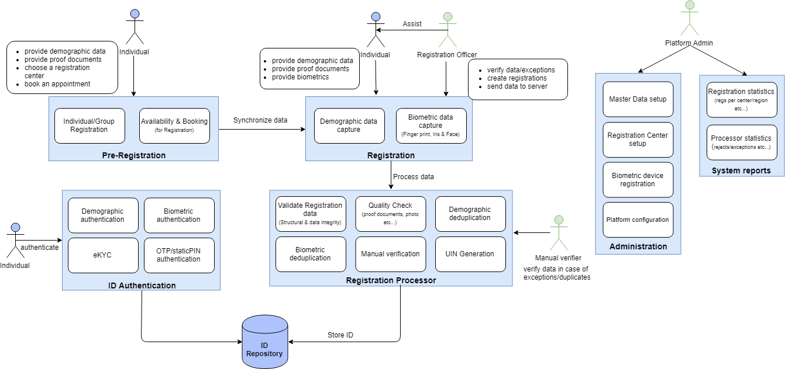

MOSIP acronym for Modular Open Source Identity Platform helps governments of countries to build a digital identity system. Using this, every Individual of a country can be given a Unique Identity Number (UIN). This helps in inclusivity and accessibility of all Individuals without disparity or discrimination.

MOSIP provides the following basic features 
* acquire an Individual's identity data
* process the identity data to establish uniqueness
* generate a Unique Identity Number
* verify/authenticate an Individual's identity where required to provide access to services (for example, providing 
  healthcare insurance to the poorest in the society; provide government subsidized food for the needy; include children 
  from the poorest and remote communities into the education system etc.)

The key objectives of the platform are to
* provide the basic framework to create a fully functional identity system
* provide the flexibility for a country to choose the features from the basic framework as per their requirements
* maintain privacy, security and confidentiality of an Individual's data
* provide a scalable and accessible solution to cater to a wide range of population (a few thousands to tens of millions)

# Functional View
MOSIP has the following modules

**Pre-Registration**
An application through which Individuals can pre-register, choose a Registration center, book an appointment for   registration. This helps to reduce registration time and optimize the process. MOSIP will provide the necessary back end services and a reference web application. The reference web application can be customized or modified as per the country's requirements. A country can also build a new web/mobile application on top of the back end services that MOSIP provides.

**Registration**
A client application to capture demographic and biometric details of an Individual. This application is a thick client that runs on a desktop or laptop in offline/online mode. This is a reference implementation which can be customized or modified to a country's requirements. A country can build a new client on top of the APIs provided by MOSIP. The APIs are in Java and runs on a JVM.

**Registration Processor**
Registration processor takes the data and processes it to establish uniqueness of an Individual and issue a UIN. MOSIP provides configurability of the process where a new processing stage can be added by a country to meet their requirements. For example, a country may want to import data from an existing system either to augment or validate data captured in MOSIP. MOSIP provides the flexibility to accommodate such features.

**ID Authentication**
Once a unique identity is established, the Individual can use his/her UIN to prove his/her identity for use in services provided by the government.

**Administration**
Since MOSIP is a platform, it provides the flexibility for countries to configure parameters to customize MOSIP as per their requirements. For example, Country A may choose a 12 digit UIN whereas Country B may choose 10 digit UIN. It is also possible that Country A chooses to capture Finger Print data only whereas Country B chooses to capture Finger Print and Iris data. Both these scenarios are possible by configuration.
Administration also provides basic data setup like geographic hierarchy of the country, Registration center setup etc...

**Reports**
MOSIP will provide basic system reports to get a view of the system performance. Some of the reports are
- Number of Registration per day (by Registration center, Region etc...)
- Number of rejects/accepts

