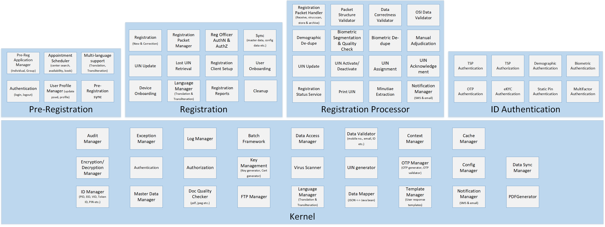

MOSIP is a modular and open source identity platform that helps user organizations such as Governments implement a digital, foundational ID in a cost effective way, while embracing the best practices of scalability, security and privacy harnessing the power of open source.

# Functional View

