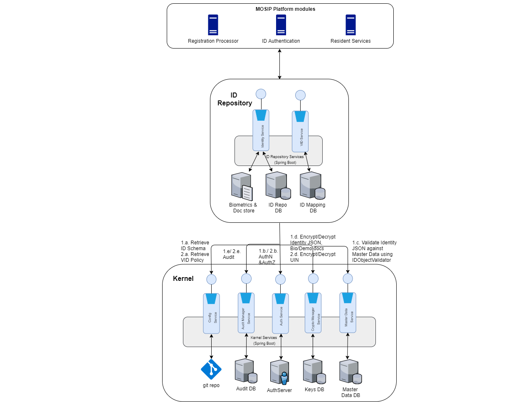

MOSIP ID Repository acts as a repository of Identity details of an Individual, and provides API based mechanism to store and retrieve Identity details by any other MOSIP modules.

Following are the pre-requisites for storing or retrieving Identity authentication of an individual
* ID Repository accepts ID JSON in the format as provided by the country in ID Schema
* ID JSON present in ID Repository APIs gets validated against IdObjectValidator 

## ID Repository Process flow
Please refer to the [**process flow**](TBD) of ID Repository

## Architecturally Significant Use Cases
### Ensure Identity is stored and retrieved in a secured and trusted way
ID Repository APIs must be accessed only by MOSIP modules internally, and must not be exposed outside. MOSIP should also ensure that Identity stored in ID Repository cryptographically encrypted to ensure that data is not seen by others, including UIN.

### Ensure captured biometrics data must be in a standard way
Biometrics stored or updated in ID Repository must conform to standards to ensure interoperability. Please refer to the [**link**](MOSIP-Biometric-Data-Specifications) for the standards.

### Ensure captured Identity must be in format defined in MOSIP ID Schema
MOSIP should ensure that Identity stored or updated in ID Repository follows format of ID Object defined for the country. Please refer [ID Object definition](MOSIP-ID-Object-definition) for details on the format.

### ID Repository APIs must have High Availability (HA) to ensure smooth service
MOSIP should ensure that ID Repository APIs are highly available so that it can serve storage and retrieval of Identity efficiently.

### ID Repository APIs must be scalable to cater to the growing population of a country
MOSIP should ensure that ID Repository APIs scales out based on the increase in the requests from internal modules due to growing population of a country.

### ID Repository APIs must be audited for reporting and fraud management checks
All ID Repository requests should be audited to help in producing analytical reports later.

## Logical View    
