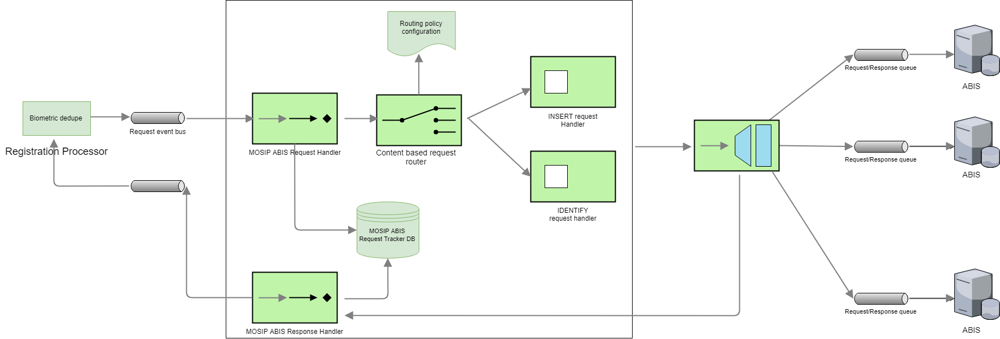

A country may use one or more ABIS's to de-duplicate biometric data. The reason for using multiple ABIS's could be
- Use one ABIS for fingerprint and another for Iris
- Use multiple ABIS's for the same biometric data and evaluate the best ABIS based on the de-duplication (However, MOSIP ABIS middleware will not have any logic to evaluate the best ABIS)

MOSIP ABIS middleware will have the following components
- MOSIP ABIS request handler 
- Request router (based on routing policy, an ABIS request is routed to the correct ABIS system)
- ABIS response handler
- ABIS performance evaluator

## MOSIP ABIS Middleware API's
MOSIP ABIS Middleware will support a MATCH interface. This interface accepts the biometrics data of an individual, inserts the data into 1 or more ABIS's based on the routing policy then issues an identify request to the ABIS's. Response from all the ABIS's is evaluated and a response is sent back to the requesting party.

### MATCH (A 1:n match of fingerprint or Iris data)

## ABIS performance evaluator <<TBD in v2 of MOSIP>>
This component will evaluate the performance of an ABIS over a period of time based on the responses received for MATCH request. 