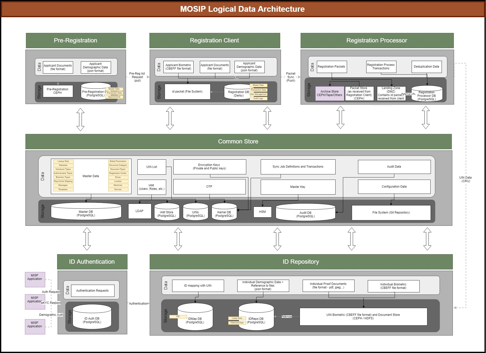

# Data Architecture Principles

* All personally identifiable information like name, age, gender, address etc and other sensitive information must be stored in an encrypted form
* All personally identifiable information must be signed and stored along with the encrypted data
* Documents and images must not be stored in a database table. They must be stored in a file system and referenced in DB.
* No business logic applied at database level other than Primary / Unique key, Not null and foreign keys. Foreign keys are applied within the same database, if a table is referenced in another database then no FK is applied
* Database specific features like triggers, DB functions like sequence generators etc must not be used in MOSIP. This avoids vendor lock-in
* Keys (surrogate keys) must be a random number and not be generated based on the record data. This improves privacy
* Direct queries on the database by a human must not be made. Database administrators must ensure this control during setup
* All DDL and DML statements must follow ANSI standards
* Database is setup in UTF-8*** file format to support multiple languages
* Only following datatypes are used
    - Character varying
    - Timestamp
    - Date
    - Integer
    - Number
    - Bytea/blob
    - Boolean

# Logical view of MOSIP data system

## Security

In MOSIP, the following roles are defined to perform various activities and have control over the DB objects that are defined

* **sysadmin:** sysadmin user/role is a super administrator role, who will have all the privileges to perform any task within the database. Currently all the objects are being owned by this user / role.
	
* **dbadmin:** dbadmin user / role is created to handle all the database administration activities db monitoring, performance tuning, backups, restore, replication setup, etc.
	
* **appadmin:** appadmin user / role is used to perform all the DDL (Data Definition Language) tasks. All the db objects that are created in these databases will be owned by appadmin user.
	
* **Application User:** Each application will have a user / role created to perform DML (Data Manipulation Language) tasks like CRUD operations (select, insert, update, delete). The user prereguser, is created to connect from the application to perform all the DML activities. Similarly, we will have masteruser, prereguser, reguser, idauser, idrepouser, idmapuser, kerneluser, audituser, regprcuser to perform DML tasks for master, pre-registration, registration, ida, ID repository, ID Map, kernel, audit and registration processor modules respectively.

**Note:** From the above set of roles only application user / role is specific to a application / module. The other user / roles are common which needs to be  created per postresql db instance / server.

Apart from the above, MOSIP will provide control over accessing data by various users based on the user access defined at zone level. This will implemented at application layer. 

## Multi-Language

MOSIP platform is being built for multiple countries, there is a need to support multiple languages. So as per the requirements, MOSIP will support 3 languages as configured by the country level administrator.
Multi language support is needed for the following datasets. 

* Master Data
* ID data of an individual
* Transaction comments
* Labels used in UI
* Messages and notifications

From database side, the data will support **UTF-8 Unicode character set** to store data entered in multiple languages. 
There will not be any in-built support to translate data at database level. Any translation or transliteration will be handled at API or UI layer.

## High Availability

TBD

## Auditability

TBD

## High Performance

To support high performance, following database design features are to be considered

* Database sharding is applied on uin dataset. By default, base sharding algorithm will be applied in MOSIP system. SI can define the sharding algorithm based on the deployment setup
* All tables will have a primary key index on the primary key field. This will help in faster retrievals and joins
* All foreign keys will have indexes defined so that it will help in faster joins
* No referential integrity is applied on tables across databases
* Partitioning: Partitioning design to be discussed as PostgreSQL has certain limitation / different way of implementation that requires specific database features to be applied. To be discussed further to finalize the implementation of this feature.

Below is the list of databases in MOSIP

|Sl No|Database Name|Description|
|---------|---------|------------|
|1|mosip_kernel|Kernel database maintains common / system configurations, data related to kernel services like sync process, OTP, etc.|
|2|mosip_master|All the master data that is defined and related to an organization is stored in this database. Including User management, authentication and authorization services related data is also be stored in this db|
|3|mosip_idrepo|ID repository database stores all the data related to an individual for which an UIN is generated|
|4|mosip_prereg|Pre-registration database to store the data that is captured as part of pre-registration process|
|5|mosip_reg|Registration client database to capture registration related data. The needed data from MOSIP system will be synched with this database.|
|6|mosip_regprc|The data related to Registration process flows and transaction will be maintained in this database. This database also maintains data that is needed to perform deduplication.|
|7|mosip_ida|ID Authentication related requests, transactions and mapping related data like virtual ids, tokens, etc. will be stored in this database|
|8|mosip_audit|Audit related logs and the data is stored in this database|
|9|mosip_iam|The user management related data of MOSIP application is stored in various storages, the database related users are stored in this database|
|10|mosip_idmap|Database to store and manage all the data related to mapping between various IDs, like vid with UIN of an individual|

# Data Model Naming Standards

[Naming Standards](Data-Model-Naming-Standards)

# Data Model

[Data Model](MOSIP-Data-Model)
