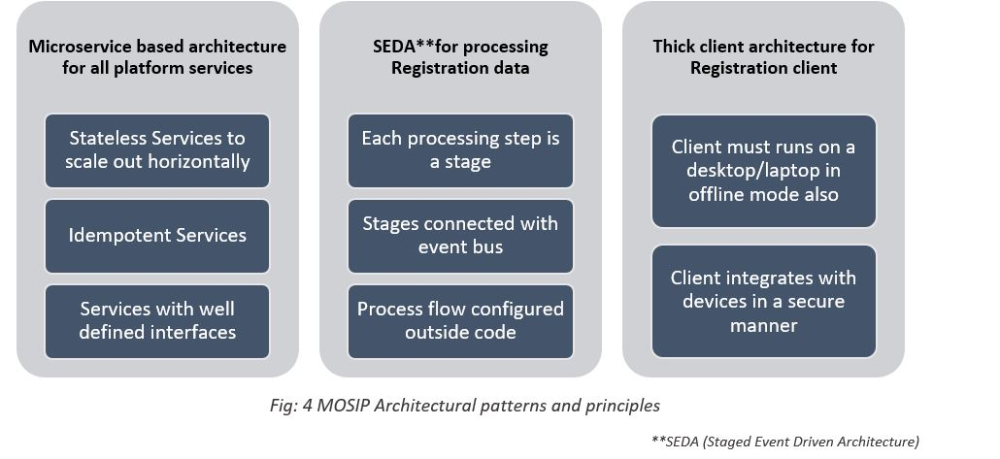

# 1. MOSIP-INTRODUCTION

## Scope

The scope of this document is to describe high level business objectives along with explicit functional requirements of MOSIP (Modular Open source Identity management platform) completely, accurately and unambiguously in Technology-independent manner. 

## Intended audience

### Internal audience

* Business owners of the proposed system. They must be able to verify that their business requirements have been documented here completely, accurately and unambiguously.

* Data Architects, Application Architects and Technical Architects would also find the information in this document useful when they need to design a solution that will address these business requirements.
 
### External Audience

* SIs (system integrator)

* Since the requirements are documented here in Technology-independent manner, the end-users of the system should be able to comprehend the requirements fairly easily from this document. 

# 2. MOSIP -FOR IDENTITY MANAGEMENT

## What-is an identity management system

To better understand and serve citizens, countries are placing increasing attention on establishing national identification systems .The ability to formally identify oneself has increasingly become integral to many aspects of civic participation and inclusion. Proponents argue that formalized identity management systems have the potential to establish strategic partnerships between the state and citizen’s .Failure to register populations and provide identity documents is believed to have detrimental effects for both the individual and the state.

The complexity of government administration in “the modern world” is a major problem in developing countries. Often, individual government programs have their own database of beneficiaries that are not digitized and therefore cannot be easily merged. Delivering public services efficiently and providing financial inclusion to the poor in partnership with the private sector depends on accurate identification and authentication of citizens and residents. Hence Government programs must have the capacity to cross-reference databases and information.

## Identity management systems in the digital era

Technological innovations have opened up new possibilities for governments to develop comprehensive identity management systems that link peoples’ identities through their entire life from birth certificate, civil registration, driver’s license, to marriage certificate, voter registration and national identity card. At the same time, governments in developing countries are expected to carry out many of the same functions that richer countries are capable of performing; these functions include providing universal access to healthcare and education, implementing know your customer (KYC) rules for financial institutions, and administering a wide variety of transfer programs.

As identification technology evolves, so do identification systems. It is estimated that as of 2012, over 1 billion people in developing countries have had their biometrics captured for one or more purposes. Incorporating biometric technologies in national identity systems is particularly useful for the growth of electronic government (e-government) as well as providing both public and private services. 

As compared to manual, paper-based registers, advanced electronic capture and storage of data are able to reduce costs and human error as well as increase administrative efficiency (World Bank, 2014).  Electronic and biometric identification systems also have the potential to link national identity to multiple functional applications (World Bank, 2015). With electronic identity programs, a wide range of services can be delivered on computers or mobile devices. Biometrics have also been used beyond authentication to secure identities in order to fulfill KYC requirements for opening bank accounts, to register and de-duplicate beneficiaries, to authenticate cash or in-kind transfers at the point of service, and to fulfill various other services such as health, voting and civil service reform (Gelb & Clark, 2013).
 
A World Bank report quoted several projections showing that the number of “digital government/citizen transactions worldwide will grow to about $67 billion by 2020” (World Bank, 2015). As a result of linkages between national ID programs and financial services, these programs are also believe to have the potential to promote financial inclusion.

## Why-an identity management system is needed

A well-established identity management system can help countries to verify their people’s identity by issuing unique identity number which one can use to go into any institution and be readily accepted. The following are some key reasons why a country needs as Identity management system

## Setting the stage for MOSIP. (How MOSIP as a product\platform wants to position itself)

MOSIP (Modular Open Source Identity Platform) helps governmen
ts of countries to build a digital identity system. Using this, every Individual of a country can be given a Unique Identity Number (UIN). This helps in inclusivity and accessibility of all Individuals without disparity or discrimination.

Fig: 1 MOSIP basic features

Fig: 2 Key objectives of the platform

# 3. MOSIP FUNCTIONAL OVERVIEW

[Please Refer wiki](https://github.com/mosip/mosip/wiki)

Fig 3: [MOSIP functional overview](https://raw.githubusercontent.com/wiki/mosip/mosip/_images/arch_diagrams/MOSIP_functional_view.png?token=ArzdLTDTLDsn5CWFkrfbMGV4DOWTXPOTks5cPC5nwA%3D%3D)

# 4.MOSIP Technical overview

## MOSIP-SYSTEM ARCHITECTURE-PATTERNS AND PRINCIPLES

MOSIP adopts the following Architectural patterns & principles to achieve modularity, better maintainability, scalability and extensibility.
[Please refer wiki](https://github.com/mosip/mosip/wiki/Logical-Architecture) for more details

Fig: 4 MOSIP Architectural patterns and principles

Fig 5: [MOSIP Thick client architecture](https://raw.githubusercontent.com/wiki/mosip/mosip/_images/arch_diagrams/MOSIP_logical_architecture_v0.1.png?token=ArzdLc8QifbbbyMdB7ODebKgCDl33ajNks5cPC-LwA%3D%3D)

## MOSIP Configuration and Launcher

[Please Refer wiki](https://github.com/mosip/mosip/wiki/MOSIP-configuration-&-launcher)

# 5.MOSIP PLATFORM FEATURES

## MOSIP ID Object Definition
[Please Refer wiki](https://github.com/mosip/mosip/wiki/MOSIP-ID-Object-definition)

## Key Design Considerations

This sections lists out some of the Key design considerations for MOSIP

[Please refer wiki](https://github.com/mosip/mosip/wiki/Logical-Architecture)

## Multi-modal Automated Biometric Identification System (ABIS) Interface

### [Know more about ABIS interface](https://github.com/mosip/mosip/wiki/MOSIP-ABIS-Middleware) 

### [MOSIP-ABIS middleware ](https://github.com/mosip/mosip/wiki/MOSIP-ABIS-Middleware)

## Biometric Standards for inter-operability
### [MOSIP biometric data standards](https://github.com/mosip/mosip/wiki/MOSIP-Biometric-Data-Specifications) 

## Device specifications

### [Vendor Device Specifications](https://github.com/mosip/mosip/wiki/MOSIP-VDM-Specifications)

# 6.MOSIP FUNCTIONAL AND NON FUNCTIONAL REQUIREMENT SPECIFICATIONS

## FUNCTIONAL REQUIREMENT SPECIFICATIONS

## NON FUNCTIONAL REQUIREMENT SPECIFICATIONS

# 7.SECURITY

## MOSIP Security standards and principles

Multiple aspects of security like confidentiality, privacy, integrity of data are key in ensuring an Individual's identity is not compromised. Below are the security design principles MOSIP follows

* Direct access to data stored in database is discouraged. Data can only be accessed via API's
* An Individual's Identity data at is always encrypted to ensure confidentiality of data
* Access controls is implemented on all API's to ensure data privacy  and who can see what

[Please refer wiki](https://github.com/mosip/mosip/wiki/Security) for more details.

## Database encryption

[Data encryption flow](https://raw.githubusercontent.com/wiki/mosip/mosip/_images/arch_diagrams/DB_encryption.png?token=ArzdLejO2ylFZXOx0RCrKjGeV0TBtsPKks5cPDLnwA%3D%3D)

## Key management, Data Encryption & Decryption

[Data encryption and decryption flow](https://raw.githubusercontent.com/wiki/mosip/mosip/_images/arch_diagrams/encryption.png?token=ArzdLTtM-3lDHfRe6jimBELKqUrXpwJuks5cPDPZwA%3D%3D)

## Authentication & Authorization (TBD)

[ID authentication flow](https://raw.githubusercontent.com/wiki/mosip/mosip/_images/arch_diagrams/AuthN%26AuthZ.png?token=ArzdLSbnBwNZ4GqWT2K64Jlz_GmKtlsnks5cPDP8wA%3D%3D)

# 8.MOSIP-PRE-REGISTRATION

[Please refer wiki](https://github.com/mosip/mosip/wiki/Pre-Registration)

# 9.MOSIP RESIDENT SERVICES

# 10.MOSIP-REGISTRATION CLIENT

[Please refer wiki](https://github.com/mosip/mosip/wiki/Registration-Client)

# 11.MOSIP –REGISTRATION PROCESSOR

[Please refer wiki](https://github.com/mosip/mosip/wiki/Registration-Processor)

# 12.MOSIP-AUTHENTICATION

[Please refer wiki](https://github.com/mosip/mosip/wiki/ID-Authentication)

# 13.APIs-THE CRUX OF MOSIP

## External APIs
This sections details out the external APIs of MOSIP that interact with external entities.

### ID Authentication APIs

Format: JSON

This section details the REST services exposed by ID Authentication. 
[Please refer wiki](https://github.com/mosip/mosip/wiki/ID-Authentication)
This service details Auth Request to be used by TSPs to authenticate an Individual. Below are various authentication types supported by this service:

* OTP based - TOTP
* Pin based - Static Pin
* Demo based - PersonalIdentity, Address, FullAddress
* Bio based - Fingerprint, IRIS and Face

### ABIS APIs

Format: JSON

An ABIS system that integrates with MOSIP should support the operations listed in this section [Refer wiki](https://github.com/mosip/mosip/wiki/ABIS-APIs). 
All ABIS operations are via a message queue & asynchronous and should adhere to the Common parameters as identified.

This service details the behavior of:
* Insert Request
* Identify Request
* Delete Request
* Ping Request
* Pending Jobs Request
* Reference Count Request

### OTP Manager API

Format: JSON

OTP manager includes APIs for
 
* OTP generation 
* OTP validation
[Please refer wiki](https://github.com/mosip/mosip/wiki/OTP-Manager)

### Pre-Registration APIs

Format: JSON

This section [Refer wiki](https://github.com/mosip/mosip/wiki/Pre-Registration-APIs) details about the service APIs in the Pre-Registration modules

### Registration Processor APIs

Format: JSON

This API will support the following features
* APIs for receiving packets
* APIs for packet registration status
* APIs for Manual Verification 
[Refer wiki for more details](https://github.com/mosip/mosip/wiki/Registration-Processor-APIs)

## Internal APIs
This refers to APIs consumed by internal modules.Listed below are a few MOSIP internal APIs

### Kernel
* APIs for key management
* APIs for master data management
* APIs for configuration management
* APIs for Audit and Log management

### ID Repository

This is a central API which all other modules of MOSIP will use to retrieve an ID record.
This API will support the following features

* Creation of a ID record
* Lookup of an ID record based on the UIN
* Updation of an ID record based on the UIN
* Will not support search based on attributes of an ID

# 14.MOSIP Tool KIT

## 14.1.DEPLOYMENT GUIDE
## 14.2.PRODUCT DEMO
## 14.3.SET UP GUIDE

# 15.SUMMARY(WIP) 

The growing complexities on the government administrative process and need for social inclusion calls for an identity management system. Identity management system provide a unique identity to individuals. Recent advancements in technology has enable identity management systems to incorporate biometric data.MOSIP is a highly configurable, extensible and secure platform for identity management.

# 16.APPENDICES
# 17.REFERENCES

* International Journal of Innovative Research in Engineering & Management (IJIREM) ISSN: 2350-0557, Volume-3, Issue-1, January-2016

* ITU-T Focus Group Digital Financial Services, Review of National Identity Programs

# Comments and Revision logs
1) [RC] ID Object Definition Schema-**covered under platform features**
- Recommend inclusion of this section
- Refer WiKi for content - https://github.com/mosip/mosip/wiki/MOSIP-ID-Object-definition

2) [RC] MOSIP Configuration and Launcher-**Covered under MOSIP technical overview**
- Recommend inclusion of this section (Includes Platform Config and Config Server related content)
- Refer WiKi for content - https://github.com/mosip/mosip/wiki/MOSIP-configuration-&-launcher

3) [RC] Section 12 - API Specs:**Updated API list**
- Except for below, rest of the APIs are external:
- Kernel, ID Repository and Master Data APIs
- Refer WiKi for API content and API format: https://github.com/mosip/mosip/wiki/Kernel-APIs 

4) [RC] MOSIP Biometrics Data Specifications (Registration Client and ID-Authentication)**Covered under platform features** In the PDF version of PRD its provided as annexure
- Include a sub-section for "MOSIP Biometrics Data Specifications" or include a separate section by itself
- Refer WiKi for content - https://github.com/mosip/mosip/wiki/MOSIP-Biometric-Data-Specifications

5) [RC] VDM Specs-**TBD**
- Include a section and refer WiKi for content - https://github.com/mosip/mosip/wiki/MOSIP-VDM-Specifications

6) [RC] ABIS Middleware and ABIS Interface **Spec Covered under platform features** In the PDF version of PRD its provided as annexure
- Include sections for the same and refer WiKi for content
- https://github.com/mosip/mosip/wiki/MOSIP-ABIS-Middleware
- https://github.com/mosip/mosip/wiki/Automated-Biometric-Identification-System-(ABIS)-Interface
