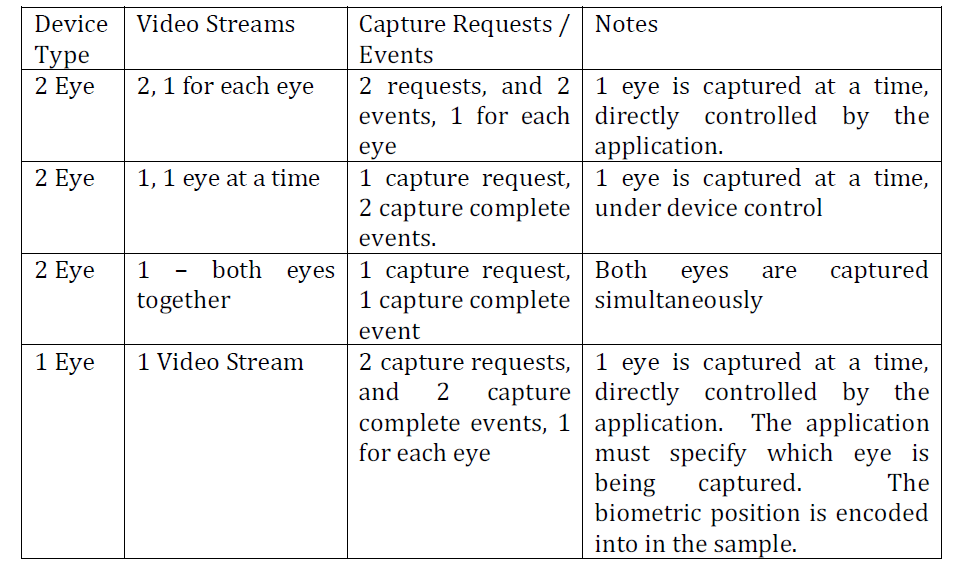
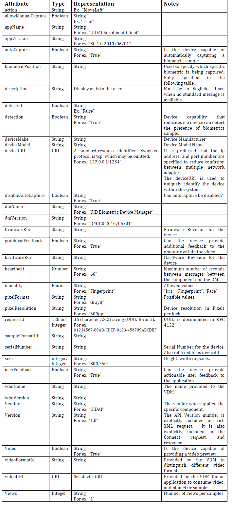
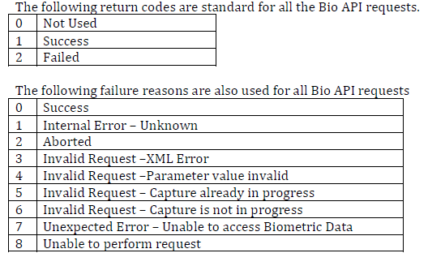

# **Vendor Device Manager - Specification**

This document provides the detail of VDM technical specification to be adhere by the vendor to adopt their devices to the MOSIP platform 
to capture the biometric data and manipulate on the same. 


* Following points has been considered while designing the VDM spec:
   - Vendor should follow this MOSIP specification standards and provide the device along with the VDM service to integrate from application.
   - Any changes in the device state should notify the application.
   - VDM upgrade or new vendor devices added shouldn't impact the application code. 
   - VDM should be provided along with the GUI to register and manage the running devices port .
   - Any security related to the device can be implemented at single stage rather doing at application end.
   - VDM should have capabilities to integrate with multiple devices like : Finger Print, IRIS and Face Reader. 
   - No vendor specific code will be written inside the application.
   - All communication should happen through TCP/IP sockets to isolate the application from devices.
   - The software from each vendor will be executed as separate process and that won't impact the application.
   - VDM should be accessible from different platform and environment (Java, .Net).
   - The communication between the services should happen by exchanging XML messages.
   
* VDM - The Vendor Device Manager, provided by the device vendor, which manages the device, 
  and allows for biometric data capture.   
* DM  - The vendor independent Device Manager, which orchestrates the discovery, of the VDMs by the application, 
  and manages connectivity to the VDM.
* Application - The Application that needs to use the biometric devices for capture. 

### Vendor Device Manager - VDM
   The **vendor must provide this** as installer (and Uninstaller) to install and configure the VDM specific 
   to the requirement. During initial setup the required configuration to be completed using the respective GUI. 
   
   - The DM port should be configured during initial setup of VDM.
   - Once the VDM has been started then communicate with the DM through TCP socket and port 
     and register the VDM listening port.
   - VDM uses the DM Connect api to check the connectivity.
   - If VDM failed to connect to a particular port of DM then admin can modify the port using the respective GUI.
   - If VDM success to connect then continue with the Device Arrival api.
   
   The communication with the VDM happens through the TCP socket and port from application. 
   The VDM should listen to a particular port to send and receive the command from application. 
   There is a separate socket should be opened to receive the Video streams and Biometric samples. 

   It provides following functionality, which will be triggered from the application based on the user actions.  
   1. Subscribe 
   2. Un-subscribe 
   3. Start Capture 
   4. Stop Capture 
   5. Force Capture 
   6. Get Frame 
   7. Get Sample 

   The following notifications are provided by the VDM to the application when the respective operations are completed. 
   1. Capture Complete 
   2. Detection 
   3. User Actionable Feedback 

   There is an additional configuration utility expected to provided by the vendor to provide GUI 
   that will help the users to manage the device with the following operations:
   1. Configuration, including port number override
   2. Device Self Test
   3. Device Reset / Reinitialization
   4. Device Calibration
   5. Device Startup
   6. Device Shutdown
   
   **VDM process**
   1. VDM senses that a device under it's control is connected to the system. 
   2. VDM creates a Device Arrival / Removal event and sends it to the DM through socket and port. 
   3. The event contains information about the device, and it's capabilities. 
   4. It also accepts the request from application through the port and communicate with the device through the respective driver. 
   5. Send response back to the application based on the request. 
   
### Device Manager - DM
   
   The **DM provided by MOSIP** is responsible for managing the list of all connected applications, VDMs, and 
   devices. Whenever a device arrives, it must register with the DM, and continue to send 
   a heartbeat event at regular intervals. Failure to send the heartbeat is treated as a 
   removal event. The DM sends a list of all connected devices to the application after the 
   initial connection, by forwarding stored Arrival events. 

   Multiple devices can be communicate with the DM and register with the respective available port for communication. 

   - The DM service should Listen on a particular range of port to receive the device arrival and removal events from the VDM. 
   - In case the provided ports are busy or occupied by some other service then should provide facility for an admin to modify the same.
   - It Maintain the list of the all the supported biometric devices available for the applications. 
   - It also Notify the applications about arrival and removal of the supported devices (Plug and Play - PNP). 

   The DM service will be provided by the MOSIP. The DM responds to the following requests: 
   1. Connect        - VDM and application uses this api to initiate communication with DM. 
   2. Device Arrival - VDM uses this api to inform the DM whenever the PNP device connected. 
   3. Device Removal - VDM uses this api to inform the DM whenever the PNP device disconnected.
   4. Ping           - This is used as a heartbeat event, to notify the DM that a VDM, is still alive.  
   
   The DM provides applications with the following events.
   1. Device Arrival 
   2. Device Removal 


The DM listens on a TCP/IP port (specified later in this document). Applications and the 
VDMs must connect to this port once, and communicate over this open connection. 

### Application  

   When the application needs to work with the device, it opens the socket to the location
pointed by the deviceURI in the Arrival event from the Device Manager. Only one application can open the device. The 
device should reject the connections on the deviceURI, until the socket is closed. 


### API Usage Workflows and Examples 

This section will guide the user to understand about the Device discovery and bio-metric capturing workflow 
process using the API methods.

**Service(s) Startup Sequence :**

   When DM and VDM Startup: 
   	

   
   When application Startup:  
   	 It is similar to VDM startup except the strategy of handling failure case.

**Device Management (Arrival and Removal):**

    1. When the VDM senses that a device under it's control is connected to the system, it 
       creates a Device Arrival event and sends it to the DM
    2. The DM must acknowledge the receipt of this event, forward it to all applications, and 
       maintain a copy of this event (for all applications that may connect in the future). 
    3. Application further uses this port number to communicate with the VDM service. 
    4. VDM further communicates with the Device through the respective driver.    


    
   **Sequence of process**
 [**wrong - to be updated**]

	
**Bio-Metric Capture Sequence:**
[TBD]


### API Methods 

There will be two types of API methods: commands and notification events. The
command API methods are initiated by the Application, while the event API methods are
initiated by the Biometric Capture Device.

   - This specifies the request and response messages that are exchanged between
   the Application, DM and VDM. All messages are in XML.
   - All requests and responses carry a requestId, which is a numeric value (128 bit),
   represented as a 36 character UUID format string in XML. Since the API is asynchronous, 
   the requestId is used to connect requests with the appropriate response.
   - The VDM, DM and Application must not use requestId outside the scope of a request,
   since this could be recycled.

  Video stream from the Biometric Capture Device will be delivered using the binary
protocol over a separate channel. The final captured biometric samples will also be
delivered using the binary protocol through a separate channel. The request and
response messages for both video stream and biometric samples will be encoded using
ASN1 BER. See http://en.wikipedia.org/wiki/Asn1

**API Version Number :**

The version number for the current API is 1.0. The version number is included in every
API message.

**Connect :**
    On establishing connection with the DM, the application, and VDMs must ensure that
they are connecting with a DM, and exchange certain configuration information. 

    From: Application, VDM
    To: DM
    When: At required time can establish connection with DM.
    
```
<DeviceManagerEventRequest requestId="" version="">
	<Connect apiVersion="">
		<VDM vendor="" vdmName="" vdmVersion=""/>
		<APP vendor="" appName="" appVersion=""/>
	</Connect>
</DeviceManagerEventRequest>

<DeviceManagerEventResponse requestId="">
	<Return value=""/>
	<ConnectResponse apiVersion="" vendor="" dmName=""
	dmVersion="" heartBeat=""/>
</DeviceManagerEventResponse>
```
In addition to exchanging the names of the vendors, version numbers of the API, and the
software, the DM responds with a heartbeat value, which is the maximum requested
time between pings (specified in seconds). Applications must provide a <APP> element,
while VDMs must provide a <VDM> element.

**Ping :**
This is used as a heartbeat event, to notify the DM that a VDM, is still alive. 

   From: VDM 
   To: DM 
   When: To notify DM that a VDM is still alive. 
   
```
<DeviceManagerEventRequest requestId="">
	<Ping vdmName=""/>
</DeviceManagerEventRequest>
<DeviceManagerEventResponse requestId="">
	<Return value="" failureReason=""/>
</DeviceManagerEventResponse>
```
The only failure condition is if the device was previously removed, or never registered.

**Device Arrival :**

   The Device Arrival event should be sent from VDM to DM after the device component starts listening for 
the connections on the socket addressed by the deviceURI. 

    From: VDM.
    To: DM.
    When: The event notifies the DM, and that in turn forwards it to the application about a device arrival.

```
<DeviceManagerEventRequest requestId="">
	<Arrival vdmName="" deviceURI="" modality="Fingerprint Slap "
		deviceMake="Manufacturer Name " deviceModel="DEVICE MODEL NAME /
		IDENTIFIER " hardwareRev="1.0.0" firmwareRev="1.0.1"
		serialNumber="ABC1234567">
		<Capabilities detection="True" video="True"
			autoCapture="True" disableAutoCapture="True" userFeedback="True"
			graphicalFeedback="False">
			<VideoFormats>
				<VideoFormat videoFormatId="1" modality="Fingerprint
					Slap ">
					<FrameType biometricPosition="Any" size="800,750"
						pixelFormat="Gray8" pixelResolution="250ppi" />
				</VideoFormat>
			</VideoFormats>
			<SampleFormats>
				<SampleFormat formatId="1" format="ISO IEC 1 views="1"
					size="1600,1500" pixelResolution="500ppi" />
			</SampleFormats>
		</Capabilities>
	</Arrival>
</DeviceManagerEventRequest>
```
```
<DeviceManagerEventResponse requestId="">
	<Return value="1" failureReason="0" />
</DeviceManagerEventResponse>
```
   
**Device Removal :**

The event notifies the device manager, and the application about a device removal. The
VDM originates this event, and sends it to the DM, which in turn forwards it to the
Application. 

    From: VDM service.
    To: DM service.
    When: Event notification to the DM when the devices is disconnected.

```
<DeviceManagerEventRequest requestId="">
	<Removal deviceURI="" />
</DeviceManagerEventRequest>

<DeviceManagerEventResponse requestId="">
	<Return value="" failureReason="0"/>
</DeviceManagerEventResponse>
```
The device component of the removed device should be listening on the deviceURI until
the response is received. After the response is received it can close all sockets of this
device that not closed already by the application.

**Subscribe :**

Change the subscription to the device events: uses by the application to subscribe or
unsubscribe to the specific categories of the device events. Some events will be fired
only when capture is in progress.

    From: Application.
    To: VDM.
    When: Subscription to the device event.

```
<DeviceCommandRequest requestId="">
	<Subscribe>
		<Event eventCategory="Detection" />
		<Event eventCategory="UserFeedback" />
	</Subscribe>
</DeviceCommandRequest>

<DeviceCommandResponse requestId="">
	<Return value="1" failureReason="0" />
	<State detected="False" />
</DeviceCommandResponse>
```

**Expected behaviour:** change the list of subscribed events to the list in this command
request. The events to which the device was previously subscribed can be sent by the
RC1 MOSIP Biometric Capture Device API device until the response is sent. Any new events can only be fired after the response is
sent. If the command is subscribing for the notification to the change of state the
response should include the corresponding state at a time of response.
The following EventCategories are supported.

eventCategory Events Expected Notes
Detection Detection
UserFeedback UserFeedback


**Start Capture :**
Starts the capture process, also subscribes to Capture Complete and optionally User
Feedback events.

```
<DeviceCommandRequest requestId="">
	<StartCapture biometricPosition="Right Thumb "
		allowManualCapture="True" [ videoFormatId="1"] sampleFormatId="1">
		[
			<MissingBiometrics>
				<MissingBiometric biometricPosition="Left Middle " />
			<MissingBiometrics>
		]
	</StartCapture>
</DeviceCommandRequest>
<DeviceCommandResponse requestId="">
	<Return value="" failureReason="" />
	[
		<Video videoURI="" />
	]
</DeviceCommandResponse>
```
**Expected behaviour:** starts the capture process. Any capture related event can be sent
only after the response to the start capture event. MissingBiometrics is optional.
Attribute sampleFormatId is indicating the requested output sample format. Optional
attribute videoFormatId is indicating that the video stream is requested, and the desired
video format referred by videoFormatId in the Device Arrival VDM event in Capabilities/videoFormats/videoFormat.

**Force Capture :**
Forces manual capture. Should not be issued when the capture is not started. 

```
<DeviceCommandRequest requestId="">
	<ForceCapture/>
</DeviceCommandRequest>
<DeviceCommandResponse requestId="">
	<Return value="1" failureReason="0"/>
</DeviceCommandResponse>
```
Expected behaviour: force manual capture, whether the automatic capture is on or off.
The capture complete event is sent right after the response to this event. If the capture 
complete event comes before the response, it means the event resulted from the
automatic capture.

**Stop Capture :**
Stops capture process. No capture complete event should come after the response to Stop Capture. 

   From: application
   To: VDM
   When: To stop the current capture process.

```
<DeviceCommandRequest requestId="">
	<StopCapture/>
</DeviceCommandRequest>
<DeviceCommandResponse requestId="">
	<Return value="1" failureReason="0"/>
</DeviceCommandResponse>
```

**Capture Complete :**
   The event should be sent upon successful completion of the capture. The biometric 
   sample should be available until the response is received: as a result the device may 
   have to maintain multiple samples and make them available at the different URIs. 

   From:  VDM.
   To: Application.
   when: When capture event completed at VDM, it sends this request to application.
   
```
<DeviceEventRequest requestId="">
	<CaptureComplete sampleURI="" />
</DeviceCommandRequest>

<DeviceEventResponse requestId="">
	<Return value="" failureReason="" />
</DeviceCommandResponse>
```

Samples must be provided in the format indicated by _sampleFormatId_ in the Start
Capture request.

**Detection :**
Notifies of the change of the state whether the biometric is detected by the device 
(for example if the finger is placed or removed from the reader). 

   From:  VDM.
   To: Application.
   when: Detects the device state changes.

Usage example: the application needs to capture one finger, followed by the other. The
application issues capture request, which completes. The now application needs to wait
for the finger removed event before issuing the next capture request, to make sure that
the same finger is not captured again immediately.

```
<DeviceCommandRequest requestId="">
	<Detection detected="True" />
</DeviceCommandRequest>
<DeviceCommandResponse requestId="">
	<Return value="" failureReason="" />
</DeviceCommandResponse>
```

**User Feedback :** 
   From: .
   To: Application.
   when: Detects the device state changes.
   

```
<DeviceCommandRequest requestId="">
	<UserFeedback>
		<Message biometricPosition="Right Thumb " action="Other"
			description="Display this " />
		<!-- biometricPosition and description are optional -->
	</UserFeedback>
</DeviceCommandRequest>

<DeviceCommandResponse requestId="">
	<Return value="" failureReason="" />
</DeviceCommandResponse>
```

### Biometric Device Video Streaming and Sample API Methods

The Video Stream will be retrieved using the binary protocol for sending video frames
(with the actual image data represented in ISO 19794-x) over the socket referenced by
videoURI using the pull model. The application will maintain pending Get Frame
requests for all the time that it can keep-up with the visualization.
The sample will be retrieved over the socket referenced by sampleURI, with the actual
image data represented in ISO 19794-x.
The requests and the responses are represented in ASN1 BER encoding. The rationale
in choosing BER encoding is to transfer the binary data in the self-descriptive extensible
data format with the reasonably low overhead.

**Get Frame :**
```
	RequestMessage ::= SEQUENCE {
		messageType MessageType ::= Request,
		requestCode RequestCode ::= GetFrame,
		requestId OCTET STRING
	}
	ResponseMessage ::= SEQUENCE {
		messageType MessageType ::= Response,
		requestId OCTET STRING,
		return Return,
		biometricSample BiometricSample OPTIONAL
	}
```

**Get Sample :**
```
	RequestMessage ::= SEQUENCE {
		messageType MessageType ::= Request,
		requestCode RequestCode ::= GetSample,
		requestId OCTET STRING
	}
	ResponseMessage ::= SEQUENCE {
		messageType MessageType ::= Response,
		requestId OCTET STRING,
		return Return,
		biometricSample BiometricSample
		OPTIONAL
	}
```


### Notes and Clarrification 

**Biometric Device Video Streaming and Sample API Methods**

**Supporting IRIS Cameras :**


**Device Arrival - IRIS Device :**
    The application needs to distinguish between the two types of the devices before 
opening the device, to choose which device to open and to show the appropriate UI. 
This information is provided in the Device Arrival event from the VDM. 

    From: VDM.
    To: DM.
    When: IRIS device connected to the VDM.

    1. Iris device showing video of the portion of the face 
    2. Iris device showing two videos of the two eyes 

1. Iris device showing video of the portion of the face 
```
<DeviceManagerEventRequest requestId="999">
	<Arrival deviceURI="localhost:1234" modality="Two Iris "
		deviceMake="LG" deviceModel="iCAM TD100 " hardwareRev="1.0.0"
		firmwareRev="1.0.1" serialNumber="ABC1234567">
		<Capabilities detection="True" video="True"
			autoCapture="True" disableAutoCapture="True" userFeedback="True"
			graphicalFeedback="True">
			<VideoFormats>
				<VideoFormat videoFormatId="1" modality="Face Partial ">
					<FrameType size="640,240" pixelFormat="RGB32"
						pixelResolution="Unspecified" />
				</VideoFormat>
			</VideoFormats>
			<SampleFormats>
				<SampleFormat sampleFormatId="1" format="ISO IEC 1
					views="2" size="480,480" pixelResolution="500ppi" />
			</SampleFormats>
		</Capabilities>
	</Arrival>
</DeviceManagerEventRequest>
```

2. Iris device showing two videos of the two eyes 
```
<DeviceManagerEventRequest requestId="999">
	<Arrival deviceURI="localhost:1234" modality="Two Iris "
		deviceMake="Manufacturer Name " deviceModel="I SCAN 2
		hardwareRev="1.0.0" firmwareRev="1.0.1" serialNumber="ABC1234567">
		<Capabilities detection="True" video="True"
			autoCapture="True" disableAutoCapture="True" userFeedback="True"
			graphicalFeedback="False">
			<VideoFormats>
				<VideoFormat videoFormatId="1" modality="Two Iris ">
					<FrameType biometricPosition="Left Eye " size="240,240"
						pixelFormat="Gray8" pixelResolution="250ppi" />
					<FrameType biometricPosition="Right Eye " size="240,240"
						pixelFormat="Gray8" pixelResolution="250ppi" />
				</VideoFormat>
			</VideoFormats>
			<SampleFormats>
				<SampleFormat sampleFormatId="1" format="ISO IEC 1
					views="2" size="480,480" pixelResolution="500ppi" />
			</SampleFormats>
		</Capabilities>
	</Arrival>
</DeviceManagerEventRequest> 
```

### Data Types and Representation 
The following table documents the various attributes specified in the XML, their data
types, and representation.



### Return Codes 


### Biometric Modality Enumeration 
The following strings are used to enumerate the Biometric Modalities in this API. 
   • Face 
   • Iris 
   • Two Iris 
   • FingerPrint 
   • Fingerprint Slap 

### Biometric Position Enumeration 
The following strings will be used for biometricPosition in the XML requests, events and responses.
   • Unknown 
   • Right Thumb 
   • Right Index 
   • Right Middle 
   • Right Ring 
   • Right Little 
   • Left Thumb 
   • Left Index 
   • Left Middle 
   • Left Ring 
   • Left Little 
   • Right Slap 
   • Left Slap 
   • Both Thumbs 
   • Left Iris 
   • Right Iris 
   • Both Iris 
   • Face 

### SampleFormat Enumeration

The following sampleFormats are supported.
• ISO IEC 19794-4 2005
• ISO IEC 19794-5 2005
• ISO IEC 19794-6 2005

### Actionable User Feedback


### Security Considerations 
   The MOSIP platform should have ability to validate that the data received at the client application is 
   indeed the same data captured by the device. The device should be able to sign the data using specific key 
   before transmitting to the client. The same data should be validated at application end using another key. 
   If not valid then it will be rejected. However this is not currently mandatory. It will be implemented by 
   the MOSIP at later.
	
   Whenever the security feature is implemented, the required changes will be taken care at API end. 


