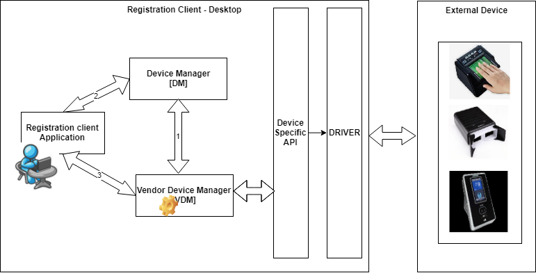
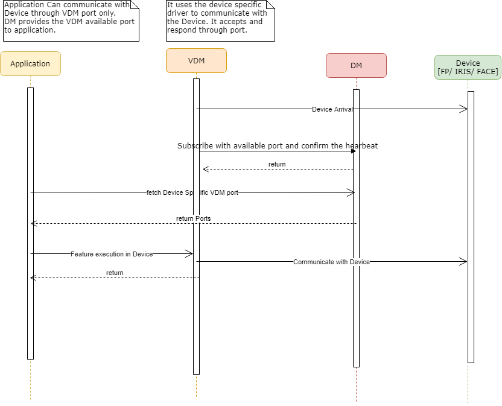

# **Vendor Device Manager - Specification**

This document provides the detail of VDM spec to be adhere by the vendor to adopt their devices to the MOSIP platform 
to capture the biometric data and manipulate on the same. 

* Following points has been considered while designing the VDM spec:
   - Vendor should follow this spec and create the device specific VDM service to integrate with the application.
   - Device specific code and integration with device should be available with in this scope.
   - Any security related to the device can be implemented at single stage rather doing at application end.
   - VDM upgrade or SDK upgrade shouldn't impact the application code. 
   - VDM should be provided along with the GUI to register and manage the running devices port .
   - VDM should have capabilities to integrate with multiple devices like : Finger Print, IRIS and Face Reader. 
   

* VDM - The Vendor Device Manager, provided by the device vendor, which manages the device, and allows for biometric data capture.   
* DM  - The vendor independent Device Manager, which orchestrates the discovery, of the VDMs by the application, and manages connectivity to the VDM.
* Application - The Application that needs to use the biometric devices for capture. 

### Vendor Device Manager 
   The vendor must provide this as installer (and Uninstaller) to install and configure the VDM specific to the requirement. During initial
   setup the required configuration to be completed using the respective GUI. The DM port should be configured during initial setup.
   
   Once the VDM has been started then communicate with the DM through socket **TBD** and register the VDM listening port.
   
   The communication with the VDM happens through the socket **TBD** from application. The VDM should listen to a particular port to send and 
   receive the command from application. There is a separate socket should be opened to receive the Video streams and Biometric samples. 
      
   It provides following functionality, which will be triggered from the application based on the user actions. 
   1. Subscribe 
   2. Un-subscribe 
   3. Start Capture 
   4. Stop Capture 
   5. Force Capture 
   6. Get Frame 
   7. Get Sample 

   The following notifications are provided by the VDM to the application when the respective operations are completed. 
   1. Capture Complete 
   2. Detection 
   3. User Actionable Feedback 

   There is an additional configuration utility expected to provided by the vendor to provide GUI 
   that will help the users to manage the device with the following operations:
   1. Configuration, including port number override
   2. Device Self Test
   3. Device Reset / Reinitialization
   4. Device Calibration
   5. Device Startup
   6. Device Shutdown
   
   **Sequence of process**
   1. VDM senses that a device under it’s control is connected to the system. 
   2. VDM creates a Device Arrival event and sends it to the DM through socket and port. 
   3. The event contains information about the device, and it’s capabilities. 
   4. It accepts the request from application through the port and communicate with the device through the respective driver. 
   5. Send response back to the application based on the request. 
   
### Device Manager 
   
   The DM is responsible for managing the list of all connected applications, VDMs, and 
   devices. Whenever a device arrives, it must register with the DM, and continue to send 
   a heartbeat event at regular intervals. Failure to send the heartbeat is treated as a 
   removal event. The DM sends a list of all connected devices to the application after the 
   initial connection, by forwarding stored Arrival events. 

   Multiple devices can be communicate with the DM and register with the respective available port for communication. 

   The DM service will be provided by the MOSIP. The DM responds to the following requests: 
   1. Connect        - VDM and application uses this api to initiate communication with DM. 
   2. Device Arrival - VDM uses this api to inform the DM when the device connected. 
   3. Device Removal - VDM uses this api to inform the DM when the device disconnected.
   4. Ping           - This is used as a heartbeat event, to notify the DM that a VDM, is still alive.  
   
   The DM provides applications with the following events.
   1. Device Arrival 
   2. Device Removal 

The DM listens on a TCP/IP port (specified later in this document). Applications and the 
VDMs must connect to this port once, and communicate over this open connection. 

### Device Management 

    1. When the VDM senses that a device under it’s control is connected to the system, it 
       creates a Device Arrival event and sends it to the DM
    2. The DM must acknowledge the receipt of this event, forward it to all applications, and 
       maintain a copy of this event (for all applications that may connect in the future). 
    3. Application further uses this port number to communicate with the VDM service. 
    4. VDM further communicates with the Device through the respective driver.    
    
   **Sequence of process**

### API Methods

There will be two types of API methods: commands and notification events. The
command API methods are initiated by the Application, while the event API methods are
initiated by the Biometric Capture Device.

   - This specifies the request and response messages that are exchanged between
   the Application, DM and VDM. All messages are in XML.
   - All requests and responses carry a requestId, which is a numeric value (128 bit),
   represented as a 36 character UUID format string in XML. Since the API is asynchronous, 
   the requestId is used to connect requests with the appropriate response.
   - The VDM, DM and Application must not use requestId outside the scope of a request,
   since this could be recycled.

  Video stream from the Biometric Capture Device will be delivered using the binary
protocol over a separate channel. The final captured biometric samples will also be
delivered using the binary protocol through a separate channel. The request and
response messages for both video stream and biometric samples will be encoded using
ASN1 BER. See http://en.wikipedia.org/wiki/Asn1

**Connect :**
    On establishing connection with the DM, the application, and VDMs must ensure that
they are connecting with a DM, and exchange certain configuration information. 

<DeviceManagerEventRequest requestId=”” version=””>
	<Connect apiVersion=””>
		<VDM vendor=”” vdmName=”” vdmVersion=””/>
		<APP vendor=”” appName=”” appVersion=””/>
	</Connect>
</DeviceManagerEventRequest>

<DeviceManagerEventResponse requestId=””>
	<Return value=””/>
	<ConnectResponse apiVersion=”” vendor=”” dmName=””
	dmVersion=”” heartBeat=””/>
</DeviceManagerEventResponse>

**Device Arrival :**

The event notifies the device manager, and the application about a device arrival. The
VDM originates this event, and sends it to the DM, which in turn forwards it to the
Application.

<DeviceManagerEventRequest requestId=””>
	<Arrival vdmName=”” deviceURI=”” modality=”Fingerprint Slap ”
		deviceMake=”Manufacturer Name ” deviceModel=”DEVICE MODEL NAME /
		IDENTIFIER ” hardwareRev=”1.0.0” firmwareRev=”1.0.1”
		serialNumber=”ABC1234567”>
		<Capabilities detection=”True” video=”True”
			autoCapture=”True” disableAutoCapture=”True” userFeedback=”True”
			graphicalFeedback=”False”>
			<VideoFormats>
				<VideoFormat videoFormatId=”1” modality=”Fingerprint
					Slap ”>
					<FrameType biometricPosition=”Any” size=”800,750”
						pixelFormat=”Gray8” pixelResolution=”250ppi” />
				</VideoFormat>
			</VideoFormats>
			<SampleFormats>
				<SampleFormat formatId=”1” format=”ISO IEC 1 views=”1”
					size=”1600,1500” pixelResolution=”500ppi” />
			</SampleFormats>
		</Capabilities>
	</Arrival>
</DeviceManagerEventRequest>

<DeviceManagerEventResponse requestId=””>
	<Return value=”1” failureReason=”0” />
</DeviceManagerEventResponse>

 **TBD - to be expanded**

**Device Removal :**

The event notifies the device manager, and the application about a device removal. The
VDM originates this event, and sends it to the DM, which in turn forwards it to the
Application.

<DeviceManagerEventRequest requestId=””>
	<Removal deviceURI=”” />
</DeviceManagerEventRequest>

<DeviceManagerEventResponse requestId=””>
	<Return value=”” failureReason=”0”/>
</DeviceManagerEventResponse>

The device component of the removed device should be listening on the deviceURI until
the response is received. After the response is received it can close all sockets of this
device that not closed already by the application.

**Ping :**
This is used as a heartbeat event, to notify the DM that a VDM, is still alive.
<DeviceManagerEventRequest requestId=””>
	<Ping vdmName=””/>
</DeviceManagerEventRequest>
<DeviceManagerEventResponse requestId=””>
	<Return value=”” failureReason=””/>
</DeviceManagerEventResponse>

The only failure condition is if the device was previously removed, or never registered.

**VDM Events :**
The VDM establishes a connection with the DM on startup. The VDM sends device 
arrival and removal events to the DM on this connection, and expects responses on the  
same connection. At startup, the VDM will send the device arrival event for each device 
already present in the system. Every time the PNP device is connected the VDM will 
send device arrival event, and every time the PNP device is disconnected the VDM will 
send device removal event. 

**Start Capture :**
Starts the capture process, also subscribes to Capture Complete and optionally User
Feedback events.

<DeviceCommandRequest requestId=””>
	<StartCapture biometricPosition=”Right Thumb ”
		allowManualCapture=”True” [ videoFormatId=”1”] sampleFormatId=”1”>
		[
		<MissingBiometrics>
			<MissingBiometric biometricPosition=”Left Middle ” />
			<MissingBiometrics>]
	</StartCapture>
</DeviceCommandRequest>
<DeviceCommandResponse requestId=””>
	<Return value=”” failureReason=”” />
	[
	<Video videoURI=”” />
	]
</DeviceCommandResponse>

Expected behaviour: starts the capture process. Any capture related event can be sent
only after the response to the start capture event. MissingBiometrics is optional.
Attribute sampleFormatId is indicating the requested output sample format. Optional
attribute videoFormatId is indicating that the video stream is requested, and the desired
video format referred by videoFormatId in the Device Arrival VDM event in
“Capabilities/videoFormats/videoFormat”.

3.3.3 Force Capture
Forces manual capture. Should not be issued when the capture is not started.
<DeviceCommandRequest requestId=””>
<ForceCapture/>
</DeviceCommandRequest>
<DeviceCommandResponse requestId=””>
<Return value=”1” failureReason=”0”/>
</DeviceCommandResponse>
Expected behaviour: force manual capture, whether the automatic capture is on or off.
The capture complete event is sent right after the response to this event. If the capture 
complete event comes before the response, it means the event resulted from the
automatic capture.

3.3.4 Stop Capture
Stops (cancels) current capture

<DeviceCommandRequest requestId=””>
	<StopCapture/>
</DeviceCommandRequest>
<DeviceCommandResponse requestId=””>
	<Return value=”1” failureReason=”0”/>
</DeviceCommandResponse>

Expected behaviour: stops capture process. No capture complete event should come
after the response to Stop Capture.

### Biometric Device Video Streaming and Sample API Methods

### Security Considerations 

