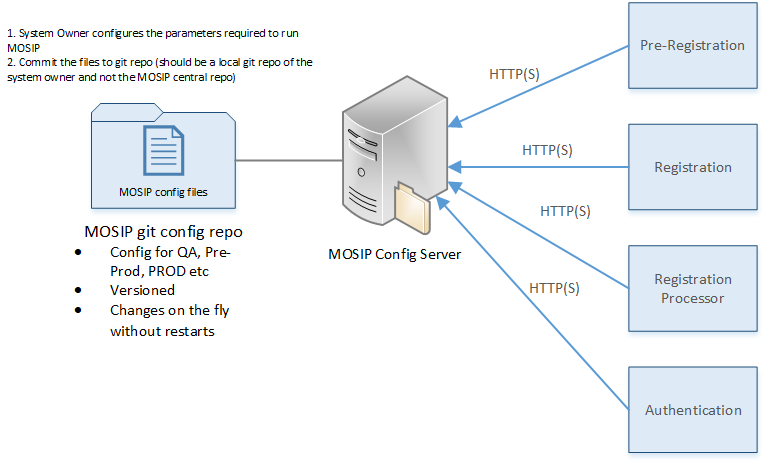

MOSIP as a platform will have multiple applications running and each application will have a set of configurations. The section details 
1. The key configuration files a system owner has to create before starting the platform
2. Launcher component which will read the configuration files, validate and launch the platform

### MOSIP platform config
MOSIP platform config is the file a system owner will create that controls which features are available and which ones are not. For example, in Pre-Registration module, a system owner may not wish to have booking feature and would like the users to just pre-register by giving demo details, then come to a registration center, take a token and wait in queue for registration.

<< TBD >>

### MOSIP Config server
MOSIP will have a centralized config server where all the configuration elements will go including the platform config and ID Object schema. MOSIP will use spring cloud config to implement the config server. All the config files will be version controlled in git and the config server will fetch the config values from a git url. Different sets of configurations can be created based on the environment. One set for Pre-Prod and one for Prod etc. so that system administrators need not change the values on the same set of files.

Please refer to [**developer documentation**](3.1--MOSIP-Configuration-Server) for usage steps

# MOSIP Launcher
MOSIP lanucher will be used by system owners to deploy the modules of MOSIP, do the environment setup and prepare the system for use. The key steps of MOSIP launcher are

1. Read the MOSIP ID definition and MOSIP platform config XML's and validate them (structural and value)
2. Deploy the artifacts (microservices and DB schemas) based on the platform config XML

