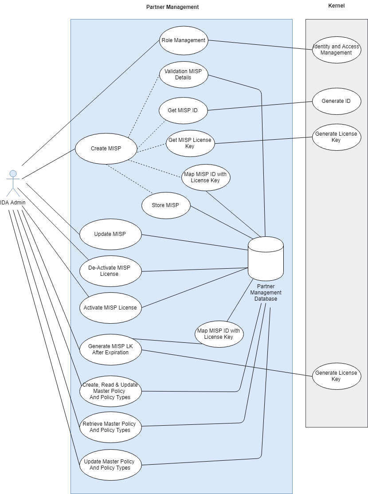
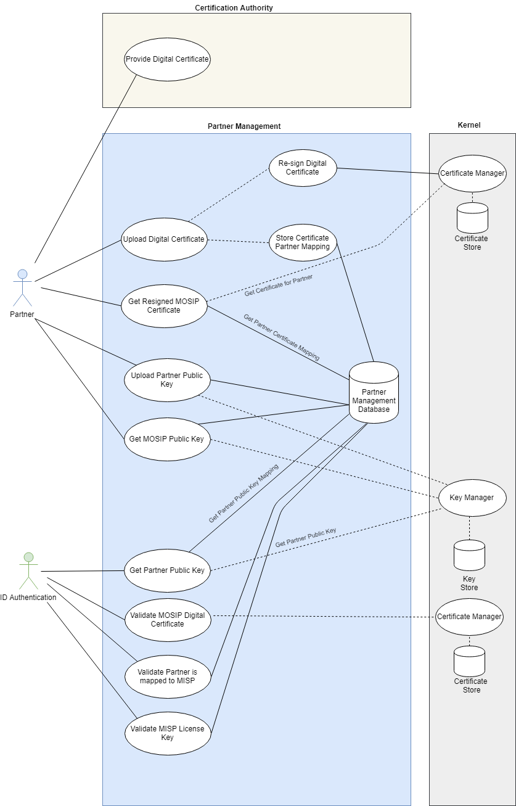

## Partner Management
Partner Management provides services for Partner and MISP (MOSIP Infrastructure Service Provider) Registration and Authentication. Registered Partners and MISP are only allowed to access MOSIP Authentication services. Partners and MISP are registered using Partner Management Services.  Authentication services of MOSIP will internally use the Partner Management Services to authenticate Partner and MISP and validate if only the registered entities are accessing the services.

Partner Management also involves policy management for Partners. Each partner can access Authentication services only based on a defined policy. Authentication services of MOSIP will internally use the Partner Management Services to authenticate a partner based on the policy.

Partner Management also includes License Key Management services. Authentication Services of MOSIP will utilize Partner Management services for License key based authentication of a MISP Partners send authentication request and receive authentication responses in a secured setup. Public/Private keys are used for encryption/decryption/signing the request/response. Distribution of Public key to Partners and retrieval of Public key from partners is managed by Partner Management Services. 

Partners will utilize MOSIP’s resigned digital certificate from Partner Management Services for signing the authentication request.

## Partner Management Process Flow
Please refer to the [**process flow**](Process-view#id-authentication) of Partner Management

## Architecturally Significant Use Cases
**MOSIP Infrastructure Service Provider (MISP) Management**
* IDA Admin will be able to register MISP with following details - MISP Name, MISP Contact Name, MISP Phone, MISP emailId. Partner management will do basic validations on the data submitted
* Partner Management module will utilize Kernel services (ID Generation Service) for generating MISP License Key and MISP ID. Partner Management module will be able to map MISP license key with MISP ID and store the mapping in Partner Management module database. License key is associted with expiration date and status (Active, Expired, Inactive/Blocked).
* IDA Admin will be able to update MISP details - MISP Name, MISP Contact Name, MISP Phone, MISP emailId
* IDA Admin will be able to generate block/deactivate MISP request, further to that MSIP will not be able to do any transaction in Partner Management module
* IDA Admin will be able to generate unblock/activate MISP request, further to that MISP will be able to do all transactions in Partner Management
* IDA Admin will be able to generate new lisence key request for MISP, in case expiration of existing MISP license key
* Partner Management module will utilize Kernel-IAM Module service for Authentication and Authorization

**Partner Management**
* MISP will be able to register partner/s with following details - Partner Name, Partner Contact Name, Partner Phone, Partner emailId. Partner management will do basic validations on the data submitted.
* Partner Management module will utilize Kernel services (ID Generation Service) for generating Partner ID
* MISP will be able to update partner/s with following details - Partner Name, Partner Contact Name, Partner Phone, Partner
* MISP will be able retrieve all policy types avaialble, before setting policies for Partners
* MISP will be able to generate policy mapping request for specified partner/s. A partner will be mapped to a single policy.
* MISP will be able to generate block/deactivate partner request, further to that partner will not be able to do any transaction in Partner Management module
* MISP will be able to generate unblock/activate partner request, further approval to that partner/s will be able to do all transactions in Partner Management module, as per applicable policy for the partner
* Partner Management module will be able to share partner policy details, based on requested partner ID for ID Authentication module

**Digital Certificate Management**
* Partners will be able to procure digital certificate from recognised Certification Authority (CA)
* Partners will be able to share/upload digital certificate to Partner Management module for certificate resigning.
Partner Management module will utilize Kernel services for certificate resigning. Resigned digital certificates are stored at Kernel, Partner Management module will map resigned certificate ID with partner ID
* Partners will be able to get resigned digital certificate, post sharing digital certificate, whenever required
* Based on certificate expiration property, partners will be able to share/upload new digital certificate to Partner Management module for certificate resigning. Partner Management module will utilize Kernel services for certificate resigning. Resigned digital certificates are stored at Kernel, Partner Management module will map resigned certificate ID with partner ID
* ID Authentication module will be able to access Partner Public Key from Partner Management module. Partner Management module will utilize Kernel services to get Partner provided public keys
* ID Authentication module will be able to utilize Partner Management module for Partner digital certificate validation. Partner Management module will utilize Kernel services for validating partner digital certificates
* ID Authentication module will be able to utilize Partner Management module for validating partner and MISP mapping

**Key Management**
* Partners will be able to share/upload partner public key with Partner Management module. Partner Management module / ID Authentication module will use this public key for encrypting response for partners
* Partner public keys are stored in Kernel, refernece to public keys are maintained in Partner Management module
* Based on Key rotation and expiration property, partners will be able to share/upload new public key with Partner Management module
* Partners will be able to fetch Partner Management module public key, as and when required. This public key will be utilized by partners to send encrypted requests to ID Authentication module / Partner Management module 

## Logical View

