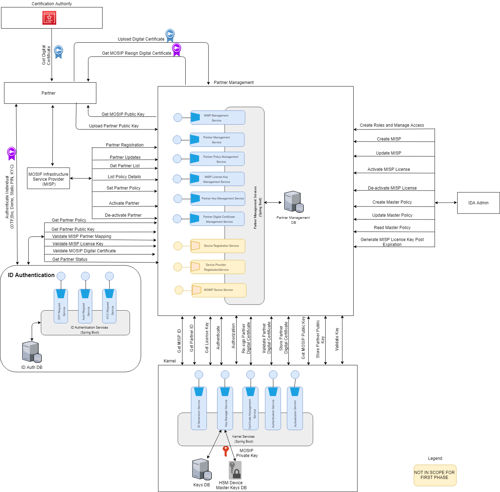

## Partner Management
<Description/Introduction>

## Partner Management Process Flow
Please refer to the [**process flow**](Process-view#id-authentication) of Partner Management

## Architecturally Significant Use Cases
**MOSIP Infrastructure Service Provider (MISP) Management**
* IDA Admin will be able to register MISP with following details - MISP Name, MISP Contact Name, MISP Phone, MISP emailId
* Partner Management module will utilize Kernel services (ID Generation Service) for generating MISP License Key and MISP ID. PM module will be able to map MISP license key with MISP ID and store the mapping in PM module database. License key is associted with expiration date and status (Active, Expired, Inactive/Blocked).
* IDA Admin will be able to update MISP details - MISP Name, MISP Contact Name, MISP Phone, MISP emailId
* IDA Admin will be able to generate block/deactivate MISP request, further to that MSIP will not be able to do any transaction in PM module
* IDA Admin will be able to generate unblock/activate MISP request, further to that MISP will be able to do all transactions in PMP
* IDA Admin will be able to generate new lisence key request for MISP, in case expiration of existing MISP license key
* Partner Management module will utilize Kernel-IAM Module service for Authentication and Authorization

**Partner Management**
* MISP will be able to register partner/s with following details - Partner Name, Partner Contact Name, Partner Phone, Partner emailId
* Partner Management module will utilize Kernel services (ID Generation Service) for generating Partner ID
* MISP will be able to update partner/s with following details - Partner Name, Partner Contact Name, Partner Phone, Partner
* MISP will be able to generate policy mapping request for specified partner/s. A partner will be mapped to a single policy.
* MISP will be able to generate block/deactivate partner request, further to that partner will not be able to do any transaction in PM module
* MISP will be able to generate unblock/activate partner request, further to that partner/s will be able to do all transactions in PM module, as per applicable policy for the partner
* MISP will be able to share partner policy details, based on requested partner ID for ID Authentication module

**Digital Certificate Management**
* Partners will be able to procure digital certificate from recognised Certification Authority (CA)
* Partners will be able to share/upload digital certificate to PM module for certificate resigning. PM module will utilize Kernel services for certificate resigning. Resigned digital certificates are stored at Kernel, PM module will map resigned certificate ID with partner ID.
* Partners will be able to get resigned digital certificate, post sharing digital certificate, whenever required.
* Based on certificate expiration property, partners will be able to share/upload new digital certificate to PM module for certificate resigning. PM module will utilize Kernel services for certificate resigning. Resigned digital certificates are stored at Kernel, PM module will map resigned certificate ID with partner ID.

**Key Management**
* Partners will be able to share/upload partner public key with PM module. PM module / ID Authentication module will use this public key for encrypting response for partners.
* Partner public keys are stored in Kernel, refernece to public keys are maintained in PM module
* Based on Key rotation and expiration property, partners will be able to share/upload new public key with PM module.

## Logical View

