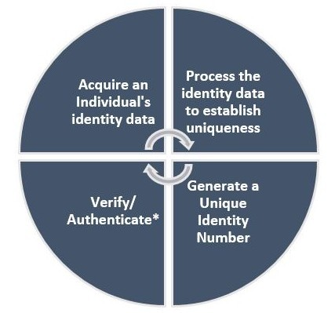
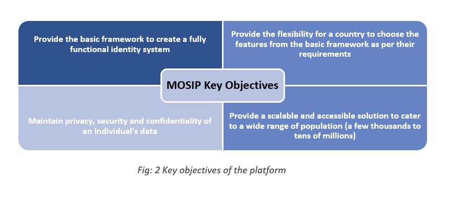

*WIP
## Table Of Content
* [1. INTRODUCTION](#1-introduction)
  * [1.1 Scope](#11scope-)
* [2. IDENTITY MANAGEMENT](#2-identity-management)
  * [2.1 What-is an Identity Management System](#21what-is-an-identity-management-system-)
  * [2.2 Why-an Identity Management System is needed](#22why-an-identity-management-system-is-needed-)
  * [2.3 Key Objectives of MOSIP Platform](#23key-objectives-of-MOSIP-platform-)
* [3. FUNCTIONAL OVERVIEW](#3-functional-overview)
  * [3.1 Pre-Registration](#31-pre-registration-)
  * [3.2 Registration Services](#32-registration-services-)
  * [3.3 Registration Processor](#33-registration-Processor-)
  * [3.4 ID Authentication](#34-id-authentication-)
  * [3.5 Kernel](#35-kernel-)
  * [3.6 Administrator Services (WIP)](#36-administrator-services-wip-)
  * [3.7 Resident Services (WIP)](#37-resident-services-wip-)
  * [3.8 Partner Management (WIP)](#38-partner-management-wip-)
  * [3.9 ID Repository](#39-id-repository-)
 * [4. SCOPE](#4-scope-)
* [5. REQUIREMENT SPECIFICATIONS](#5-requirement-specifications)
  * [5.1 Functional Requirement Specifications](#51-functional-requirement-specifications-)
  * [5.2 Non-Functional Requirement Specifications](#52-non-functional-requirement-specifications-)
* [6. Visual Designs](#6-visual-designs-)
* [7. ARCHITECTURE OVERVIEW](#7-architecture-overview)
  * [7.1 Principles](#71-principles-)
  * [7.2 Platform Features](#72-platform-features-)
    * [7.2.1 Configurability](#721-configurability-)
    * [7.2.2 Extensibility](#722-extensibility-)
    * [7.2.3 Modularity](#723-modularity-)
  * [7.3 Process View](#73-process-view-)
  * [7.4 Logical View](#74-logical-view-)
  * [7.5 Technology Stack](#75-technology-stack-)
  * [7.6 Data Architecture](#76-data-architecture-)
* [8. ARCHITECTURALLY SIGNIFICANT COMPONENTS](#8architecturally-significant-components)
  * [8.1 ID Object Definition](#81-id-object-definition-)
  * [8.2 Configurations](#82-configurations-)
  * [8.3 Registration Packet Structure](#83-registration-packet-structure-)
  * [8.4 ABIS middleware](#84-abis-middleware-)
  * [8.5 Biometric Data Standards](#85-biometric-data-standards-)
  * [8.6 Vendor Device Specifications](#86-vendor-device-specifications-)
  * [8.7 Security](#87-security-)
  * [8.8 Core Data Management](#88-core-data-management-)
  * [8.9 Test Rig Design](#89-test-rig-design-)
  * [8.10 Tester Documentation (WIP)](#810-tester-documentation-wip-)
  * [8.11 Integration with External System](#811-integration-with-external-systems-)
* [9. MOSIP APIs](#9-mosip-apis)
  * [9.1 External APIs](#91external-apis-)
    * [9.1.1 ID Authentication APIs](#911-id-authentication-apis-)
    * [9.1.2 ABIS APIs](#912abis-apis-)
    * [9.1.3 OTP Manager API](#913otp-manager-api-)
    * [9.1.4 Pre-Registration APIs](#914pre-registration-apis-)
    * [9.1.5 Registration Processor APIs](#915registration-processor-apis-)
  * [9.2 Internal APIs](#92internal-apis)
    * [9.2.1 Kernel](#921-kernel-)
    * [9.2.2 ID Repository](#922id-repository-)
* [10. Building and Deploying MOSIP](#10-how-to-guide-tbd)
  * [10.1 Getting Started Guide](#101-getting-started-guide-)
  * [10.2 Developer Document](#102-developer-document-)
Performance and Sizing Guidelines
* [11. INFRASTRUCTURE RECOMMENDATIONS](#11--infrastructure-recommendations-)
11.1 Add: Section on Customization
Add: Section on Data Center Architecture
* [12. GLOSSARY](#12--glossary-)
* [13. ABBREVIATIONS](#13-abbreviations-)
* [14. REFERENCES](#14-references-)
### Document Scope [**[↑]**](#table-of-content)
The scope of this document is to describe high level business objectives along with explicit functional requirements of MOSIP (Modular Open source Identity management platform) completely, accurately and unambiguously. The document also gives an over view of the architecturally significant features, APIs, standards followed in MOSIP. Lastly provides necessary information on implementation, customization and set up.

## 1. INTRODUCTION

### 2.2	Why-an Identity Management System is Needed [**[↑]**](#table-of-content)

A well-established identity management system can help countries to verify their people’s identity by issuing unique identity number which one can use to go into any institution and be readily accepted. The following are some key reasons why a country needs as Identity management system.

MOSIP acronym for Modular Open Source Identity Platform helps governments of countries to build a digital identity system. Using this, every Individual of a country can be given a Unique Identity Number (UIN). This helps in inclusivity and accessibility of all Individuals without disparity or discrimination.

MOSIP provides the following basic features

                      Fig 1: Basic features of MOSIP

The key objectives of the platform are to

## 2. IDENTITY MANAGEMENT
### 2.1	What-is an Identity Management System [**[↑]**](#table-of-content)
To better understand and serve citizens, countries are placing increasing attention on establishing national identification systems. The ability to formally identify oneself has increasingly become integral to many aspects of civic participation and inclusion. Proponents argue that formalized identity management systems have the potential to establish strategic partnerships between the state and citizen’s. Failure to register populations and provide identity documents is believed to have detrimental effects for both the individual and the state.

The complexity of government administration in “the modern world” is a major problem in developing countries. Often, individual government programs have their own database of beneficiaries that are not digitized and therefore cannot be easily merged. Delivering public services efficiently and providing financial inclusion to the poor in partnership with the private sector depends on accurate identification and authentication of citizens and residents. Hence Government programs must have the capacity to cross-reference databases and information.
### 2.2	Why-an Identity Management System is Needed [**[↑]**](#table-of-content)

A well-established identity management system can help countries to verify their people’s identity by issuing unique identity number which one can use to go into any institution and be readily accepted. The following are some key reasons why a country needs as Identity management system.

### 2.3	Key Objectives of MOSIP platform [**[↑]**](#table-of-content)
MOSIP (Modular Open Source Identity Platform) helps government countries to build a digital identity system. Using this, every Individual of a country can be given a Unique Identity Number (UIN). This helps in inclusivity and accessibility of all Individuals without disparity or discrimination.

                      Fig 1: Basic features of MOSIP

## 3. FUNCTIONAL OVERVIEW
This section details out the design aspects of MOSIP, driven by the key functional modules as listed below. Navigate to wiki for further details on each module. 
### 3.1 Pre-Registration [**[↑]**](#table-of-content)

Pre-registration is the module which is the web channel of the MOSIP. This module enables a user to do the following: 
1. Book Registration Appointment 
1. Enter Demographic data & Upload supporting documents 
1. Appointment notification, rescheduling and cancellation 
1. Send resident data to registration center before appointment 

Please refer [**wiki**](FRS-Pre-Registration) for detailed functional specifications of pre-registration module.

### 3.2 Registration Services [**[↑]**](#table-of-content)
Registration Client application captures the Demographic and Biometric details of an Individual along with supporting information (proof documents & information about parent/guardian/introducer) and packages the information in a secure way. This module provides the following capabilities:
1. Provides a secure way of capturing an Individual's demographic and biometric data
1. Provides interfaces to biometric devices that comply to industry standards
1. Registration client works in online and offline mode to capture data
1. This module also provides option to transfer data to server when online and helps in uninterrupted registrations
1. Client has the ability to update itself for patch upgrades (bug fixes/enhancements) in a remote way. There could be hundreds of client instances running on laptops/desktops. Updates on all of them are controlled by the client and a central server.
1. Registration client is secured such that it cannot be tampered and misused

Please refer [**wiki**](FRS-Registration-Services) for detailed functional specifications of registration services.

### 3.3 Registration Processor [**[↑]**](#table-of-content)
Registration Processor processes the data (demographic and biometric) of an Individual for quality and uniqueness and then issues a Unique Identification Number (UIN). The source of data are primarily from:
1. MOSIP Registration Client
1. Existing ID system(s) of a country

This module has the following capabilities:
1. Provides guaranteed packet processing - Not lose the packet once received on the server
1. Handle server failure, recovery and re-submission of packets for processing automatically
1. It has the capability to add new processing step(s) without changing existing steps as different countries may have different processing requirements
1. Capability to integrate with multiple ABIS providers. Accommodate sending one or more biometric modality to one or more ABISs and calculate a composite fusion score and then take a decision on the processing
1. Each processing step is scalable independently based on the load

Please refer [**wiki**](FRS-Registration-Processor) for detailed functional requirement specifications of Registration Processor
### 3.4 ID Authentication [**[↑]**](#table-of-content)

ID Authentication in MOSIP provides services through APIs  that validates the authenticity of a resident based on one or more factors (demographic and biometric).  The authentication services are integrated with TSPs (Trusted Service Providers) for delivering eKYC services to citizens via user agencies.

This module provides the following capabilities:
1. Authenticate an Individual in a secure and trusted way
1. Captures of biometrics data as per the defined standards
1. Authenticates an Individual based on their basic identity data captured via MOSIP
1. In addition to demographic and biometric authentication, an Individual is also authenticated based on the following parameters:
   * TOTP based 
   * Static pin 
   * Challenge response
5. Authentication APIs
1. High Availability (HA) to ensure smooth service
1. Scalable to cater to the growing population of a country
1. Protects an Individual's identity from request-replay attacks
1. Audited for reporting and fraud management checks

Please refer [**wiki**](FRS-Authentication-Services) for detailed functional requirement specifications for authentication services.

### 3.5 Kernel [**[↑]**](#table-of-content)
Kernel is a platform to build higher-level services as well as a secure sandbox. Functionally it caters to the following services:
* UIN Generation
* Configuration Server
* Audit Manager
  * Log manager
* Authentication and Authorization
* Common Services
* Data Services
* Admin Services

Please refer wiki for detailed functional specification of the following services:
* [**UIN Generation**](UIN-Generation)
* [**Configuration Server**](Configuration-Server)
* [**Audit Manager**](Audit-Manager)
  * [**Log manager**](log-manager)
* [**Authentication and Authorization**](Authentication-and-Authorization)
* [**Common Services**](FRS-Common-Services)
* [**Data Services**](FRS-Data-Services)
* [**Admin Services**](FRS-Admin-Services)

### 3.6 Administrator Services (WIP) [**[↑]**](#table-of-content)
MOSIP Admin manages the functional and non-functional activities of MOSIP on Admin Portal through either the backend process or the UI screens. 

Admin will be able to:

 * Set up Platform Data, Process Flows, ID Definition, Configuration, and Security Policy (Through backend process).
 * Manage (Create, Update, View, Activate/Deactivate, Map/Un-map/Re-map/Decommission) the resources.
 * Map the resources (Users, Machines, and Devices) to a registration center.
 * Manage the master data (Create/Update/Activate/Deactivate).
 * Manage approval requests for creation and updation of resources and master data.
 * Manage personal account details (Reset Password, Forgot User Name, Change Password, Unlock Account, and Edit Personal 
   Details.
 * Activate/deactivate UIN
 * View status of packets

Please refer [**wiki**](FRS-Administrator-Services) for detailed functional specifications of administrator services module.
### 3.7 Resident Services (WIP) [**[↑]**](#table-of-content)

Resident Services module will provide a host of services for a user which he/she can utilize after generation of his/her UIN. The list of services a user can avail are outlined below:

1. Download e-UIN.
2. Retrieve lost UIN.
3. Initiate UIN Update.
4. Request re-print UIN.
5. Track status of UIN update.
6. View history of Authentication Requests.
7. Lock or Unlock UIN/VID for each ‘Auth’ type(s).

Additionally a user can also track status of his/her UIN generation after registration. 
These services include:

1. Retrieve Lost RID (registration ID).
2. Track Status of UIN Generation via RID.

Please refer [**wiki**](FRS-Resident-Services) for detailed functional specifications of resident services module.
### 3.8 Partner Management (WIP) [**[↑]**](#table-of-content)

Partner Management provides services for Partner and MISP (MOSIP Infrastructure Service Provider) Registration and Authentication. Registered Partners and MISP are only allowed to access MOSIP Authentication services. Partners and MISP are registered using Partner Management Services.  Authentication services of MOSIP will internally use the Partner Management Services to authenticate Partner and MISP and validate if only the registered entities are accessing the services.

Partner Management also involves policy management for Partners. Each partner can access Authentication services only based on a defined policy. Authentication services of MOSIP will internally use the Partner Management Services to authenticate a partner based on the policy.

Partners send authentication request and receive authentication responses in a secured setup. Public/Private keys are used for encryption/decryption/signing the request/response. A few of the key management activities are managed in the Partner Management Services.

Further Certificates are used by Partners for signing the authentication request.  Partner Management Services is used for a few of the signature related services.

Please refer [**wiki**](FRS-Partner-Management) for detailed functional specifications of Partner Management module.

### 3.9 ID Repository [**[↑]**](#table-of-content)
Please refer [**wiki**](FRS-ID-Repository) for detailed functional specifications of ID Repository.
## 4. SCOPE [**[↑]**](#table-of-content)
## 5. REQUIREMENT SPECIFICATIONS
### 5.1 Functional Requirement Specifications [**[↑]**](#table-of-content)
This section provides a detailed functional requirement specification for each module in MOSIP
#### 5.1.1 [Pre-Registration](FRS-Pre-Registration)
#### 5.1.2 [Data Services](FRS-Data-Services)
#### 5.1.3 [Common Services](FRS-Common-Services)
#### 5.1.4 [Admin Services](FRS-Admin-Services)
#### 5.1.5 [UIN Generation](UIN-Generation)
#### 5.1.6 [Configuration Server](Configuration-Server)
#### 5.1.7 [Audit Manager](Audit-Manager)
#### 5.1.8 [Authentication and Authorization](Authentication-and-Authorization)
#### 5.1.9 [Registration Services](FRS-Registration-Services)
#### 5.1.10 [Registration Processor](FRS-Registration-Processor)
#### 5.1.11 [Authentication Services](FRS-Authentication-Services)
#### 5.1.12 [Resident Services](FRS-Resident-Services)
#### 5.1.13 [Administrator Services](FRS-Administrator-Services)
#### 5.1.14 [Partner Management](FRS-Partner-Management)
#### 5.1.15 [ID Repository](FRS-ID-Repository)
### 5.2 Non-Functional Requirement Specifications [**[↑]**](#table-of-content)
This section details out the non-functional requirements of MOSIP platform

Please refer [**wiki**](MOSIP-NON-Functional-Requirements) for the detailed functional spec.

## 6. Visual Designs [**[↑]**](#table-of-content)

This section provides links to the Clickable Prototypes/Visual Designs of the reference implementation (Reference screens) provided by MOSIP for the following modules: _Pre-registration, Registration Client_ and _Admin_.

_Pre-Registration_ - [**visual design**](//xd.adobe.com/view/3139bfc4-5338-48f0-4ffe-5efca5fdcb72-4708/)

_Registration_ - [**visual design**](//xd.adobe.com/view/dbb0c028-0959-475f-6aea-a9c4d7c57cdf-ad81/)

_Admin_ - WIP

## 7. ARCHITECTURE OVERVIEW
MOSIP Architecture is defined in 5 separate sections which are detailed in GitHub wiki. Click on each specific header name to navigate to wiki for further details.

### 7.1 Principles [**[↑]**](#table-of-content)
This section consists of the foundational principles of MOSIP based on which the architecture is defined. The key principle considered includes: Open source and Vendor Neutral, Adaptability, Security, Multi party, Authorization, Authentication, Multi language support, Performance and Scalability, High Availability, and Auditability.

Please refer [**wiki**](Architecture-Principles-&-Platform-Goals) for more details.
### 7.2 Platform Features [**[↑]**](#table-of-content)
#### 7.2.1 Configurability [**[↑]**](#table-of-content)

MOSIP should be flexible for countries to configure the base platform according to their specific requirements. Some of the examples of configurability are
* Country should be able to choose the features required. For example, it must be possible for a country to turn off Finger Print capture
* Country should be able to configure the attributes of an ID Object
* Country should be able to define the length of the UIN number.
#### 7.2.2 Extensibility [**[↑]**](#table-of-content)

MOSIP should be flexible to extend functionality on top of the basic platform. Some of the examples of extensibility are
* A country should be able to introduce a new step in processing data
* Integrate MOSIP with other ID systems and include it as part of the MOSIP data processing flow
#### 7.2.3 Modularity [**[↑]**](#table-of-content)

All components in MOSIP should be modular and their features exposed via interfaces such that the implementation behind the interface can be changed without affecting other modules. Some examples of modularity are
* UIN generator algorithm provided by the platform can be replaced by a country with their own implementation
* The default demographic deduplication algorithm provided by MOSIP can be changed to a different one without impacting the process flow
### 7.3 Process View [**[↑]**](#table-of-content)
This section provides a functional overview of the processes like Pre-registration, Registration Client, Registration Processor, and ID Authentication.

Please refer [**wiki**](Process-view) for more details.

### 7.4 Logical View [**[↑]**](#table-of-content)
This section details the key design aspects considered for MOSIP. This includes Ecosystem approach, Configurability, Extensibility, Modularity, and Solution Principles. 

Please refer [**wiki**](Logical-Architecture) for more details.

### 7.5 Technology Stack [**[↑]**](#table-of-content)
This section lists all the technologies used in building MOSIP platform.

Please refer [**wiki**](Technology-Stack) for more details.

### 7.6 Data Architecture [**[↑]**](#table-of-content)
This section details the data architecture of MOSIP which includes Security, Multi-Language, High Availability, Auditability, and High Performance. It also details the data models and its naming standards. 

Please refer [**wiki**](MOSIP-Data-Architecture) for more details.

## 8.	ARCHITECTURALLY SIGNIFICANT COMPONENTS OF MOSIP
### 8.1 ID Object Definition [**[↑]**](#table-of-content)
ID definition describes the attributes a Country or entity intends to capture from an Individual, which will formulate the definition of ID for a Country. This section elaborates on the mechanism MOSIP adopts, in order to provide the flexibility for each Country to define its preferred ID definition and ID object definition schema.

Please refer [**wiki**](MOSIP-ID-Object-definition) for more details.

### 8.2 Configurations [**[↑]**](#table-of-content)
MOSIP as a platform will have multiple applications running and each application will have a set of configurations.
This section details:
1. The key configuration files a system owner has to create before starting the platform – with a centralized Config Server.
1. Launcher component which will read the configuration files, validate and launch the platform.

Please refer [**wiki**](MOSIP-configuration-&-launcher) for more details.

### 8.3 Registration Packet Structure [**[↑]**](#table-of-content)
This section illustrates the packet creation flow along with the encryption process, as part of Registration Client.

Please refer [**wiki**](Registration-Packet) for more details.

### 8.4 ABIS Middleware [**[↑]**](#table-of-content)
This section provides details on the ability of MOSIP to support a single or multi-ABIS solution, specifics on the Components & APIs of ABIS Middleware, Strategies for Biometric data management in ABIS and Strategies for de-duplication in case of multiple ABIS systems.

Please refer [**wiki**](MOSIP-ABIS-Middleware) for more details.
### 8.5 MOSIP Biometric Data Standards [**[↑]**](#table-of-content)
This section details out the specifications for Biometric data during data acquisition and verification. 

Please refer [**wiki**](MOSIP-Biometric-Data-Specifications) for more details.

### 8.6 Vendor Device Specifications [**[↑]**](#table-of-content)
This section illustrates the VDM technical specifications to be adhered by a vendor, who intends to adopt their devices to the MOSIP platform, so as to capture the biometric data and process the same. 

Please refer [**wiki**](MOSIP-VDM-Specifications) for more details.

### 8.7 Security [**[↑]**](#table-of-content)
Multiple aspects of Security like Confidentiality, Privacy, and Integrity of data are key in ensuring an Individual's identity is not compromised. This section illuminates on the Security design principles MOSIP follows.

Please refer [**wiki**](Security) for more details.
### 8.8 Core Data Management [**[↑]**](#table-of-content)
ID Repository module contains the golden record of Identity for an Individual. Once new/update packets are processed by Registration Processor, the Identity details of an Individual are added/updated in ID Repository. The Identity information available in ID Repository is then used by ID Authentication to authenticate an Individual.

This module exposes few REST APIs which can be used to create/update/retrieve Identity of an Individual. Please refer [**wiki**](ID-Repository-API) for more details.

### 8.9 Test Rig [**[↑]**](#table-of-content)
Test Rig represents a one click automation to build, deploy and test a software module. Successful execution of test rig would ascertain complete setup of the MOSIP platform.

Please refer to [**wiki**](Test-Rig-Design) for more details about **Test Rig Design**.

Please refer to [**wiki**](Tester-Documentation) for more details about **Test Automation**.
### 8.11 Integration with External Systems [**[↑]**](#table-of-content)
This section illustrates the integrational specifications of MOSIP with an external system.
Please refer to [**wiki**](/mosip/mosip/blob/0.12.0/docs/design/registration-processor/External_System_Integration_Guide.md) for more details.
## 9. MOSIP APIs
APIs are the crux of MOSIP platform. This section explains about the internal and external APIs of MOSIP platform. Navigate to  wiki to know more about each API.
### 9.1	External APIs [**[↑]**](#table-of-content)
This sections details out the external APIs of MOSIP that interact with external entities.
#### 9.1.1 ID Authentication APIs [**[↑]**](#table-of-content)
Format: JSON

This section details the REST services exposed by ID Authentication. 

Please refer [**wiki**](ID-Authentication). 

This service details Auth Request to be used by TSPs to authenticate an Individual. Below are various authentication types supported by this service:
1. OTP based - Time-based OTP
2. Demo based - Personal Identity, Address
3. Bio based - Fingerprint, IRIS and Face

#### 9.1.2	ABIS APIs [**[↑]**](#table-of-content)
Format: JSON

An ABIS system that integrates with MOSIP should support the operations listed in this section.

Refer [**wiki**](ABIS-APIs). 

All ABIS operations are via a message queue & asynchronous and should adhere to the Common parameters as identified.
This service details the behavior of:
1. Insert Request
1. Identify Request
1. Delete Request
1. Ping Request
1. Pending Jobs Request
1. Reference Count Request
#### 9.1.3	OTP Manager API [**[↑]**](#table-of-content)
Format: JSON

OTP manager includes APIs for
1. OTP generation
1. OTP validation. 

Please refer [**wiki**](Kernel-APIs#otp-manager)
#### 9.1.4	Pre-Registration APIs [**[↑]**](#table-of-content)
Format: JSON

This [**wiki**](Pre-Registration-Services) details about the service APIs in the Pre-Registration modules
#### 9.1.5	Registration Processor APIs [**[↑]**](#table-of-content)
Format: JSON

This API will support the following features
1. APIs for receiving packets
1. APIs for packet registration status
1. APIs for Manual Verification. 

Refer [**wiki**](Registration-Processor-APIs) for more details
### 9.2	Internal APIs
This section describes about APIs consumed by internal modules. Listed below are a few MOSIP internal APIs
#### 9.2.1 Kernel [**[↑]**](#table-of-content)
The Kernel APIs cover the following APIS
1. APIs for key management
1. APIs for master data management
1. APIs for configuration management
1. APIs for Audit and Log management

Please refer [**wiki**](Kernel-APIs) for more details.

#### 9.2.2	ID Repository [**[↑]**](#table-of-content)
This is a central API which all other modules of MOSIP will use to retrieve an ID record. This API will support the following features
1. Creation of a ID record
1. Lookup of an ID record based on the UIN
1. Updation of an ID record based on the UIN
1. Will not support search based on attributes of an ID

Please refer [**wiki**](ID-Repository-API) for more details

### 10. Building and Deploying MOSIP (TBD)
#### 10.1 Getting Started Guide [**[↑]**](#table-of-content)
Please refer [**wiki**](Getting-Started) for more details
#### 10.2 Developer Document [**[↑]**](#table-of-content)
Please refer [**wiki**](Developer-Documentation) for more details
Performance and Sizing Guidelines
**](Performance-and-Sizing-Guidelines)
## 11.  INFRASTRUCTURE RECOMMENDATIONS [**[↑]**](#table-of-content)
Add: Section on Customization
Add: Section on Data Center Architecture

## 12.  GLOSSARY [**[↑]**](#table-of-content)
## 13. ABBREVIATIONS [**[↑]**](#table-of-content)
## 14. REFERENCES [**[↑]**](#table-of-content)

