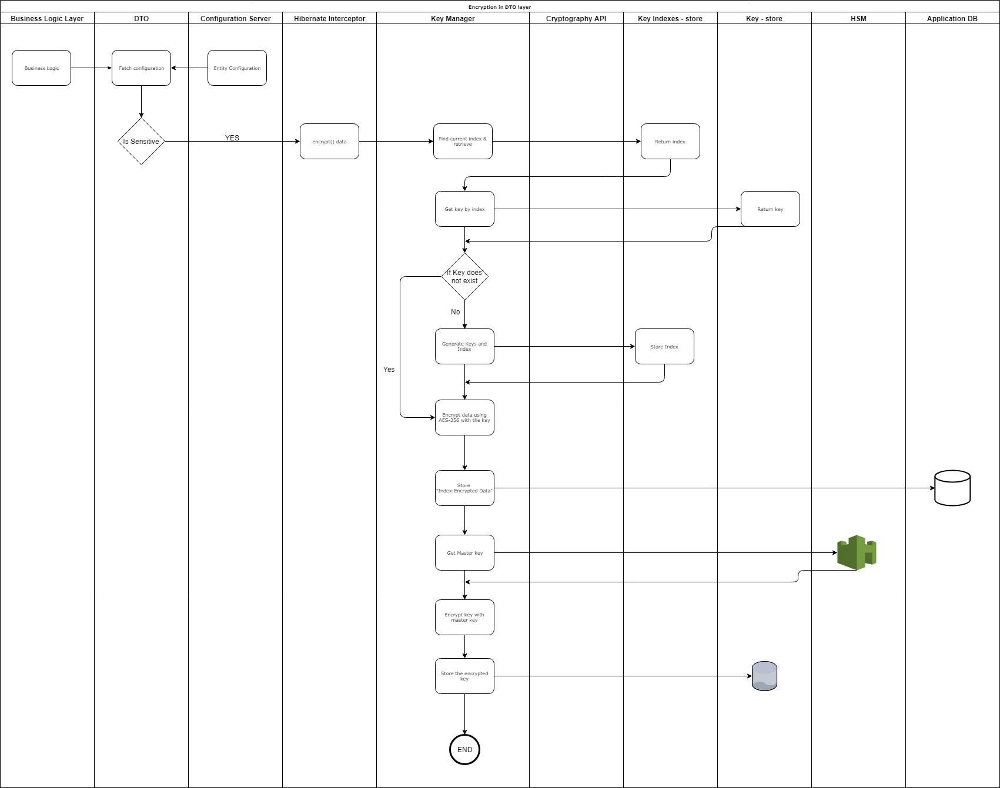
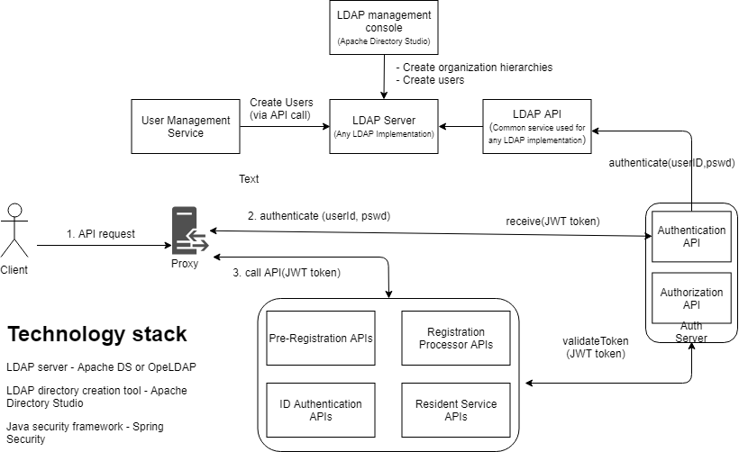

In MOSIP, privacy and security are highest priorities and this document details the measures that have been implemented in the platform so far. As an open source project we aim to continuously improve the security features and incorporate new developments through collaborations and community contributions.

# Governing Principles
MOSIP's approach on privacy and security is determined by the [framework principles](https://www.mosip.io/uploads/resources/5cc84b0a08284Country%20Engagement%20Principles_v2.pdf) under which it operates.

# MOSIP Security Design Key Features

- Direct access to data stored in database not permitted - data accessed via APIs only.
- Zero-Knowledge Administration principle used so administrators can manage data without seeing the actual data. Data can be accessed only via APIs
- The integrity of each database row protected to prevent any malicious tampering like swapping identities, for instance.
- Revocable Virtual IDs and Tokens used to thwart any attempt on profiling the users.
- Access controls implemented on all APIs to ensure data privacy (who can see what).
- All APIs support rate-limiting and are digitally signed.
- All network channels assumed 'dirty'.
- Every artifact (including JSON data sent over API) digitally signed.

# MOSIP Cryptography Algorithms
MOSIP uses following algorithms:
1. RSA OAEP 2048 bit minimum for all PKI based encryption.
2. AES GCM 256 bit minimum for all Symmetric key encryption.
3. SHA256 as the standard hashing algorithm.
4. X509 V3 as the certificate standard.
5. FIPS 140-2 Level 3 as the minimum Hardware Security Module (HSM) standard.
6. PKCS11 is used for HSM communication.

# Database encryption
As a principle, MOSIP does not use any mechanism in-built in a database for encryption. All sensitive data to be stored in a DB is encrypted/decrypted outside the DB at the application layer.

- All sensitive (configurable) data is encrypted using a symmetric key algorithm. MOSIP supports AES 256 algorithm by default. 
- Each cell is encrypted using its own symmetric key and the keys are selected randomly.
- By default, we generate 10,000 symmetric keys for the database encryption. This is a soft limit and that can be increased.
- The symmetric keys are encrypted using a master key in HSM. 
- Every key has an expiry and application follows the expiry to update the data with new keys.

### Encryption/Decryption flow

### Data format in DB

## Key management
- MOSIP uses symmetric keys to protect its database.
- Every key, when created, is set to an expiry date.
There are two modes of operation for key management.
Inline
- When a data is written back to the database a new active key is used.
- When a data is read where the encryption key is expired the system notifies the key management that the expired key is used and has to be re-encrypted with an active key.
Batch
- In this mode, the system would search for all the tables for encrypted data with expired keys.
- Re-encrypt them with the new active keys.
- This mode is scheduled to run upon need basis or bi-monthly so there is no huge data crunch and the inline mode would have re-encrypted most of the data.

# Registration data encryption
Registration Client is used to collect all the personal and biometric information for MOSIP. The client is designed to work on TPM compatible machines. The client follows the following principles

- All machines are registered using the TPM identity keys. The public part of these keys are pre whitelisted in the MOSIP database.
- An SK from SRK key is created to encrypt all the other keys used by MOSIP.
- All local configurations are encrypted using the same mechanism.
- A set of (defaulted to 10000) RSA keys are created for registration. These keys are generated in an HSM and the public part of these keys are embedded in the MOSIP registration client. These keys are used to encrypt the users/residents data. 
- The registration data in its unencrypted form is always stored in the volatile memory and never stored.
  
# Authentication & Authorization (TBD)
**Authentication**
- Authentication via web channel (for Pre-Registration web app, Admin web app and Resident services portal)
- Authentication via local system i.e., offline authentication (for Registration client)

**Authorization**
- Authorization of API's accessed via web channel (we are in migration to a KeyCloak server at this point in time. We will publish the documents soon.)
- Authorization to access specific data (will be implemented in v3)

A country will have its own hierarchy of system users especially the registration staff and system administration staff. So, instead of defining a fixed hierarchy, by default MOSIP will depend on an LDAP implementation to manage users, organizational hierarchy and roles for users in the hierarchy. MOSIP will uses an open source LDAP server as the LDAP implementation. Administrators can create hierarchy and users using Apache Directory Studio.

