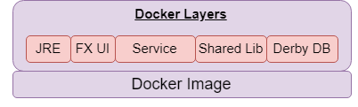
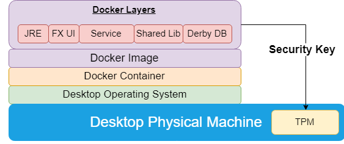
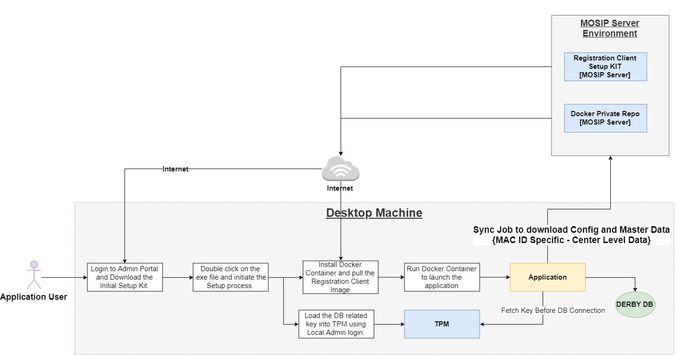

**Application Bundle:**
***
Registration client application will be delivered as a Docker image, which can be downloadable from Docker MOSIP private repository. 
The generated image would be signed and same will be validated when it is installed at the desktop machine.
 
**Registration Client – Docker Image:**  
 
 
**Application Setup KIT:** 
***
The ‘Registration Client Setup KIT’ would be available at MOSIP server.
This KIT will contain the runtime engine that is required for Registration client application to run.  
As Docker container is the runtime engine, the same would be embedded into this KIT.
The Docker image would not be available as part of this KIT. It would be available in binary repository and same would be downloaded from client application through Docker command.
It also contains the DB key which is to be loaded into the TPM of client machine.
User should login to the Admin portal and Download this KIT and initiate the installation process.

   **Build Process:** 
    The standard Jenkin build process would be followed to generate the Registration client docker image and the generated binary would be placed in to the 
    MOISP JFrog repository. 

    The Docker image contains the Derby database jar, authentication setup script, initial table creation and few insert script.
    - Initial Script contains:
      1. List of screens.
      2. Screen and role mapping. 
     
   **Application Runtime:** 
   	 

   The above diagram depicts the actual runtime of registration client application. 
    
   -Windows 10 Operating System.  
   -VcXsrv Windows X Server [.exe] - [40 MB] - to open the GUI component from docker container.  
   -Java Runtime Environment - 1.8  
   -Derby DB. [ Version - 13]  
   -Docker Installation Pkg. [version - 18.*][600 MB]  
	 
**Installation at Desktop Machine:**
***
   		 
 
   Download the application setup KIT from MOISP admin portal. 
   Double click on the provided .exe file to extract the package and install the Docker container in local machine in a particular folder. 
   **TBD -** List of values to be entered by the user during installation to be determined. 
   Once installation completed then click on the ‘RegClientStart.bat’ file to initialize the Docker container and pull the latest ‘MOSIPRegistrationClient’ image from Private Docker hub. 
   Generate and Load the DB key into the TPM [Trusted Platform Module]. {More research required in this area} 
   
   Then run the Docker container to launch the application. 
   Once application launched then connect to the TPM and pull the required key to communicate with the DB. 
   Check the data availability in the local DB, if no data available then initiate the ‘Sync [Master/ Configure/ User]’ process to download the machine [MAC ID] specific center level data from MOSIP server environment.
   
   Note: Before initialize the installation process, user should make sure that the local system meets the runtime / hardware requirement. 

**Database:**
***
   -The Derby database will be used to store the local transaction information along with Master and configuration data. 
   -The data stored into the database would be encrypted using a particular boot key password. 
   -The key would be maintained in TPM and same will be used during communication with database from application. 

**Update:**
***
   **Database update:** 
   If database to be updated to the next version then update the same in the Docker image [JFROG repository] and that will get downloaded through the respective Docker pull statement. Docker pull only download the updated layer [not all layers]
   
   **Application update:** 
   Through application the version of Docker Image between the local repository and remote repository will be validated. If there is any difference in the version, then prompt the user to complete the current process [Registration and pushing packet] and initiate the software update process.
   
    	
**Security:** 
***
   **Data Security:** 
   While storing the data into the local database the data would be encrypted and same would be decrypted while retrieving the same from db. The key required for the database encryption/decryption would be stored into the TPM and same will be fetched when the application start up.
The packet created during registration process and downloaded from pre-registration application would be encrypted using asymmetric and symmetric key. 
The asymmetric key received from MOSIP server will be used for encryption of registration packet and it can only be decrypted at server end only. At regular interval the encryption public key at Registration client would be updated.
The Symmetric key would be generated on runtime and same will be used during the pre-registration packet decryption.
	**<TODO>:** How to secure the Docker image?

   **Key management:**
   The key required for encryption / decryption at different process of an application would be maintained in database and TPM.
   TPM  – it will hold the DB encryption and decryption key.
   DB 	– it will hold the pre-registration symmetric key.
        – it will also hold the Registration packet public key.
 
   **REST Service integration Authentication:**
   When application is having online connectivity, it may need to push and pull the packet and the respective status from server.
Whenever communication happening with online services the OAuth token need to be generated and should be attached to the header of the http request. 
To generate the OAuth token the client secret key / login user id / password would be passed to the ‘Login’ REST service. If success it will provide us the valid OAuth token in the http response. The same token would be passed during rest of REST service communication. 

**System Prerequisites:**
*** 
   •CPU - Dual Core Processor - 2GHZ  
   •Ram – 8 GB  
   •Local Storage Disk Space – 500 GB 
   •5 USB 2.0 ports or equivalent hub.  
   •Physical machine with TPM facility.   
 
**Data Setup:** 
***
In Registration client application, only user mapping to the local machine can be performed. Rest of the data setup should be taken care at MOSIP Admin portal.
Through sync process the data would be sync between local machine and server based on machine mac-id and center id.

   **Admin Portal:** 
   Configure the following Data with respect to Registration client at Admin portal.
   1.	User Profile Setup. 
   2.	User Authentication Setup. 
   3.	Role Setup. 
   4.	Master Data Setup at application level. 
   5.	Application configuration setup. 
   6.	Device Configuration. 
   7.	Registration Center Configuration. 
   8.	Machine Configuration. 
   9.	Center to Machine mapping. 
   10.	Center – User mapping. 

   **User Mapping to the Local machine:** 
   User can do the self-mapping to the local machine by using their user id and password [which is provided by admin user] and OTP shared to their mobile/ email id. 
   The existing user configured in Admin portal for a particular registration center can only be tagged to the local machine. 

**Archival Policy:**
***
   At the regular interval the old / historical transactional data in the client database / logs would be deleted.
   The batch process which is running at the client application, will do this process based on the defined configuration in DB table.

   **List of data to be archived:** 
   1.	Transaction data in database
   2.	Audit log in database
   3.	Logs in local machine.
   4.	Generated Registration and Pre-Registration packet.

   
**To Be Discussed:** 
***
   1. Docker login credential during installation?
   2. Docker installation volume path.?
   3. Auto update/ manual update?	
   4. How to load key into TPM? The respective rotation policy.
   5. How to update the DB password/ encryption key?
   