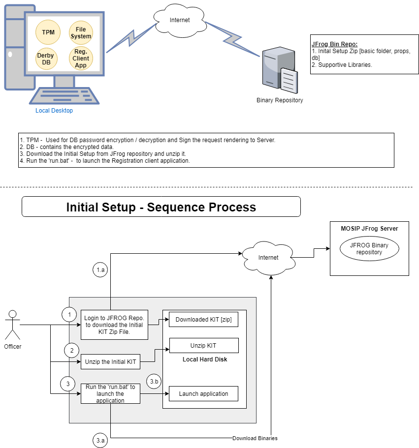

**Registration Client - Installation and Configuration:** 
***

This document contains the 'Registration client' application initial setup and configuration process at local machine.     

   

**System Prerequisites:**
*** 
   - CPU - Dual Core Processor - 2GHZ  
   - Ram - 8 GB  
   - Local Storage Disk Space - 500 GB 
   - USB 2.0 ports or equivalent hub.  
   - Physical machine with TPM 2.0 facility.   

Registration client has certain **prerequisite** which is to be completed before installing the software:  
- Creation of Windows User Accounts in local desktop machines.  
- Addition of user profiles and credentials in the MOSIP Admin Portal.  
- Setup the users in IAM.  
- Machine with center mapping in Admin Portal.  

The Registration client application is delivered into two parts:  
   1. Base Zip file 			- Contains Application Base folder structure with installed derby DB.      
   2. Application Binaries.  - Contains the application binary classes and the db scripts .  
       - Shared libraries.
       - Encrypted client UI and Service jars.
       - DB scripts.  

**Anti Virus - ClamAV Setup and Configuration in local machine:**  
***  
   Installation of Open Source Anti Virus Software [ClamAV]:  
   1.	Download the ClamAV (Version: 0.101.2) Anti Virus Software - [link](http://www.clamav.net/downloads)  
   2.	Install the downloaded .exe file.  
   	
   **ClamAV Config Setup:**     
     1. Rename the **clamd.conf.sample** to **clamd.conf** from the installed directory of ClamAV.   
        Ex: C:\Program Files\ClamAV\conf_examples\clamd.conf.sample file   
            save as  C:\Program Files\ClamAV\conf_examples\clamd.conf   
    2.Rename the **freshclam.conf.sample** to **freshclam.conf** from the installed directory of ClamAV.
        Ex: C:\Program Files\ClamAV\conf_examples\ freshclam.conf.sample file  
            save as C:\Program Files\ClamAV\conf_examples\ freshclam.conf  
    3.Comment the line# 8(Example) in both the files  
    4. Update Config files:   
      
    **clamd.conf file changes:**  
      1.	Uncomment LogFile "C:\Program Files\ClamAV\clamd.log"(Line 14)
   
    **freshclam.conf file changes:**  
     Uncomment the below mentioned lines in the file,  
    1.	DatabaseDirectory - "C:\Program Files\ClamAV\database"(Line 13)  
    2.	UpdateLogFile     - "C:\Program Files\ClamAV\freshclam.log"(Line 17)  
    3.	DatabaseMirror    - db.XY.clamav.net(Line 69)  change XY to our country code  
    4.	DatabaseMirror    - database.clamav.net(Line 75)   
    5.	Checks 24(Line 113)  
    6.	LocalIPAddress aaa.bbb.ccc.ddd(Line 131)  change to our machine IP address   

   **Once all the Configurations are done run the freshclam.exe and then run clamd.exe.**   
 

**Installation at Desktop Machine:**   
***  
**Zip file:**  
   1. User login to the Admin portal and download the client application ZIP file.  
   2. Once downloaded then unzip the file into a particular location. It contains the following structure.  
      - bin : It contains the client UI and service executable in encrypted format.
      - lib : it contains the library required for the application to start.  
      - prop : it contains the property file that will be used by application.    
      - cer  : it contains the certificate used to communicate with the MOSIP server.
      - log : the application log file would be written under this folder.    
      - db : it contains the derby database, tables and few table with the data.  
      - run.jar : Executable jar to download the s/w.
      - MANIFEST.MF : Third Party libraries information.
   3. Click the 'run.jar' to initiate the process.  
   
   When user clicks on the 'run.jar' it does the following :  
   1. It loads the binary repository URL from property file.  
   2. Communicate with the  JFrog repository through secured connection and download the maven-metadata.xml file to identify the latest jar versions.    
   3. Download the latest build Manifest.mf file from server, where all the jars (including shared lib) name and checksums are provided.  
   4. Compare the checksum of local version of jar files with the data present in latest downloaded Manifest.mf file.    
   5. Identify the list of binary files and Download the required jars.  
   6. Once download completed then communicate with TPM to decrypt the key, which is used to decrypt the UI and service jars.  
   7. Place the jar to the User temp directory and start the application.  
   
**Application Startup:**  
   - Once application launched then connect to the TPM and pull the required key to communicate with the DB.  
   - User should initially be online to validate their authentication against the MOSIP server. Post which, the sync process would be initiated.     
   - Check the data availability in the local DB, if no data available then initiate the Sync [Master/ Configure/ User] process to download the machine [MAC ID] specific center level data from MOSIP server environment.  
   - During initial setup, the application should have online connectivity with the MOSIP server to synch the configuration detail from server to local machine.       
   - Before initialize the installation process, user should make sure that the local system meets the runtime / hardware requirement.    

   
**External hardware Driver(s):**
   This section covers the list of drivers required to communicate with the devices.  
   - To integrate with Scanner, windows WIA libraries are used. So, the respective service should be running and also the scanner specific driver should be installed.    
   - The application has been currently tested with CANON LiDE 120.   

**Database:**  
   - The Derby database will be used to store the local transaction information along with Master and configuration data.   
   - The data stored into the database would be encrypted using a particular boot key password, which is secured in TPM.     
   - The initial DB contains all the required empty tables along with few tables are having data.    
   - Through sync process the data would be updated into the local database from server.  
   - The user mapped to the local machine would be pushed to the server through sync process.  
   

**Update Process:**
***
   **Application update:**
   - The application binary update is validated during startup of the application by downloading maven-metadata.xml file from JFROG repository. If any library version difference found with the version available at the local system then display the message to the user to initiate the update process. User can either choose the 'Update Now' or 'Update Later' option to initiate the update process or postponed to implement it later.    
   
   **Database update:**  
   - The database update would be rolled out through the binary update process. If any changes in the script then the respective script would be attached inside registration-service/resource/sql this folder and deliver the jar with newer version. During update process the jar would be downloaded and script inside the jar would be executed.   

**User Mapping to the Local machine:**  
***  
   - User can do the self-mapping to the local machine by using their user id and password [which is provided by admin user] and OTP shared to their mobile/ email id.  
   During initial setup, the application should be online and the user entered credential would be validated against the online system and post which user would be allowed to onboard into the system.   

    	
**Security:** 
***
   **Data Security:**  
   - While storing the data into the local database the data would be encrypted and same would be decrypted while retrieving the same from db. The key required for the database encryption/decryption would be stored into the TPM and same will be fetched when the application start up.  
   - The packet created during registration process and downloaded from pre-registration application would be encrypted using asymmetric and symmetric key.   
   - The asymmetric key received from MOSIP server will be used for encryption of registration packet and it can only be decrypted at server end only. At regular interval the encryption public key at Registration client would be updated.
   - The Symmetric key would be generated on runtime and same will be used during the pre-registration packet decryption.  
   
   **Key management:**  
   The key required for encryption / decryption at different process of an application would be maintained in database [encrypted format] and TPM.
   
   **REST Service integration Authentication:**  
   When application is having online connectivity, it may need to push and pull the packet and the respective status from server.
Whenever communication happening with online services the OAuth token need to be generated and should be attached to the header of the http request. 
To generate the OAuth token the client secret key / login user id / password would be passed to the Login REST service. If success it will provide us the valid token in the http response. The same token would be passed during rest of REST service communication.   

   **Trusted Platform Module (TPM):**  
   - TPM device would be used to secure the information stored into the local machine.  
   - Windows 10 with TPM 2.0 to be enabled in all its desktop editions (Home, Pro, Enterprise, and Education).    
   - Application integrate with the TPM using the respective API and secure the data.  
   
**Initial - Data Setup:**  
***
In Registration client application, only user mapping to the local machine can be performed. Rest of the data setup should be taken care at MOSIP Admin portal.
Through sync process the data would be sync between local machine and server based on machine mac-id and center id.

   **Sync Service :**  
   The following data would be sync from Server to local db through the multiple sync jobs and the same to be setup at server by Admin.   
   
   1.	User Profile Setup. 
   2.	User Authentication Setup. 
   3.	Role Setup. 
   4.	Master Data Setup at application level. 
   5.	Application configuration setup. 
   6.	Device Configuration. 
   7.	Registration Center Configuration. 
   8.	Machine Configuration. 
   9.	Center to Machine mapping. 
   10.	Center User mapping. 

**Archival Policy:**
***
   At the regular interval the old / historical transactional data in the client database / logs would be deleted.
   The batch process which is running at the client application, will do this process based on the defined configuration in DB table.

   **List of data to be archived:** 
   1.	Transaction data in database
   2.	Audit log in database
   3.	Logs in local machine.
   4.	Generated Registration and Pre-Registration packet.

