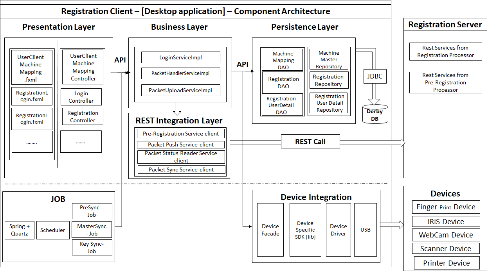

Registration Client application captures the Demographic and Biometric details of an Individual along with supporting information (proof documents & information about parten/guardian/introducer) and packages the information in a secure way. The information packet can be sent to the server in an online or offline mode for processing. 

## Registration Client process flow
Please refer to the detailed [**process flow**](Process-view#registration-client)

## Architecturally significant use cases
### Registration client must provide a secure way of capturing an Individual's demographic and biometric data
An Individual's demographic and biometric data is private. So, ensuring security and privacy of the data during capture is very important. The captured data must be cryptographically secure such that the data cannot be tampered with. 

### Registration client must provide interfaces to biometric devices that comply to industry standards
Since there are many manufacturers of biometric devices around the world, best way to ensure compatibility with a device is to comply to industry standards. This ensure that any device manufactured as per standards will work with MOSIP.

### Registration client must work in online and offline mode
In remote areas where Internet connectivity is a challenge, Registration client must work in an offline mode to capture data. Client must provide option to transfer data to server when online. This helps in uninterrupted registrations. 

### Registration client must have the ability to update itself remotely
Client must have the ability to update itself for patch upgrades (bug fixes/enhancements) in a remote way. There could be hundreds of client instances running on laptops/desktops. Updates on all of them must be controlled by the client and a central server.

### Registration client must be secured such that it cannot be tampered and misused
Since Registration client must work in offline mode, there is a possibility of client software itself being tampered with. There must be enough checks and balances to detect tampering and reject such packets.

## Logical view

## Component Architecture  
  

