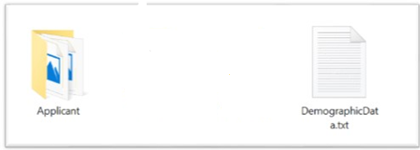

**Design - Registration Packet Structure**

This document illustrates the Packet structure created at Registration client application post capturing of
individual's data. 

**Solution**

The detailed technical process for Registration packet creation is
provided below:

**Packet Structure**
	

-   Create the Registration packet in the below format. 
	

-   Folder structure inside the packet zip. 
	
	
-   Biometric and Demographic folders should have the below sub folder
    structure.
    -   Applicant
    -   Introducer
    -   HOF
    
    **Biometric File :**
    

   **Demographic :**
   

Folder level Data: 

1.  **Biometric**

	a.  Applicant

    -   LetThumb.jpg
    -   RightThumb.jpg
    -   LeftPalm.jpg
    -   RightPalm.jpg
    -   LeftEye.jpg
    -   RightEye.jpg

2.  **Demographic**

    a.  Applicant

        -   ProofOfIdentity.pdf
        -   ProofOfResidenty.pdf
        -   ProofOfAddress1.pdf
        -   ApplicantPhoto.jpg
        -   ExceptionPhoto.jpg \[If Exceptional cases\]
        -   Registration Acknowledgement.jpg

    b.  Demographic\_info.json  
        - Follwed the Mosip ID spec and generated this Json structure. It contains the entire text data captured in the UI application. 
	
3.  **RegistrationID.txt**
4.  **HMAC File.txt**
5.  **Packet\_MetaInfo.json
6.  **Registration Officer Bio Image\[JPEG\]**
7.  **Registration Supervisor Bio Image\[JPEG\]**

-   Hash :

    -   Generate the Hash for the Biometric, Demographic and RID of
        Resident Information.

    -   Use the HMAC generation from Java 8 \[MD5 Hashing -- SHA256\]

-   Store the generated Hash in a file and append to the created Zip
    object.

-   Capture the Registration Officer/Supervisor Authentication finger
    image from the respective DTO object and append to the Zip object.

-   Create the Packet Info JSON file, which contains the **Meta data**
    information about packet and appended to the existing Zip object.

-   Session Key Encryption:

    -   Session key generation is \[MAC of machine + RO Id + Timestamp\]
        should not exceed 32 characters.

    -   Pass the created Zip object \[in-memory\] through the AES-256
        bit encryption.

    -   Pass the Random Session Key as a seed to this AES encryption.

    -   Get the Registration Officer Id from user context object. 

-   RSA Public Key Encryption:

    -   AES Session key bytes pass through the RSA public key
        encryption.

-   Use the "\#KEY\_SPLITTER\#" as a key separator for the AES encrypted
    bytes and the RSA Public key encrypted Session key seed.

-   Append the RSA Public key Encrypted Session Key, Key Separator to
    the AES encrypted bytes.

-   Append the EO and machine information as a META-INFO JSON file and
    create another ZIP out of it. \[Packet Zip + META-INFO JSON\]

-   Save the encrypted data as a ZIP in local file system under the
    defined location in configuration file.

