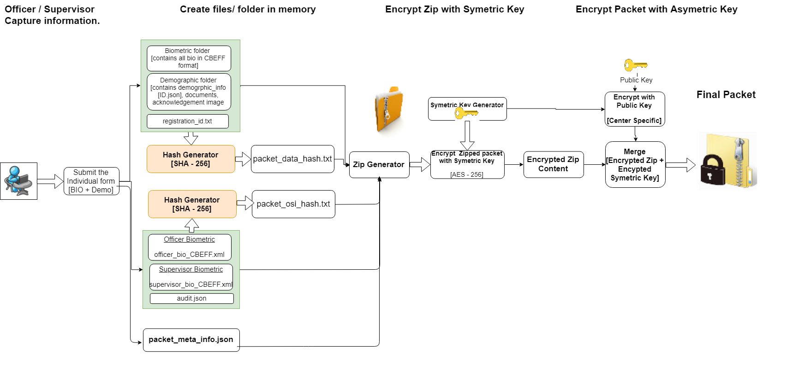
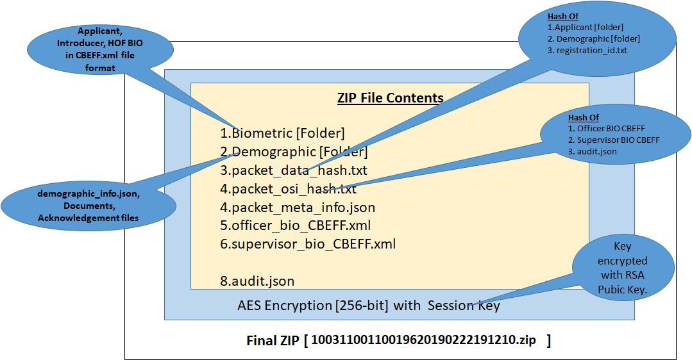

The below diagram depicts the packet creation flow along with the encryption process.

  
 
This document describes the following aspects
- Registration packet structure
- Packet encryption procedure

**Registration Packet Structure**
	

   Create the Registration packet in the below format. 
	

1.  **Folder structure inside the packet zip.**
	
	
2.  **Biometric and Demographic folders should have the below sub folder structure.**
    -   Applicant
    -   Introducer
    -   HOF
    
    **Biometric Folder:**
    
    Each folder contains the respective biometric detail in [CBEFF XML](https://github.com/mosip/mosip/wiki/MOSIP-Biometric-Data-Specifications) format.
    It contains the applicant's IRIS, Finger Print and Face bio in XML format.

    **Demographic Folder:**
    
    This folder contains the Applicant document image and demographic data.
     
     a. Applicant  
        - POI_drivinglicense.jpg  
        - POR_passport.jpg  
        - POA_passport.jpg  
        - ApplicantPhoto.jpg  
        - ExceptionPhoto.jpg \[If Exceptional cases\]  
        - Registration Acknowledgement.jpg  
        
     b.  Demographic\_info.json  
        - Follwed the Mosip [ID Spec](https://github.com/mosip/mosip/wiki/MOSIP-ID-Object-definition) and generated this JSON structure. It contains the entire text data captured in the UI application. 
	
3.  **registration_id.txt**
    -   It contains the generated Registration id which is having the length of 28 digit.
        [Eg: 0001782130002201811011002010]

4.  **packet_data_hash.txt**
    -   Generate the Hash for the Biometric, Demographic and RID of
        Resident Information.
	-   Store the generated Hash in a file and append to the created Zip
	    object.
    
5.  **packet_meta_info.json**  
    It contains the following attributes.
    -   Biometric image detail  
        "leftEye" : {
          "language" : "en",
          "label" : "label",
          "imageName" : "LeftEye",
          "type" : "iris",
          "qualityScore" : 79.0,
          "numRetry" : 2,
          "forceCaptured" : false
        }
    -   Exceptional Biometric detail
    -   Geo Location detail
    -   Applicant Type [New/ UIN Update/ Lost UIN]
    -   Pre Registration Id
    -   osiData {Operator and Supervisor authentication info.}
    -   HashSequence {It provides the hash created sequence}

6.  **Registration Officer authentication Bio [officer_bio_cbeff.xml]**
    -   Officer bio should be captured in standard [CBEFF xml](https://github.com/mosip/mosip/wiki/MOSIP-Biometric-Data-Specifications) format.
7.  **Registration Supervisor authentication Bio [supervisor_bio_cbeff.xml]**
    -   Supervisor bio should be captured in standard [CBEFF xml](https://github.com/mosip/mosip/wiki/MOSIP-Biometric-Data-Specifications) format.

-   Capture the Registration Officer/Supervisor Authentication finger
    image and append to the Zip object.

-   Create the Packet Info JSON file, which contains the **Meta data**
    information about packet and appended to the existing Zip object.

**Packet Encryption Procedure**
    
-   Session Key Encryption:

    -   Session key generation is \[MAC of machine + RO Id + Timestamp\]
        should not exceed 32 characters.

    -   Pass the created Zip object \[in-memory\] through the AES-256
        bit encryption.

    -   Pass the Random Session Key as a seed to this AES encryption.

    -   Get the Registration Officer Id from user context object. 

-   RSA Public Key Encryption:

    -   AES Session key bytes pass through the RSA public key
        encryption.

-   Use the "\#KEY\_SPLITTER\#" as a key separator for the AES encrypted
    bytes and the RSA Public key encrypted Session key seed.

-   Append the RSA Public key Encrypted Session Key, Key Separator to
    the AES encrypted bytes.

-   Append the EO and machine information as a META-INFO JSON file and
    create another ZIP out of it. \[Packet Zip + META-INFO JSON\]

-   Save the encrypted data as a ZIP in local file system under the
    defined location in configuration file.

