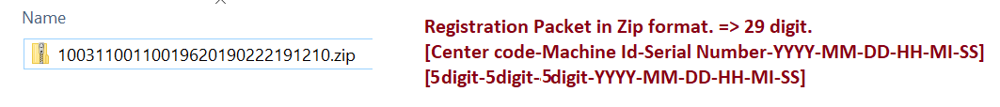
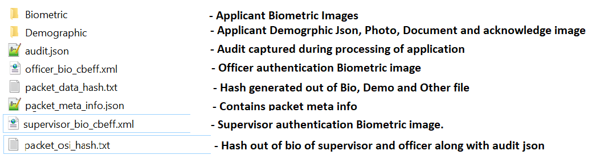

This document describes the following aspects
- Registration packet structure
- Packet encryption procedure

**Registration Packet Structure**
	

-   Create the Registration packet in the below format. 
	

-   Folder structure inside the packet zip. 
	
	
-   Biometric and Demographic folders should have the below sub folder structure.
    -   Applicant
    -   Introducer
    -   HOF
    
    **Biometric File :**
    
    

	Each folder contains the respective biometric detail in CBEFF XML format.
			
	Files inside Applicant folder.
	
	    * File contains the applicant IRIS, Finger Print and Face bio in XML format.

    **Demographic File:**
    
    This folder contains the Applicant document image and demographic data.

     a. Applicant  
        - ProofOfIdentity.jpg  
        - ProofOfResidenty.jpg  
        - ProofOfAddress1.jpg  
        - ApplicantPhoto.jpg  
        - ExceptionPhoto.jpg \[If Exceptional cases\]  
        - Registration Acknowledgement.jpg  
        
     b.  Demographic\_info.json  
        - Follwed the Mosip [ID Spec](https://github.com/mosip/mosip/wiki/MOSIP-ID-Object-definition) and generated this JSON structure. It contains the entire text data captured in the UI application. 
	
3.  **RegistrationID.txt**
-   It contains the generated Registration id which is having the length of 28 digit.
    [Eg: 0001782130002201811011002010]

4.  **packet_data_hash.txt**
    -   Generate the Hash for the Biometric, Demographic and RID of
        Resident Information.
	-   Store the generated Hash in a file and append to the created Zip
	    object.
    
5.  **Packet\_MetaInfo.json**

6.  **Registration Officer authentication Bio**
    -   Officer bio should be captured in standard CBEFF xml format.
7.  **Registration Supervisor authentication Bio**
    -   Supervisor bio should be captured in standard CBEFF xml format.

-   Capture the Registration Officer/Supervisor Authentication finger
    image and append to the Zip object.

-   Create the Packet Info JSON file, which contains the **Meta data**
    information about packet and appended to the existing Zip object.

**Packet encryption procedure**
	

-   Session Key Encryption:

    -   Session key generation is \[MAC of machine + RO Id + Timestamp\]
        should not exceed 32 characters.

    -   Pass the created Zip object \[in-memory\] through the AES-256
        bit encryption.

    -   Pass the Random Session Key as a seed to this AES encryption.

    -   Get the Registration Officer Id from user context object. 

-   RSA Public Key Encryption:

    -   AES Session key bytes pass through the RSA public key
        encryption.

-   Use the "\#KEY\_SPLITTER\#" as a key separator for the AES encrypted
    bytes and the RSA Public key encrypted Session key seed.

-   Append the RSA Public key Encrypted Session Key, Key Separator to
    the AES encrypted bytes.

-   Append the EO and machine information as a META-INFO JSON file and
    create another ZIP out of it. \[Packet Zip + META-INFO JSON\]

-   Save the encrypted data as a ZIP in local file system under the
    defined location in configuration file.

