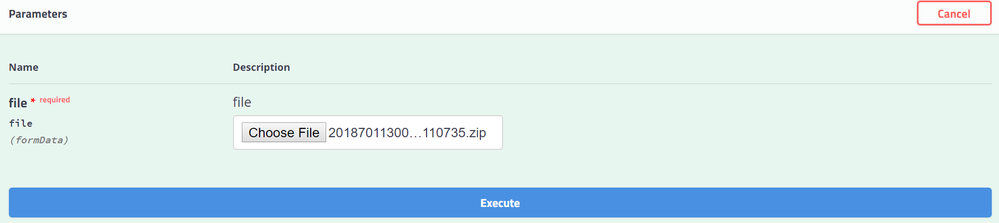

This section details about the service APIs in the Registration-Processor modules

[1. Packet receiver Service](#1-packet-receiver-service)

[2. Registration status Service](#2-registration-status-service)

[3. Manual Adjudication Service](#3-manual-adjudication-service)

[4. Bio Dedupe Service](#4-bio-dedupe-service)

[5. Packet Generator Service](#5-packet-generator-service)

# 1 Packet Receiver Service
## 1.1 Packet-receiver service
This service receives the registration packet and puts it to landing zone.

### Resource URL
### `POST /v1/packetreceiver/registrationpackets`

### Resource details

Resource Details | Description
------------ | -------------
Request format | MULTIPART
Response format | JSON
Requires Authentication | Yes

### Parameters
Name | Required | Description | Default Value | Example
-----|----------|-------------|---------------|--------
MultipartFile|Yes|The encrypted zip file| |

### Example Request


### Example Response

#### Success response
```JSON
{
	"id" : "mosip.registration.packet",
	"version" : "1.0",
	"responsetime" : "2019-02-02T06:12:25.288Z",
	"response" : {
		"status" : "PACKET_UPLOADED_TO_VIRUS_SCAN"
	}
}
```
#### Failure response

```JSON
{
  "id" : "mosip.registration.packet",
  "version" : "1.0",
  "responsetime": "2019-02-02T06:12:25.288Z",
  "errors" : [{
		"errorcode": "RPR-PKR-005",
	    "message": "The request received is a duplicate request to upload a Packet"
	}]
}
```

### Response codes
200

Description: Packet successfully uploaded to landing zone


# 2 Registration Status Service
## 2.1 Packet-status service
This service return the registration current status for list of input registration ids.

### Resource URL
### `GET /v1/registrationstatus/search`

### Resource details

Resource Details | Description
------------ | -------------
Request format | JSON
Response format | JSON
Requires Authentication | Yes

### Parameters
Name | Required | Description | Default Value | Example
-----|----------|-------------|---------------|--------
registrationIds|Yes|List of registration ids| |

### Example Request
```JSON
{
  "id" : "mosip.registration.status",
  "version" : "1.0",
  "requesttime": "2019-02-14T12:40:59.768Z",
  "request" : [
	{
		"registrationId" : "2018701130000410092012345678"
	},
	{
		"registrationId" : "2018701130000410092012345678"
	}
  ]
}
```
### Example Response
Record found :
```JSON
{
  "id" : "mosip.registration.status",
  "version" : "1.0",
  "responsetime": "2019-02-14T12:40:59.768Z",
  "response" : [
  {
    "registrationId": "2018701130000410092012345678",
    "statusCode": "PROCESSING"
  },
  {
    "registrationId": "2018701130000410092018110735",
    "statusCode": "PROCESSED"
  }
]
}
```
Record not found :
```JSON
{
  "id" : "mosip.registration.status",
  "version" : "1.0",
  "responsetime": "2019-02-14T12:40:59.768Z",
  "response" : []
}
```

### Response codes
200

Description: Successfully retrieved information


## 2.2 Sync-registration service
The registration ids has to be synced with server before uploading packet to landing zone. This service is used to syncs registration ids.

### Resource URL
### `POST /v1/registrationstatus/sync`

### Resource details

Resource Details | Description
------------ | -------------
Request format | JSON
Response format | JSON
Requires Authentication | Yes

### Parameters
Name | Required | Description | Default Value | Example
-----|----------|-------------|---------------|--------
id|Yes|the id for sync| |mosip.registration.sync
version|Yes|the version for sync| |1.0
version|Yes|the version for sync| |1.0
version|Yes|the version for sync| |1.0
version|Yes|the version for sync| |1.0
version|Yes|the version for sync| |1.0
version|Yes|the version for sync| |1.0


### Example Request
```JSON
{
	"id": "mosip.registration.sync",
	"version": "1.0",
	"requesttime": "2019-02-14T12:40:59.768Z",
	"request": [{
			"registrationId": "80006444440002520181208094000",
			"statusComment": "string",
			"registrationType": "NEW",
			"packetHashValue": "D7C87DC5D3A759D77433B02B80435CFAB5087F1A942543F51A5075BC441BF7EB",
			"packetSize": 5242880,
			"supervisorStatus": "APPROVED",
			"supervisorStatusComment": "Approved, all good",
			"optionalValues": [{
				"key": "CNIE",
				"value": "122223456"
			}]
		},
		{
			"registrationId": "10011100110002520181208094000",
			"statusComment": "string",
			"registrationType": "UPDATE",
			"packetHashValue": "D7C87DC5D3A759D77433B02B80435CFAB5087F1A942543F51A5075BC441BF7EB",
			"packetSize": 4242880,
			"supervisorStatus": "REJECTED",
			"supervisorStatusComment": "Rejected due to error",
			"optionalValues": [{
				"key": "CNIE",
				"value": "3456789o"
			}]
		}
	]
}
```
### Example Response
Success response :
```JSON
{
  "id" : "mosip.registration.sync",
  "version" : "1.0",
  "responsetime": "2019-02-14T12:40:59.768Z",
  "response" : [
	  {
		"registrationId": "1234575",
		"status": "SUCCESS"
	  },
	  {
		"registrationId": "12345678901234567890123456789",
		"status": "SUCCESS"
	  },
	  {
		"registrationId": "27847657360002520181208183052",
		"status": "SUCCESS"
	  }
	]
}
```
Failure response
```JSON
{
  "id" : "mosip.registration.sync",
  "version" : "1.0",
  "responsetime": "2019-02-14T12:40:59.768Z",
  "errors" : [
	  {
		"registrationId": "1234575",
		"status": "FAILURE",
                "errorCode": "RPR-RGS-009",
		"errorMessage": "RegistrationId Length Must Be 29"
	  },
	  {
		"registrationId": "12345678901234567890123456789",
		"status": "FAILURE",
		"errorCode": "RPR-RGS-007",
                "errorMessage": "Invalid Time Stamp Found in RegistrationId"
	  },
	  {
		"registrationId": "27847657360002520181208183052",
		"status": "FAILURE",
		"errorCode": "RPR-RGS-012",
		"errorMessage": "Parent RegistrationId Length Must Be 29"
	  }
	]
}
```

### Response codes
200

Description: Successfully synced


# 3 Manual Adjudication Service
## 3.1 manual-adjudication-assignment service
This service is used to assign one single unassigned applicant record to the input user.

### Resource URL
### `POST /v1/manualverification/assignment`

### Resource details

Resource Details | Description
------------ | -------------
Request format | JSON
Response format | JSON
Requires Authentication | Yes

### Parameters
Name | Required | Description | Default Value | Example
-----|----------|-------------|---------------|--------
String|Yes|The user id| |

### Example Request
```JSON
{
  "id" : "mosip.manual.verification.assignment",
  "version" : "1.0",
  "requesttime": "2019-02-14T12:40:59.768Z",
  "request" : {
	"userId": "mono29"
  }
}
```
### Example Response
Success response
```JSON
{
  "id" : "mosip.manual.verification.assignment",
  "version" : "1.0",
  "responsetime": "2019-02-14T12:40:59.768Z",
  "response" : {
	  "regId": "27847657360002520181208123456",
	  "mvUsrId": "mono29",
	  "statusCode": "ASSIGNED",
	  "matchedRefId": "27847657360002520181208123456",
	  "matchedRefType": "UIN",
	  "reasonCode": null
	}
}
```
Failure response
```JSON
{
  "id" : "mosip.manual.verification.assignment",
  "version" : "1.0",
  "responsetime": "2019-02-14T12:40:59.768Z",
	"errors" : [{
		"errorCode" : "RPR-FAC-003",
		"message" : "Cannot find the Registration Packet"
	}]
}
```

### Response codes
200

Description : response code is always 200 if server receives the request.

## 3.2 manual-adjudication-decision service
This service is used to get the decision from manual adjudicator for an applicant and update the decision in table.

### Resource URL
### `POST /v1/manualverification/decision`

### Resource details

Resource Details | Description
------------ | -------------
Request format | JSON
Response format | JSON
Requires Authentication | Yes

### Parameters
Name | Required | Description | Default Value | Example
-----|----------|-------------|---------------|--------
ManualVerificationDTO|Yes|Dto containing manual adjudication info| |

### Example Request
```JSON
{
  "id" : "mosip.manual.verification.decision",
  "version" : "1.0",
  "requesttime": "2019-02-14T12:40:59.768Z",
  "request" : {
	  "matchedRefId": "27847657360002520181208123987",
	  "matchedRefType": "RID",
	  "mvUsrId": "mono",
	  "reasonCode": "Problem with biometrics",
	  "regId": "27847657360002520181208123456",
	  "statusCode": "APPROVED"
	}
}
```
### Example Response
Success response
```JSON
{
  "id" : "mosip.manual.verification.decision",
  "version" : "1.0",
  "responsetime": "2019-02-14T12:40:59.768Z",
  "response" : {
	  "regId": "27847657360002520181208123456",
	  "mvUsrId": "mono",
	  "statusCode": "APPROVED",
	  "matchedRefId": "27847657360002520181208123987",
	  "matchedRefType": "RID",
	  "reasonCode": "Problem with biometrics"
	}
}
```
Failure response
```JSON
{
  "id" : "mosip.manual.verification.decision",
  "version" : "1.0",
  "responsetime": "2019-02-14T12:40:59.768Z",
	"errors" : [{
		"errorCode" : "RPR-MVS-003"",
		"message" : "Invalid status update"
	}]
}
```

### Response codes
200

Description : response code is always 200 if server receives the request.


## 3.3 manual-adjudication-applicant-biometric service
The manual adjudicator would need to verify the applicant biometric and demographic records. This service is used to get the applicant biometric from packet store by registration id.

### Resource URL
### `POST /v1/manualverification/applicantBiometric`

### Resource details

Resource Details | Description
------------ | -------------
Request format | JSON
Response format | byte[]
Requires Authentication | Yes

### Parameters
Name | Required | Description | Default Value | Example
-----|----------|-------------|---------------|--------
FileRequestDto|Yes|Dto containing registration id and file name| |

### Example Request
```JSON
{
  "id" : "mosip.manual.verification.biometric",
  "version" : "1.0",
  "requesttime": "2019-02-14T12:40:59.768Z",
  "request" : {
	  "fileName": "APPLICANTPHOTO",
	  "regId": "27847657360002520181208123456"
	}
}
```
### Example Response
Success :
```JSON
{
  "id" : "mosip.manual.verification.biometric",
  "version" : "1.0",
  "responsetime": "2019-02-14T12:40:59.768Z",
  "response" : {
	  "file": "B@629f0666"
  }
}
```
Failure :
```JSON
{
  "id" : "mosip.manual.verification.biometric",
  "version" : "1.0",
  "responsetime": "2019-02-14T12:40:59.768Z",
  "errors" : [{
	"errorCode" : "RPR-MVS-002",
	"message" : "Requested file is not present"
  }]
}
```

### Response codes
200

Description : response code is always 200 if server receives the request.


## 3.4 manual-adjudication-applicant-demographic service
The manual adjudicator would need to verify the applicant biometric and demographic records. This service is used to get the applicant demographic from packet store by registration id.

### Resource URL
### `POST /v1/manualverification/applicantDemographic`

### Resource details

Resource Details | Description
------------ | -------------
Request format | JSON
Response format | byte[]
Requires Authentication | Yes

### Parameters
Name | Required | Description | Default Value | Example
-----|----------|-------------|---------------|--------
FileRequestDto|Yes|Dto containing registration id and file name| |

### Example Request
```JSON
{
  "id" : "mosip.manual.verification.demographic",
  "version" : "1.0",
  "requesttime": "2019-02-14T12:40:59.768Z",
  "request" : {
	  "fileName": "PACKETMETAINFO",
	  "regId": "27847657360002520181208123456"
	}
}
```
### Example Response
```JSON
{
  "id" : "mosip.manual.verification.biometric",
  "version" : "1.0",
  "responsetime": "2019-02-14T12:40:59.768Z",
  "response" : {
	  "file": "B@629f0666"
  }
}
```
Failure :
```JSON
{
  "id" : "mosip.manual.verification.biometric",
  "version" : "1.0",
  "responsetime": "2019-02-14T12:40:59.768Z",
  "errors" : [{
	"errorCode" : "RPR-MVS-002",
	"message" : "Requested file is not present"
  }]
}
```

### Response codes
200

Description : response code is always 200 if server receives the request.

# 4 Bio Dedupe Service
## 4.1 Bio Dedupe service
The abis would call bio-dedupe service to get the biometric cbeff file.

### Resource URL
### `POST /v1/bio-dedupe/{referenceid}`

### Resource details

Resource Details | Description
------------ | -------------
Request format | JSON
Response format | byte[]
Requires Authentication | Yes

### Parameters
Name | Required | Description | Default Value | Example
-----|----------|-------------|---------------|--------
byte[]|Yes|byte array of CBEFF file| |

### Example Response
```JSON
// byte array of CBEFF xml file
```

### Response codes
200

Description : response code is always 200 if server receives the request.

# 5 Packet Generator Service
## 4.1 Packet Generator Service
The abis would call bio-dedupe service to get the biometric cbeff file.

### Resource URL
### `POST /v1/packetgenerator/registrationpacket`

### Resource details

Resource Details | Description
------------ | -------------
Request format | JSON
Response format | byte[]
Requires Authentication | Yes

### Parameters
Name | Required | Description | Default Value | Example
-----|----------|-------------|---------------|--------
PacketGeneratorRequestDto|Yes|Dto containing information required for activate or deactivate packet| |

### Example Request
```JSON
{
  "id": "mosip.packet.generator",
  "version": "1.0",
  "requesttime": "2019-02-02T06:12:25.288Z",
  "request": {
    "centerId": "10031",
    "machineId": "10011",
    "reason": "something",
    "registrationType": "DEACTIVATED",
    "uin": "4215839851"
  }
}
```
### Example Response
```JSON
{
  "id": "mosip.packet.generator",
  "version": "1.0",
  "responsetime": "2019-02-02T06:12:25.288Z",
  "response": {
    "registrationId": "10031100110005020190313110030",
    "status": "RECEIVED",
    "message": "Packet created and uploaded"
  }
}
```


### Response codes
200

Description : response code is always 200 if server receives the request.