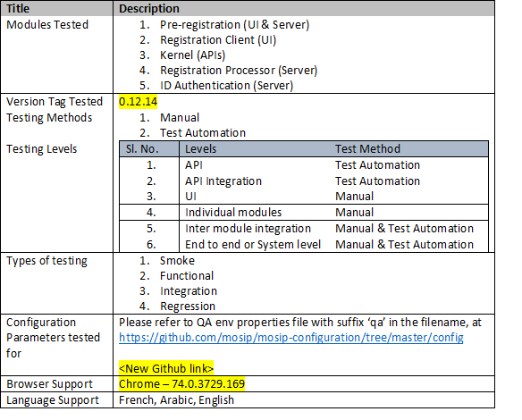

## Table Of Content

- [Scope of Version 1.0.0](#scope-of-version-100-)
- [Documentation](#documentation-)
- [Key Points](#key-points-)
- [Code](#code-)
- [Test Execution reports](#test-execution-reports-)
  * [Mindtree testing report](#mindtree-testing-report)
  * [IV&V testing report](#ivv-testing-report-need-link-to-update)
- [Training topics](#training-topics-)
- [Support Process](#support-process-)

## Scope of Version 1.0.0 [**[↑]**](#table-of-content)
This release is with **proxy biometrics**. This means that the implementation of Print system, SDK, MDM (Mosip Device Manager), ABIS and biometric devices has been stubbed. Also, this version is tested for functionality. Nonfunctional requirements (Performance, Security) are not tested.

* Modules included – Pre Registration, Registration Client, Registration Processor, ID Authentication
* Modules excluded – Administration, Partner Management, Resident Services
* Reference implementation of Pre-Registration and Registration Client UI
## Documentation [**[↑]**](#table-of-content)
### 1. Product Documentation 
High Level documentation including Functional requirements, Process flows, Architecture and high level design documents, Deployment guide, Developer documentation etc.  
   [**Link to Product Documentation**](Platform-Documentation)
### 2. Detailed Documentation
Low Level design, Wireframes, Test cases [**need link to update**]

## Key Points [**[↑]**](#table-of-content)

|Key Points|	Details|
|----|----|
|Pre Registration - Browser(s) |	Chrome (Version - 74.0.3729)|
|Deployment Script Environment|	Microsoft Azure|
|Registration Client – OS version|	Windows 10 (English version)  with TPM 2.0|
|Camera|	Logitech / Default windows camera|
|Scanner|	Canon lide 120|
|GPS|	GlobalSat BU-353-S4|
|Biometrics standard for proxy|	CBEFF format (Version - 1.0)|
|SMS gateway|	MSG91, Infobip|
|Registration Client – face capture |	OpenImaj - This is licensed for demo purpose only|
|Keystore|	SoftHSM|
|Antivirus|	ClamAV|
|Maps	|OpenstreetMap|
|Supporting key based digital signatures, not using digital certificates||	
|Transliteration|	ICU4J (Library with French, Arabic languages)|

## Code [**[↑]**](#table-of-content)
The code is available in open source repository. This includes automation test suite. The code needs to be downloaded and deployed as per the deployment guide above [**need link to update**]. We would actively support the System Integrator during the first deployment process.

## Test Execution reports [**[↑]**](#table-of-content)
### Mindtree testing report

**Test Scope**

#### 1. In Scope

The following have been the IN SCOPE entities for testing

|Title	|Description|
|------|------|
|Modules Tested|<li> Pre-registration (UI & Server) <li> Registration Client (UI) <li> Kernel (APIs) <li> Registration Processor (Server) <li> ID Authentication (Server)|
| Version Tag Tested|	0.12.15|
|Testing Methods| <li>  Manual <li>  Test Automation|
|Types of testing|<li>	 Smoke <li> Functional <li>  Integration <li> 	Regression|
|Testing Levels| |
|Configuration Parameters tested for| Refer to QA env properties file with suffix ‘qa’ in the filename, at [**Link**](/mosip/mosip-configuration/tree/master/config)|
|Browser Support|Chrome – 74.0.3729.169|
|Language Support|French, Arabic, English|

#### 2. Out Of Scope – MOSIP V1.0 Platform

|Title|	Description|
|------|------|
|NFR Testing| <li> Performance Testing <li> Security Testing|
|Global Configuration Testing|<li> Testing is done for one set of approved production configuration only <li> Changing the configuration parameters for various values (boundary values) and testing the impact of each such value on the platform code, is not tested for.|
|NFR Defect Fix Retesting|The outstanding NFR defects are not considered for fix or retesting in this release|
|Browser Support| <li>	IE <li>	Firefox <li> MAC|

#### 3. Executive Summary – Consolidated Quality Status

|Sl. No.|	Module / Activity|	Jira Epic ID|	Testing Methodology|	RAG Status|	Description|
|------|------|------|------|------|------|
|1|	Kernel	|MOS-1|	Test Automation	|API|	|
|2|	Pre-Registration|	MOS-2|<li> Manual Testing <li> Test Automation|<li> UI <li> API <li> Workflows|<li> Certified critical functional workflows <li> Open Defects <li> Major – <li> Minor - |
|3|	Registration Client|	MOS-14575| <li> Manual Testing <li> Test Automation| <li> UI <li> API <li> Workflows||
|4|Registration Processor|	MOS-4|<li> Manual Testing <li> Test Automation	|<li> API <li> Workflows| |
|5|	ID Authentication	|MOS-5|	Test Automation	|<li> API <li> Workflows|	|	
|6	|Pre-Registration to Registration Client integration testing|	NA|	Manual Testing|	Workflows|	|	
|7|	Registration Client to Registration Processor integration testing|	NA|	Manual Testing|	Workflows||	
|8|	Registration Processor to Pre-Registration integration testing|	NA	|Manual Testing|Workflows|	|	
|9|	Registration Processor to Registration Client integration testing|	NA|	Manual Testing|	Workflows|	|
|10|	Registration Client to IDA integration testing|	NA|	Manual Testing|	Workflows|		|
|11|	Registration Processor to IDA integration testing|	NA|	Manual Testing|	Workflows	||
|12|	IDA to ID Repo|	NA|	Manual Testing|	Workflows	|	|
|13	|Kernel API integration|	NA|	<li> Manual Testing <li> Test Automation|	Workflows|This is covered as part of both, individual module level & inter module level integration testing |
|14|	End to end testing|	NA|	Manual Testing|	Workflows	|	This is certified manually as of 0.12.14 release build|

#### 4.Types of testing - Definition

|Testing Type| Description|
|------|------|
|Smoke Testing|	
|Functional Testing|	
|Integration Testing|	
|Regression Testing|
	
#### 5. Manual Test Execution Metrics & Graphs
to be done
#### 6. Automation Test Reports
consolidated report run on 0.12.14 on QA env, from merged automation code base

### IV&V testing report [**need link to update**]
## Training topics [**[↑]**](#table-of-content)
Detailed topics that can be covered as a part of training to the System Integrator as shown below in the table:

|Sessions\Topics|Speaker|High Level Scope of the session|Dates(TBD)|Duration|
|------|-----|-----|-----|-----|
|MOSIP Functional Overview|TBD|Functional Modules, Demo, Documentation Overview (Github, Wiki)|TBD|2|
|MOSIP Technical Overview|	TBD|	Tools, Technology, Architecture, How to build deploy, Reference|	TBD|	2|
|MOSIP Interfaces|	TBD|	Devices, MDS, ABIS, Enrichment, Print & Post COTS - MAPS, SMS, Email, Transliteration|TBD|2|
|MOSIP Infrastructure|	TBD|	Sizing, Deployment Architecture, Infrastructure as a Code, Firewall, Zoning, Kubernatis, CI/CD, One Click Deploy|	TBD|	2|
|Data Architecture|	TBD|	|	TBD|	2|
Pre registration|	TBD|	Functional Overview Coverage - API, Configuration & Customisation|	TBD|	2|
Kernel|	TBD|	Functional Overview Coverage - API, Configuration & Customisation|	TBD|	2|
Reg client|	TBD|	Functional Overview Coverage - API, Configuration & Customisation|	TBD|	2|
Reg Processor|	TBD|	Functional Overview Coverage - API, Configuration & Customisation|	TBD|	2|
ID authentication|	TBD|	Functional Overview Coverage - API, Configuration & Customisation|	TBD|	2|
|Mosip Testing|	TBD|	Functions, Test Rig, Automation Suite, Test Data, Scenario|	TBD|	2|
|Admin Module|	TBD|	Coverage - API, Configuration & Customisation|	TBD|	2|
|Non Functional |	TBD|	Security, Performance|	TBD|	2|
|L3 Support|	TBD|	Protocols, Expectation Setting|	TBD|	Full day|
|Hands on|	TBD|	GIT Source Structure, Overview of Setup, External Dependencies (LDAP, AV etc.,), Deployment Architecture |	TBD|	Half Day |
|Hands on|	TBD|	Key Manager, Setup with / without Jenkins, setup & config Kubernetes cluster|	TBD|	Half Day |
|Hands on|	TBD|	3rd Party Products (ABIS, Devices, etc.,), Reg client Setup, Auth API Server Setup|	TBD|	Half Day |
|Hands on|	TBD|	Security Zoning, Firewall setups, Introduction to HSM and TPM |	TBD|	Half Day |
## Support Process [**[↑]**](#table-of-content)
Process to be followed for support required, escalation matrix [**need link to update**]

