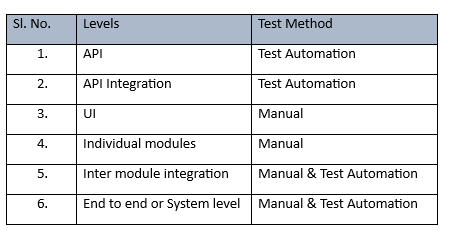

## Scope of Version 1.0.0
This release is with proxy biometrics. This means that the implementation of Print system, SDK, MDM (Mosip Device Manager), ABIS and biometric devices has been stubbed. Also, this version is tested for functionality. Nonfunctional requirements (Performance, Security) are not tested.

* Modules included – Pre Registration, Registration Client, Registration Processor, ID Authentication
* Modules excluded – Administration, Partner Management, Resident Services
* Reference implementation of Pre-Registration and Registration Client UI
## Documentation 
### 1. Product Documentation 
High Level documentation including Functional requirements, Process flows, Architecture and high level design documents, Deployment guide, Developer documentation etc.  [**link to Product Documentation**](Platform-Documentation)
### 2. Detailed Documentation
Low Level design, Wireframes, Test cases [**need link to update**]
### 3. Training topics
Detailed topics that can be covered as a part of training to the System Integrator as shown below in the table:

|Sessions\Topics|Speaker|High Level Scope of the session|Dates(TBD)|Duration|
|------|-----|-----|-----|-----|
|MOSIP Functional Overview|TBD|Functional Modules, Demo, Documentation Overview (Github, Wiki)|TBD|2|
|MOSIP Technical Overview|	TBD|	Tools, Technology, Architecture, How to build deploy, Reference|	TBD|	2|
|MOSIP Interfaces|	TBD|	Devices, MDS, ABIS, Enrichment, Print & Post COTS - MAPS, SMS, Email, Transliteration|TBD|2|
|MOSIP Infrastructure|	TBD|	Sizing, Deployment Architecture, Infrastructure as a Code, Firewall, Zoning, Kubernatis, CI/CD, One Click Deploy|	TBD|	2|
|Data Architecture|	TBD|	|	TBD|	2|
Pre registration|	TBD|	Functional Overview Coverage - API, Configuration & Customisation|	TBD|	2|
Kernel|	TBD|	Functional Overview Coverage - API, Configuration & Customisation|	TBD|	2|
Reg client|	TBD|	Functional Overview Coverage - API, Configuration & Customisation|	TBD|	2|
Reg Processor|	TBD|	Functional Overview Coverage - API, Configuration & Customisation|	TBD|	2|
ID authentication|	TBD|	Functional Overview Coverage - API, Configuration & Customisation|	TBD|	2|
|Mosip Testing|	TBD|	Functions, Test Rig, Automation Suite, Test Data, Scenario|	TBD|	2|
|Admin Module|	TBD|	Coverage - API, Configuration & Customisation|	TBD|	2|
|Non Functional |	TBD|	Security, Performance|	TBD|	2|
|L3 Support|	TBD|	Protocols, Expectation Setting|	TBD|	Full day|
|Hands on|	TBD|	GIT Source Structure, Overview of Setup, External Dependencies (LDAP, AV etc.,), Deployment Architecture |	TBD|	Half Day |
|Hands on|	TBD|	Key Manager, Setup with / without Jenkins, setup & config Kubernetes cluster|	TBD|	Half Day |
|Hands on|	TBD|	3rd Party Products (ABIS, Devices, etc.,), Reg client Setup, Auth API Server Setup|	TBD|	Half Day |
|Hands on|	TBD|	Security Zoning, Firewall setups, Introduction to HSM and TPM |	TBD|	Half Day |

## Release Notes 
This contains the features delivered as a part of version 1.0.0 and known issues  [**need link to update**]
   * Note for cpu team – Release notes will have known limitations, browsers that we have tested on,  deployment script environment (azure) etc. 

## Code 
The code is available in open source repository. This includes automation test suite. The code needs to be downloaded and deployed as per the deployment guide above [**need link to update**]. We would actively support the System Integrator during the first deployment process.

## Test Execution reports
* Mindtree testing report <email sent to you – next>
* IV&V testing report [**need link to update**]
## Support Process 
Process to be followed for support required, escalation matrix [**need link to update**]

 

|Title	|Description|
|------|------|
|Modules Tested|<li> 1. Pre-registration (UI & Server) <li> 2.	Registration Client (UI) <li> 3. Kernel (APIs) <li> 4. Registration Processor (Server) <li> 5.	ID Authentication (Server)|
| Version Tag Tested|	0.12.14|
|Testing Methods| <li> 1. Manual <li> 2. Test Automation|
|Types of testing|<li>	1. Smoke <li> 2. Functional <li> 3. Integration <li> 4.	Regression|
|Testing Levels|[Click here](#testing-levels-table)
|Configuration Parameters tested for|<li> Please refer to QA env properties file with suffix ‘qa’ in the filename, at [**Link**](/mosip/mosip-configuration/tree/master/config) <li> **provide New Github link**|
|Browser Support|Chrome – 74.0.3729.169|
|Language Support|French, Arabic, English|

## Testing Levels table

|Sl. No.|Levels|Test Method|
|------|------|------|
|1.|API |Test Automation|
|2.|API Integration|Test Automation|
|3.|UI|	Manual|
|4.|Individual modules|	Manual|
|5.|Inter module integration|Manual & Test Automation|
|6.|End to end or System level|	Manual & Test Automation|

