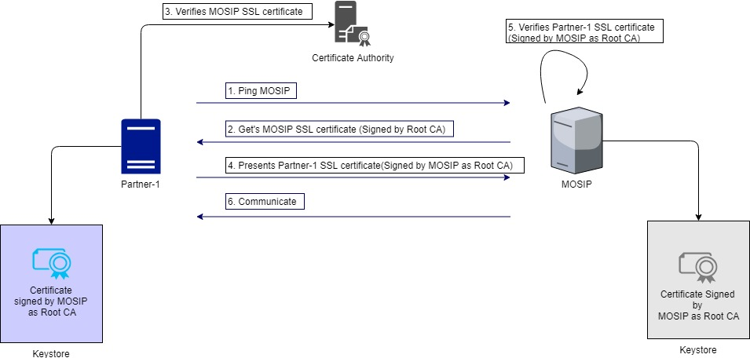
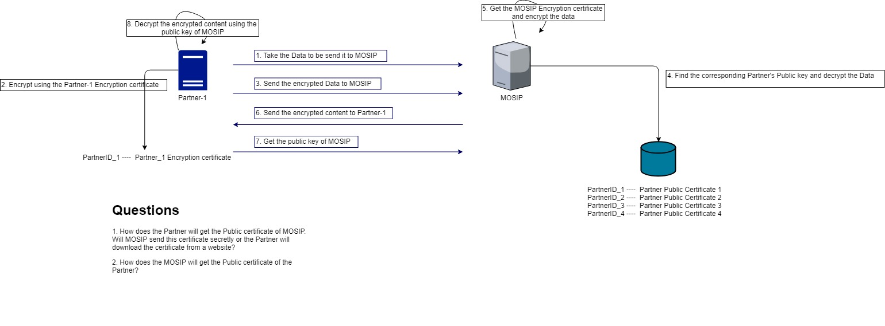
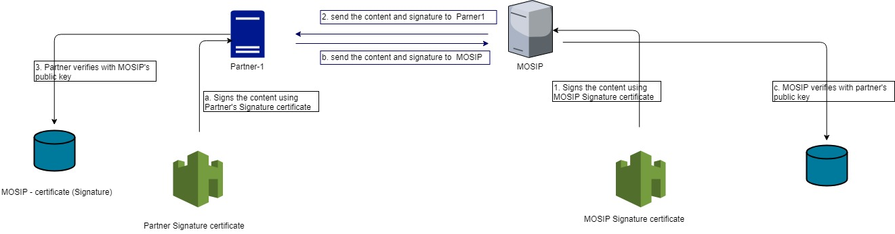

# Partner and MOSIP communications
#### Background

The MOSIP and Partners have to communicate with each other, when an individual avails the service of the partners. The communication have to be executed safely and securely. 

#### Solution

**The key solution considerations are**

- Security is one of the main concern in the communication between the partner and MOSIP communication. Following are the key considerations when given the solution,

1. CIA triad:
	Confidentiality:
		- The communication should be confidential and no other parties should be able to eaves drop the communicated details
        Integrity
                - The integrity of the communication should be maintained. Both MOSIP and Partners have to sign the request and response of the communication. 

2. Security in various levels:

2.1 Presentation Layer

	When the partner communicates with the MOSIP system, at the presentation layer, the following steps are handled, 
	
	1. The partner pings MOSIP. 
	
	2. The partner gets the MOSIP certificate which is signed by the Root CA
	
	3. The partner then verifies the MOSIP certificate with the Root CA
	
	4. Once validated, the Partner shares his SSL certificate to the MOSIP. This SSL certificate is already signed by MOSIP as Root CA. 
	
	5. MOSIP verifies the SSL certificate. 
	
	6. Once both the SSL certificate is validated, the communication channel is established and communication happens. 
	

**Communication diagram**

	

2.2 Application Layer - Encryption of the content

	At the Application Layer, the following 2 security standards are done. 
	
	1. The data is encrypted in the application layer itself before it gets into the presentation layer. 
	
	2. The Encryption certificate is shared across by both the parties(MOSIP & Partners) to decrypt the content. 
	

**Communication diagram**

	

2.3 Application Layer - Digitial Signature

	At the application layer, in addition to the encryption, the integrity can be checked by the Digital Signatures. 
	
	1. Both the parties(MOSIP and Partner) have to sign the request and response in the communication. 
	
	2. Partner signs his request and response using his Signing certificate. MOSIP can verify the signature using the Partner's public key. 
	
	3. MOSIP signs his request and response using his Signing certificate. Partner can verify the MOSIP's public key. 
	

**Communication diagram**

Summary:

 - In summary, there are 3 certificates are used in the communication, 
	1. SSL certificate - Used in the Presentation layer
	2. Encryption certificate - Used in the Application layer
	3. Signature certificate - Used in the Application layer
	

## Implementation

**partner-mosip-communication** [README](../../../security/partner-mosip-communication/README.md)

