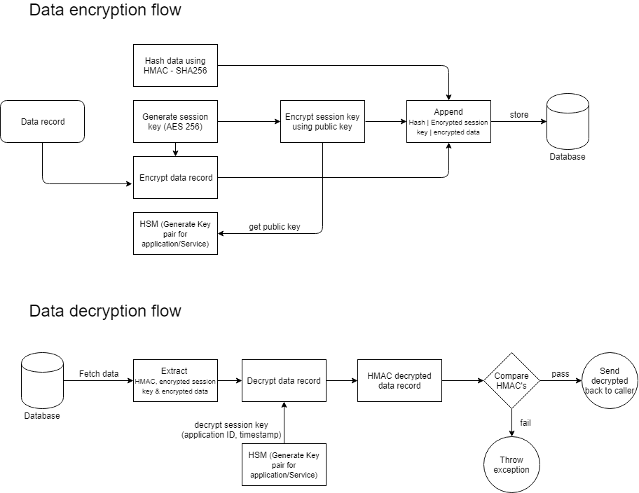
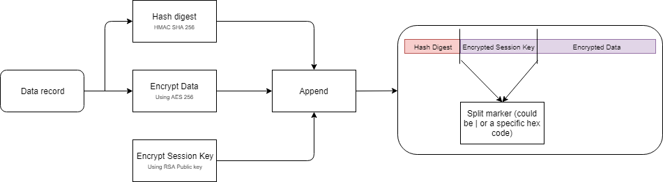
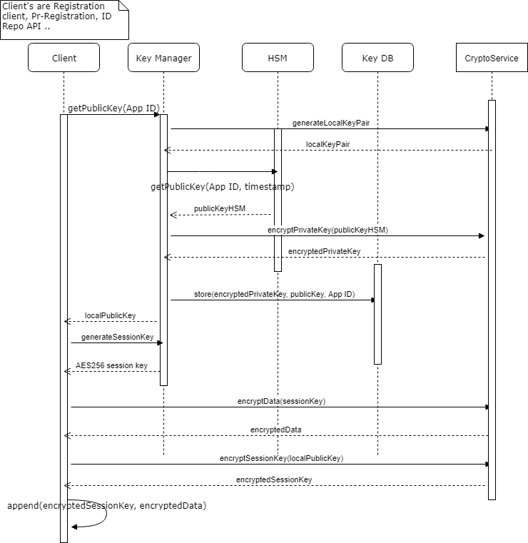
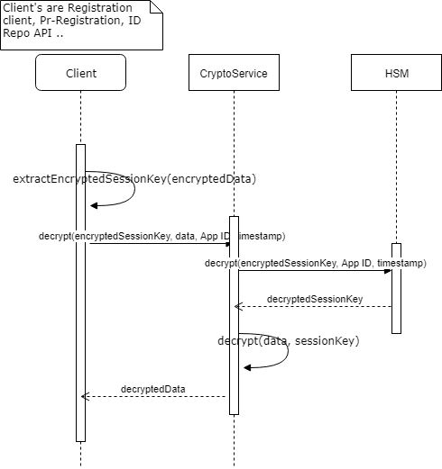

Multiple aspects of security like confidentiality, privacy, integrity of data are key in ensuring an Individual's identity is not compromised. Below are the security design principles MOSIP must follow

- Direct access to data stored in database is discouraged. Data can only be accessed via API's
- An Individual's Identity data at is always encrypted to ensure confidentiality of data
- Access controls must be implemented on all API's to ensure data privacy (who can see what)

# Database encryption
As a principle, MOSIP will not use any mechanism in-built in a database for encryption. All sensitive data to be stored in a DB is encrypted/decrypted outside the DB.

- All data will be encrypted using a symmetric key algorithm. MOSIP will support AES 256 algorithm by default. However, the specific algorithm to be used is configurable.
- Each record will be encrypted using its own symmetric key and same key will not be used to encrypt multiple records
- The symmetric key itself is encrypted using a master public key. The corresponding private must be managed in a HSM
- HSM will store an asymmetric key pair for each application/service and will be rotated periodically as per configuration
- The encrypted symmetric key is appended to the data itself and not stored separately

### Data format in DB

# Key management, Data Encryption & Decryption
- MOSIP will use both symmetric and asymmetric keys for data encryption
- Symmetric key must not be stored AS IS anywhere in MOSIP
- Symmetric is always encrypted using a public key. The respective private key must always be stored in a HSM device
- Decrypting the encrypted symmetric key must always happen inside the HSM device
- HSM device will only store master keys for each application/module and must be rotated periodically
- In case an application needs a large set of public/private key pairs (in case of Registration client where each client needs a key pair), the key pairs are maintained in a DB table with the private key being encrypted using the public key of the key pair assigned to the application in the HSM. This avoids performance impact of storing large key sets in HSM

### Data Encryption

### Data Decryption

# Authentication & Authorization (TBD)
In MOSIP Authentication largely falls into the below categories
- Authentication via web channel (for Pre-Registration web app, Admin web app and Resident services portal)
- Authentication via local system i.e., offline authentication (for Registration client)

In MOSIP Authorization falls into the below categories
- Authorization of API's accessed via web channel
- Authorization to access specific data (will be implemented in v2)

A country will have its own hierarchy of system users especially the Registration staff and system administration staff. So, instead of defining a fixed hierarchy, by default MOSIP will depend on an LDAP implementation to manage users, organizational hierarchy and roles for users in the hierarchy. MOSIP will use an open source LDAP server as the LDAP implementation. Administrators can create hierarchy and users using Apache Directory Studio.

