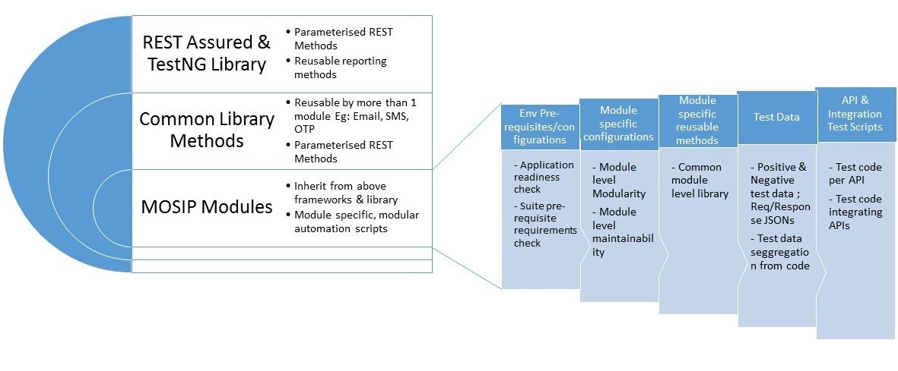

## Test Rig Design
Test Rig represents a one click automation to build, deploy and test a software module. Successful execution of test rig would ascertain complete setup of the MOSIP platform.

Test-Rig comprises of multiple components starting from: 
1. Kubernetes env setup
1. Pulling the source code from the GIT repository
1. Running sonarqube tests for static code analysis
1. Building the application using maven
1. Automated application deployment using Kubernetes
1. Running automated unit tests
1. Running automated tests to verify and validate the application build against the given requirements. 

The automation framework is further categorized to selectively execute tests such as Sanity or/and Regression across the modules which comprises of many utilities.
There will be one Test Rig for each of the below modules that be triggered via the CI/CD pipeline for the module. This would cover complete API level testing for that module including API level integration.
1. Pre-Registration 
1. Registration Client
1. Registration Processor
1. IDA

There will also be an end to end system level Test Rig covering the functionality across the modules starting with Pre-Reg and ending in Reg Proc or IDA. 

### 
 **Figure 2: _Configure Pipelines_**