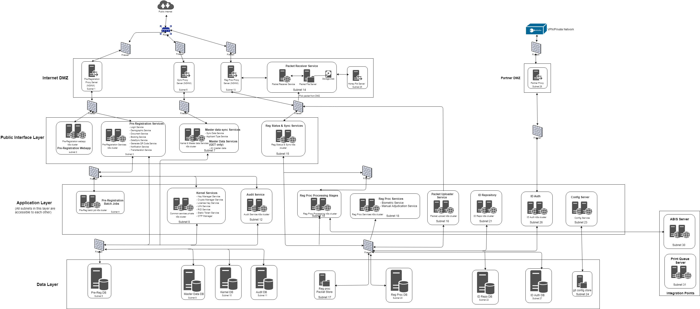

MOSIP is built on below key design considerations, which are explained in detail in [Logical Architecture](https://github.com/mosip/mosip-docs/wiki/Logical-Architecture)
1. Configurability
2. Extensibility
3. Modularity

Based on these design considerations, a Country can decide to plug-in or plug-out some components based on their requirements. MOSIP recommends below Deployment Architecture to deploy all the modules.

