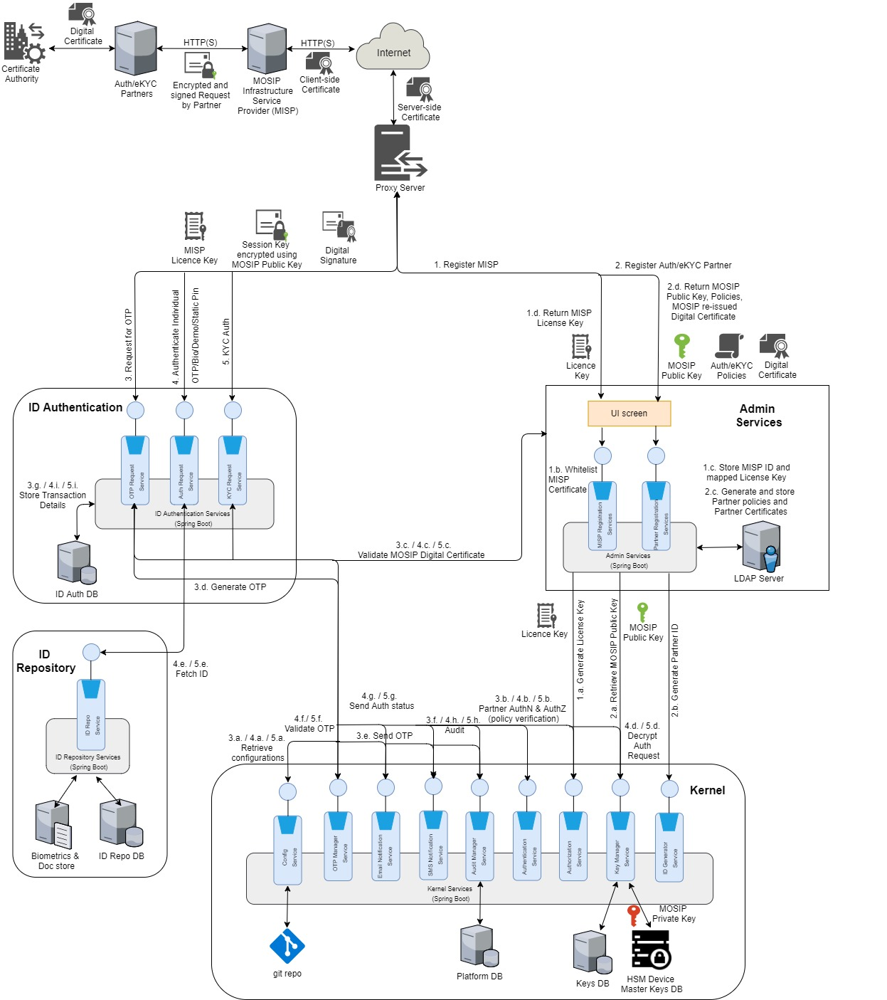

MOSIP ID Authentication provides an API based authentication mechanism for entities to validate Individuals. ID Authentication is the primary mode for entities to validate an Individual before providing any service.

Following are the pre-requisites for an entity to do authentication of an individual
* ID Authentication requests must come to MOSIP only via trusted parties who are white listed in MOSIP. The trusted parties are referred to as partners in MOSIP
* The biometric devices used for authentication must be registered with MOSIP

## ID Authentication Process flow
Please refer to the [**process flow**](Process-view#id-authentication) of ID Authentication

## Architecturally Significant Use Cases
### Authenticate an Individual in a secure and trusted way
Any entity wishing to provide service to an Individual can make an authentication request over the Internet. Since, authentication request will contain an individual's identity data, the data must be
 - Cryptographically encrypted to ensure that data is not seen by others
 - MOSIP should allow only trusted parties to make authentication request
 - MOSIP should verify the integrity of the message sent to avoid man-in-the-middle attacks

### Capture of biometrics data must be in a standard way
An entity that captures data from a biometric device must conform to standards to ensure interoperability. Please refer to the [**link**](MOSIP-Biometric-Data-Specifications) for the standards

### Authenticate an Individual based on his basic identity data captured via MOSIP
MOSIP should be able to authenticate an individual based on the data captured during registration. MOSIP must support authentication on the following
 * Demographic data
   - Name (exact match)
   - Date Of Birth (exact match)
   - Gender (exact match)
   - Address (exact match)
 * Biometrics
   - Finger print (minutiae only for version 1)
   - Iris (image)
   - Face (future version)

Authentication will always be an AND condition on all the data sent by the client.

### Authenticate an Individual based on a second factor in addition to basic identity data
To enhance security and ensure that the its the same individual who intends to authenticate his/her data a second factor of authentication will be supported by MOSIP. It must support the following second factors
* TOTP based authentication
* Static pin based authentication
* Challenge response

### Authentication API must have High Availability (HA) to ensure smooth service

### Authentication API must be scalable to cater to the growing population of a country
MOSIP should ensure that Authentication API scales out based on the increase in the requests due to growing population of a country.

### Authentication API must protect an Individual's identity from request-replay attacks
To ensure that the request is coming from a registered TSP and has not been modified during transit, MOSIP must be validate the TSP and integrity of the message, before authenticating an Individual.  

### Authentication API must be audited for reporting and fraud management checks
To analyze and generate authentication patterns, all authentication requests should be audited. These reports can then be used to determine any frauds during authentication process.

## Logical View    
