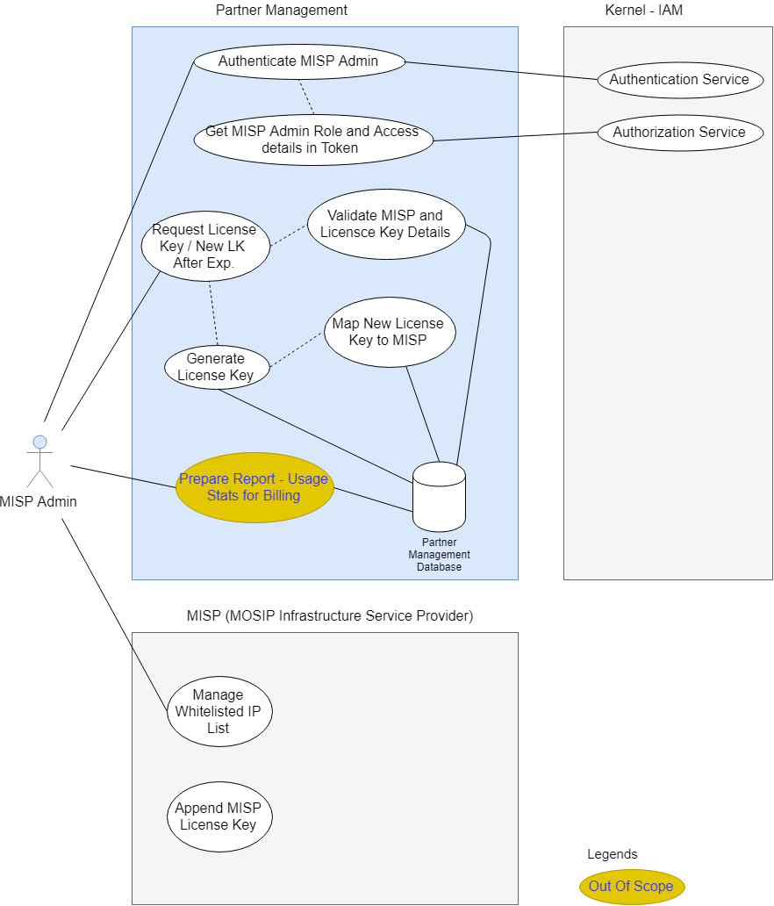

## Partner Management
Partner Management provides services for Partner and MISP (MOSIP Infrastructure Service Provider) Registration and Authentication. Registered Partners and MISP are only allowed to access MOSIP Authentication services. Partners and MISP are registered using Partner Management Services.  Authentication services of MOSIP will internally use the Partner Management Services to authenticate Partner and MISP and validate if only the registered entities are accessing the services.

Partner Management also involves policy management for Partners. Each partner can access Authentication services only based on a defined policy. Authentication services of MOSIP will internally use the Partner Management Services to authenticate a partner based on the policy.

Partner Management also includes License Key Management services. Authentication Services of MOSIP will utilize Partner Management services for License key based authentication of a MISP Partners send authentication request and receive authentication responses in a secured setup. Public/Private keys are used for encryption/decryption/signing the request/response. Distribution of Public key to Partners and retrieval of Public key from partners is managed by Partner Management Services. 

Partners will utilize MOSIP’s resigned digital certificate from Partner Management Services for signing the authentication request.

## Architecturally Significant Use Cases
**User Management**
* MOSIP admin would be able to create and manage(update,view) Partner Management users viz- MISP Admin, Partner Manager, Policy Manager in Kernel's Identity and Access Management (IAM) module. Role authorization and access control for these users would be done at Kernel's Identity and Access Management (IAM) module
* MOSIP admin would be able to issue and map license key to MISP. MOSIP admin would be able to list MISPs and would be able to activate/de-activate MISP, as well as MISP license key for a particular MISP
* MOSIP admin would be able to map users (Policy Manager, Partner Manager) to specific policy group. (Policy groups are country specific, that are customize and seeded from backend)
* MOSIP admin would be able to activate/de-activate policy manager,partner manager


**MOSIP Infrastructure Service Provider (MISP)**
* MISP will be managing whitelisted IPs at infrastructure security level and every authentication request is intercepted by MISP for validation of request from authorized partners. MISP will append MISP license key with every partner authentication request, that would be taken care at infrastructure level
* MISP will receive license key from Partner Management module 
* MISP admin would be able to generate new license key request for a MISP and receive new license key after expiration of existing license key
* MISP would be able to generate usage statistics report for billing purpose (out of scope)


**Policy Manager**
* Policy manager would be able to create policy for the policy group he belongs to
* Policy manager would be able to activate and de-activate policy for his policy group. All associated PartnerAPIKeys for the policy would accordingly get impacted
* Policy manager would be able to update policy for his policy group. All associated PartnerAPIKeys for the policy would accordingly get impacted
* Policy manager would be able to list all policies for his policy group


**Partner Manager**
*  Partner manager would be able to list all partners for a policy group
*  Partner manager would be able to activate/de-activate partners
*  Partner manager would be able to approve / reject PartnerAPIKey request, as received from partner
*  Partner manager would be able to issue PartnerAPIKey(s) to a specified partner for fulfilling specified use case(s) as requested in PartnerAPIKey request. 
*  Partner manager would be able to map PartnerAPIKey(s) to a specified partner
*  Partner manager would be able to map PartnerAPIKey(s) to policy
*  Partner Manager would be able to retrieve and update partner details for a specific PartnerAPIKey
*  Partner manager would be able to issue new PartnerAPIKey(s) after expiration of existing PartnerAPIKey(s), and map the same to the partner
*  Partner manager would be able to activate/de-activate PartnerAPIKey for a partner


**Partners**
*  Partners would be able to do self registration in partner management module. Post successful registration, partners would be provided login credentials for further activities
*  Using login credentials, Partners would be able to submit PartnerAPIKey request, track PartnerAPIKey request status, download PartnerAPIKey
*  Partners would be able to download MOSIP digital certificate. Partner management would be using Kernel services to get MOSIP digital certificate
*  Partner Management module would be using Kernel services for validation,encryption, decryption, storage, rotation requirements w.r.t. digital certificate
*  Partners would be able to encrypt any request for partner management module using MOSIP digital certificate. Partner management module would utilize kernel services to be able to decrypt the request
*  Partners would be able to upload partner digital certificates to partner management module. Any response to partners would be encrypted using respective partner provided digital certificate. Partner management module would be using kernel services to encrypt the responses for partner
*  Partner provided digital certificates are managed at kernel


**ID Authentication Services**
* IDA would be able to validate digital certificate for all requests as received from partner, and would be able to decrypt all request using MOSIP secured private key
* IDA would be able to download partner digital certificates from Partner Management module. IDA would be able to encrypt every response for partner using respective partner provided digital certificates. Partner management module would be using Kernel services for encryption and decryption
* IDA would be able to validate PartnerAPIKey, as received from partner authentication request
* IDA would be able to validate MISP License Key, as received from partner authentication request
* IDA would be able to get partner policy details, post successful validation


## High Level Entity Relationships


### Policy
A policy is an authentication type or set of authentication types that is utilized by partners to validate any individual's identity .
There are following Authentication Types available for partners to choose from :
1. Demographic Authentication - Based on individual's Name, Date of Birth, Gender, Address details
2. OTP Authentication - Based on mobile or email one time password (OTP) authentication
3. Biometric Authentication - Based on Finger, IRIS, Face

After successful authentication, KYC response is sent back to Partner for the individual.

### Policy Group
 A Policy Group is a sector OR domain like Banking, Insurance, Telecome etc, specific to a country. Any policy manager, partner manager and partner belong to a specific policy group. MOSIP would require Policy Group master data are prepared and defined beforehand by country, before creation of Partner, Partner Manager and Policy Manager
 
### Policy Manager
Policy manager would be creating and managing policy/policies for the policy group he/she belongs to 
 
### PartnerAPIKey
For a partner to opt for an authentication policy, they have to generate PartnerAPIKey request with following sample parameters - PartnerCode, UseCaseDescription, SupportingInfo, Status etc. Once the PartnerAPIKey request is approved by Partner Manager, Partner is provided PartnerAPIKey that contains details like - PartnerAPIKey (combination of PartnerCode, policy group and policy), IssuedOn, ValidTill, IsActive etc)

**Sample Master Policy JSON**

```{
  "policies": {
    "authPolicies": [ 	{"authType": "otp","mandatory": true},
						{"authType": "demo","mandatory": false},
						{"authType": "bio","authSubType": "FINGER","mandatory": true},
						{"authType": "bio","authSubType": "IRIS","mandatory": false},
						{"authType": "bio","authSubType": "FACE","mandatory": false},
						{"authType": "kyc","mandatory": false}
					],
    "allowedKycAttributes": [  {"attributeName": "fullName","required": true},
							   {"attributeName": "dateOfBirth","required": true},
							   {"attributeName": "gender","required": true},
							   {"attributeName": "phone","required": true},
							   {"attributeName": "email","required": true},
							   {"attributeName": "addressLine1","required": true},
							   {"attributeName": "addressLine2","required": true},
							   {"attributeName": "addressLine3","required": true},
							   {"attributeName": "location1","required": true},
							   {"attributeName": "location2","required": true},
							   {"attributeName": "location3",required": true},
							   {"attributeName": "postalCode","required": false},
							   {"attributeName": "photo","required": true}
							]
  }
}
```
## Logical View
